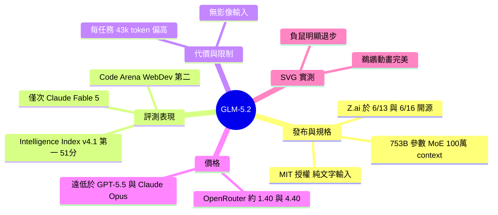

## GLM-5.2 is probably the most powerful text-only open weights LLM

中國 AI 實驗室 Z.ai 於 2026 年 6 月 16 日發佈 GLM-5.2 開源模型，以 MIT 授權完全開放。該模型規模為 753B 參數、1.51TB、採用 40 個活躍參數的混合專家架構，純文本輸入模型（視覺模型另為 GLM-5V-Turbo 但非開源）。Context 窗口擴展至 100 萬 token，較 GLM-5.1 的 200k 提升 5 倍。在 Artificial Analysis Intelligence Index v4.1 排名第一（51 分），領先 MiniMax-M3（44）、DeepSeek V4 Pro（44）、Kimi K2.6（43）；在 Code Arena WebDev 排行榜排名第二，僅次於 Claude Fable 5，顯示其在前端開發代理任務上的強大能力。然而 GLM-5.2 的 token 效率較低，每任務輸出 43k token，高於 GLM-5.1 的 26k。OpenRouter 上多家供應商定價約 $1.40/百萬輸入 token、$4.40/百萬輸出 token，遠低於 GPT-5.5（$5/$30）與 Claude Opus 4.5-4.8（$5/$25）。

### 重點
- GLM-5.2：753B 參數、100 萬 context window（較 GLM-5.1 的 200k 升級 5 倍）、40 個活躍參數 MoE、MIT 開源
- 性能領先：Artificial Analysis v4.1 排名第一（51 分）；Code Arena WebDev 排名第二（次於 Claude Fable 5）
- 成本優勢：$1.40/$4.40 per 百萬 token（vs GPT-5.5 $5/$30、Claude Opus $5/$25），但輸出 token 較多（43k vs 26k）

**原文：** [simon-willison](https://simonwillison.net/2026/Jun/17/glm-52/#atom-everything)

---

<!-- deep-analysis:begin -->
## 📌 摘要 (TL;DR)

- 中國 AI 實驗室 Z.ai 於 6/13 先對其編碼方案訂閱者釋出 GLM-5.2，6/16 再以 MIT 授權完整開源權重；模型為 753B 總參數、1.51TB，採混合專家（Mixture of Experts，簡稱 MoE）架構、40 個活躍參數，且為純文字輸入模型。
- 情境窗口（context window）擴大到 100 萬 token，較前代 GLM-5.1 的 20 萬提升 5 倍。
- 在獨立評測機構 Artificial Analysis 的 Intelligence Index v4.1 拿下 51 分，成為**開源權重模型第一名**，領先 MiniMax-M3（44）、DeepSeek V4 Pro（max，44）與 Kimi K2.6（43）。
- 在 Code Arena WebDev 排行榜排名第 2，僅次於 Claude Fable 5；作者 Simon Willison 對此感到意外，因為他原以為影像輸入是打造頂尖前端編碼模型的關鍵，而 GLM-5.2 並無此能力。
- 代價是 token 消耗偏高：每項任務輸出 43k token，高於 GLM-5.1 的 26k，也高於同級開源模型。
- 價格極具競爭力：OpenRouter 上 9 家供應商幾乎都開價約 $1.40 / 百萬輸入 token、$4.40 / 百萬輸出 token，遠低於 GPT-5.5（$5/$30）與 Claude Opus 4.5–4.8（$5/$25）。

## 🎯 核心概念

- **開源權重**（open weights）：模型權重完整公開可下載，GLM-5.2 更搭配寬鬆的 MIT 授權。
- **混合專家**（Mixture of Experts，簡稱 MoE）：模型雖有 753B 總參數，但每次推論只啟用部分「活躍參數」，藉此兼顧規模與效率。
- **情境窗口**（context window）：模型單次可處理的 token 上限，GLM-5.2 達 100 萬。
- **代理式編碼**（agentic coding）：讓模型以多步驟、自主操作的方式完成編碼任務，是 Code Arena WebDev 評測的重點。

## 📖 整理分析

### 1. 規格與開源策略
GLM-5.2 與前代 GLM-5、GLM-5.1 規模相近，為 753B 參數、1.51TB、40 個活躍參數的 MoE 模型，採 MIT 授權完整開源。它是**純文字輸入**模型；Z.ai 的視覺模型另成一系，最新為 GLM-5V-Turbo，但該模型並未開源。情境窗口從 GLM-5.1 的 20 萬 token 一舉拉高到 100 萬。

### 2. Intelligence Index 登頂開源榜
在備受推崇的獨立評測 Artificial Analysis Intelligence Index v4.1 中，GLM-5.2 以 51 分成為領先的開源權重模型，明顯超越其他競品：

| 模型 | Intelligence Index v4.1 分數 |
| --- | --- |
| GLM-5.2 | 51 |
| MiniMax-M3 | 44 |
| DeepSeek V4 Pro（max） | 44 |
| Kimi K2.6 | 43 |

### 3. 前端編碼亮眼，但 token 偏貴
GLM-5.2 在 Code Arena WebDev 排行榜排名第 2，僅落後 Claude Fable 5；該榜衡量「前端網頁開發任務，包含代理式編碼工作流」。Simon Willison 對此特別驚訝，因為他原本錯誤地假設影像輸入是頂尖前端編碼模型的必要條件，而 GLM-5.2 沒有影像輸入卻仍排名如此前面。不過代價是 token 消耗較高：

| 模型 | 每任務輸出 token |
| --- | --- |
| GLM-5.2 | 43k |
| DeepSeek V4 Pro（max） | 37k |
| Kimi K2.6 | 35k |
| GLM-5.1（前代） | 26k |
| MiniMax-M3 | 24k |

### 4. 價格優勢明顯
作者透過 OpenRouter 試用，該平台有 9 家供應商提供 GLM-5.2，幾乎都開價 $1.40 / 百萬輸入 token、$4.40 / 百萬輸出 token，相較主流封閉模型便宜許多：

| 模型 | 輸入（$/百萬 token） | 輸出（$/百萬 token） |
| --- | --- | --- |
| GLM-5.2（OpenRouter） | 1.40 | 4.40 |
| GPT-5.5 | 5 | 30 |
| Claude Opus 4.5–4.8 | 5 | 25 |

### 5. SVG 實測：鵜鶘出色、負鼠退步
作者以慣用的 SVG 生成測試把玩模型。對提示「Generate an SVG of a pelican riding a bicycle」，GLM-5.2 產出一張**自帶完整動畫且不破圖**的向量插畫——常見的眼睛掉落、車輪與車身脫節等問題都沒出現，表現令人印象深刻。但對「NORTH VIRGINIA OPOSSUM ON AN E-SCOOTER」（騎電動滑板車的維吉尼亞負鼠），結果明顯不如 GLM-5.1，這次甚至沒有嘗試加上動畫。值得一提的是，GLM-5.1 當時是把 SVG 包進 HTML 文件、再用 CSS 補上額外動畫。

## 🧠 Mindmap

<!-- deep-analysis:end -->
### 📄 原文內容

點此展開 / 收合

Chinese AI lab Z.ai released GLM-5.2 to their coding plan subscribers on June 13th, and then yesterday (June 16th) released the full open weights under an MIT license. Similar in size to their previous GLM-5 and GLM-5.1 releases, this is 753B parameter, 1.51TB monster - with 40 active parameters (Mixture of Experts). GLM-5.2 is a text input only model - Z.ai have a separate vision family most recently represented by GLM-5V-Turbo , but that one isn't open weights. GLM-5.2 has a 1 million token context window, up from GLM-5.1's 200,000. 
 The buzz around this model is strong. 
 Artificial Analysis, who run one of the most widely respected independent benchmarks: GLM-5.2 is the new leading open weights model on the Artificial Analysis Intelligence Index . 
 
 GLM-5.2 is the leading open weights model on the Intelligence Index v4.1. At 51, it leads MiniMax-M3 (44), DeepSeek V4 Pro (max, 44) and Kimi K2.6 (43) 
 
 They did however find it to be quite token-hungry: 
 
 GLM-5.2 uses more output tokens per task than other leading open weights models: the model uses 43k output tokens per Intelligence Index task, up from GLM-5.1 (26k) and above MiniMax-M3 (24k), Kimi K2.6 (35k) and DeepSeek V4 Pro (max, 37k) 
 
 The model is also now ranked 2nd on the Code Arena WebDev leaderboard , behind only Claude Fable 5. That leaderboard measures "front-end web development tasks, including agentic coding workflows". I'm impressed to see it rank so highly given the lack of image input, which I had incorrectly assumed was a key part of building a truly great frontend coding model. 
 I've been trying it out via OpenRouter , which has it from 9 different providers, almost all of which are charging $1.40/million for input and $4.40/million for output. For comparison, GPT-5.5 is $5/$30 and Claude Opus 4.5-4.8 is $5/$25. 
 Excellent pelican, disappointing opossum 
 GLM-5.1 gave me one of my favorite pelicans and my all time favorite opossum (for the prompt "Generate an SVG of a NORTH VIRGINIA OPOSSUM ON AN E-SCOOTER".) Interestingly, in both of those cases the model chose to return SVG wrapped in an HTML document that added additional animations using CSS. 
 Let's try GLM-5.2. For "Generate an SVG of a pelican riding a bicycle" I got this : 
 
 It's a self-contained fully animated SVG, and the animations aren't broken! Often I'll see eyes falling off or wheels rotating independently of the bicycle but here everything works great. It's a very nice vector illustration of a pelican too. Very impressive. 
 Sadly, the NORTH VIRGINIA OPOSSUM ON AN E-SCOOTER did not come out nearly as well : 
 
 This is such a step down from GLM-5.1! As a reminder, that possum looked like this: 
 
 5.2 didn't even try to animate it. 
 
 Tags: ai , generative-ai , llms , pelican-riding-a-bicycle , llm-release , openrouter , ai-in-china , glm

