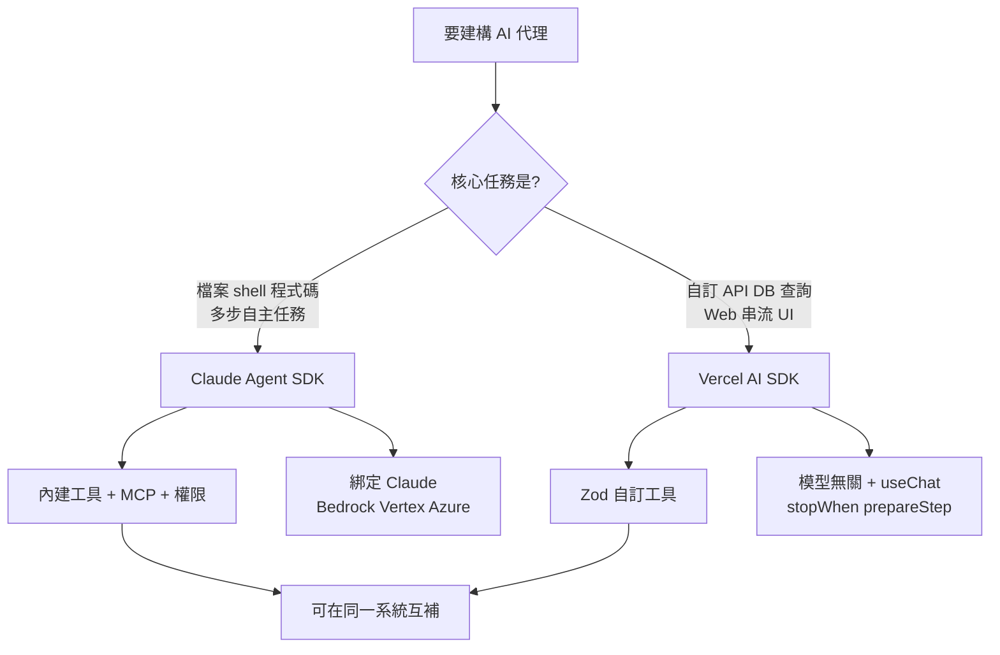
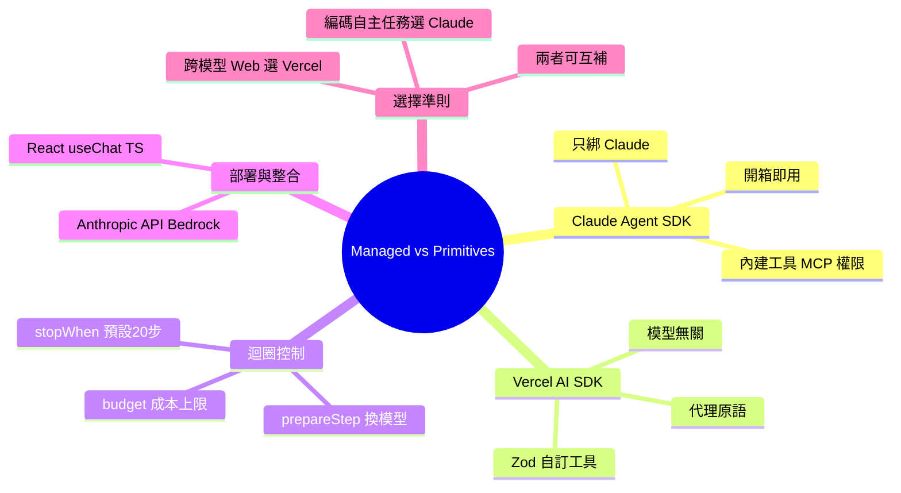

## Managed Agents vs. Agent Primitives: Comparing Claude’s Agent SDK and Vercel’s AI SDK

Claude Agent SDK 採「開箱即用」策略（內建檔案讀寫、shell 執行、網頁搜尋等工具），而 Vercel AI SDK 採「原語」策略（需自訂工具定義）。Claude SDK 來自 Claude Code 功能庫，內建 MCP、permissions、session 管理，適合自主代碼工作流；Vercel SDK 完全透明且與模型無關，提供 `stopWhen` 與 `prepareStep` 細粒度控制，可設成本上限，易整合 TypeScript/React 流。選擇標準：自主編碼相關工作用 Claude SDK，需跨模型切換與 Web 原生應用用 Vercel。

### 重點
- Claude Agent SDK = Claude Code 的函式庫版本，開箱即用檔案/shell/搜尋工具；Vercel AI SDK 需從零自訂工具——權衡便利性 vs. 透明度
- Claude SDK 鎖定 Claude 模型（可經 Bedrock/Vertex/Azure），Vercel SDK 模型無關，支援切換 Claude/GPT/其他，內建成本限制機制
- Claude 適合自主工作流（代碼審視、多步任務），Vercel 適合 API 與 Web 前端應用，需要完全控制與模型靈活性

**原文：** [medium-tag-claude](https://bertomill.medium.com/managed-agents-vs-agent-primitives-comparing-claudes-agent-sdk-and-vercel-s-ai-sdk-fb99d6b2af5f?source=rss------claude-5)

---

<!-- deep-analysis:begin -->
## 📌 摘要 (TL;DR)

- 作者（Berto Mill）比較兩種「代理」建構哲學：Claude Agent SDK 走「開箱即用」（batteries-included），等於把 Claude Code 包成函式庫；Vercel AI SDK 走「代理原語」（agent primitives），只給骨架，工具交給開發者自訂。
- Claude Agent SDK 內建檔案讀寫、shell 指令執行、regex 搜尋、glob 比對、網頁搜尋／抓取、子代理（subagents）、鉤子（hooks）、MCP 整合、權限系統與工作階段管理。
- Vercel AI SDK 預設是一張白紙：開發者用 Zod schema 定義工具的輸入與 execute 函式，SDK 只負責代理迴圈、情境管理與停止條件。
- Vercel 提供細粒度迴圈控制：stopWhen（預設 20 步上限）、prepareStep（迴圈中途換模型／裁剪歷史／限制工具），並可用 budget 條件追蹤估算 token 成本上限。
- 模型策略相反：Claude SDK 只綁 Claude（Anthropic API key，企業可走 Bedrock／Vertex AI／Azure）；Vercel 與模型無關，用字串指定模型（如 「anthropic/claude-sonnet-4.5」），原生整合 React useChat 與 TypeScript。
- 選擇準則：自主編碼／檔案系統／命令執行相關用 Claude SDK；需跨模型切換、Web 原生串流、結構化確定性流程用 Vercel；作者也指出兩者能在同一系統互補。

## 🎯 核心概念

- **開箱即用（batteries-included）**：框架預先附上常用工具與機制，拿來即用。
- **代理原語（agent primitives）**：框架只提供最小骨架（迴圈、停止條件），工具與行為全由開發者組裝。
- **模型情境協定（Model Context Protocol，簡稱 MCP）**：讓代理連接外部工具／資料源的標準協定，Claude SDK 內建支援。
- **工作階段管理（session management）**：跨多輪互動保存代理狀態與上下文的機制。
- **模型無關（provider-agnostic）**：不綁單一模型供應商，可自由切換底層模型。

## 📖 整理分析

### 1. 兩種「代理」哲學分裂
作者指出過去一年「代理」一詞悄悄分裂成兩條建構路線。Claude Agent SDK 把 Claude Code 直接包成函式庫，預設就能讀寫檔案、執行 shell、搜尋網頁並與使用者互動；Vercel AI SDK 則刻意留白，由 SDK 編排代理迴圈、情境與停止條件，工具留給開發者定義。

### 2. 內建能力 vs. 自訂工具
Claude SDK 出廠即含檔案系統存取、命令執行、regex 搜尋、glob 比對、網頁搜尋／抓取、子代理、鉤子、MCP 伺服器整合、權限系統與工作階段管理。Vercel SDK 是「設計上的一張白紙」：每個工具都要用 Zod 輸入 schema 加上 execute 函式自行定義。

### 3. 迴圈控制的細粒度
Vercel 把控制權交給開發者：stopWhen 設定停止條件（預設 20 步），prepareStep 是迴圈中途的回呼，可換模型、裁剪歷史或限制可用工具，並能以 budget 條件追蹤跨步驟的估算 token 成本。Claude 則提供與 Claude Code 一致的內建迴圈管理，透過權限系統與 allowed-tools 清單來約束行為。

### 4. 模型綁定與部署
Claude SDK 專為 Claude 打造，以 Anthropic API key 認證，企業可透過 Amazon Bedrock、Google Vertex AI、Azure 部署。Vercel SDK 與模型無關，模型以字串指定（例如 「anthropic/claude-sonnet-4.5」），並原生整合 React 的 useChat hook 與 TypeScript 應用，適合 Web 串流 UI。

### 5. 怎麼選？兩者可互補
作者建議：要做檔案操作、命令執行、程式碼審查與自動修復、多步自主任務，或法務／金融／客服等商業應用，選 Claude Agent SDK；要做自訂 API 呼叫、資料庫查詢、需供應商獨立性、Web UI 串流整合、確定性結構化流程，選 Vercel AI SDK。文末強調兩者能在同一套生產系統中互補，而非二選一。

## 🧭 決策圖：該選哪個 SDK

## 🧠 Mindmap

<!-- deep-analysis:end -->
### 📄 原文內容

點此展開 / 收合

If you have spent any time building AI agents over the past year, you have probably noticed that &#x201c;agent&#x201d; has quietly become two different&#x2026; Continue reading on Medium »

