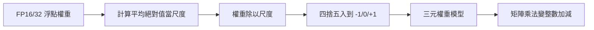
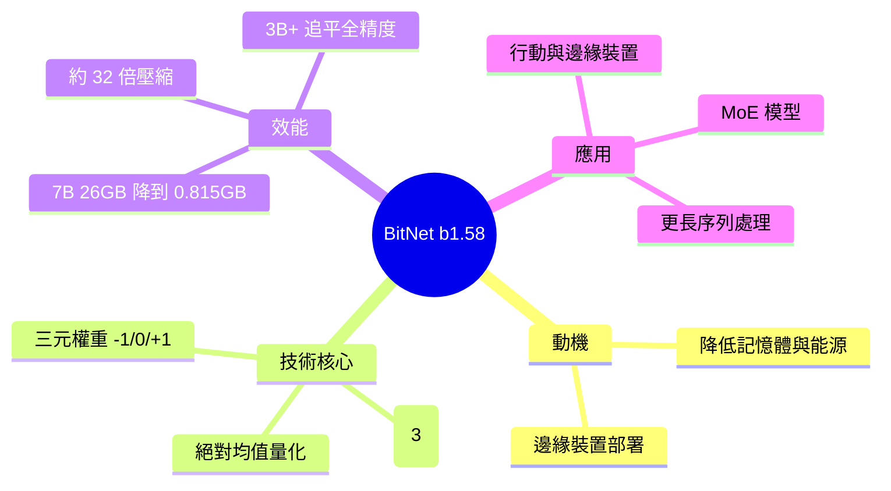

## Exploring 1-Bit LLMs by Microsoft

微軟的 1 比特 LLM 技術 BitNet b1.58 將模型參數從傳統 32 比特或 16 比特浮點壓縮至 1.58 比特，每個權重只能取 -1、0、+1 三個值。採用「絕對均值量化」方法，7B 參數模型從 26 GB 壓縮至 0.815 GB（32 倍縮減）。在 3B 以上規模，性能與全精度基準持平，同時大幅降低計算與能源成本，為邊緣/行動設備部署 AI 開啟可能，並有利於專家混合模型與更長序列處理。

### 重點
- 權重量化至 1.58 比特（三值 {-1, 0, +1}）；7B 模型記憶體從 26 GB 降至 0.815 GB，壓縮倍數 32 倍
- 3B 規模起性能與標準浮點基準相當，證實極限壓縮不犧牲有效性
- 保留層歸一化、嵌入等非參數組件高精度，主要優化計算密集的權重部分，降低邊緣設備部署門檻

**原文：** [medium-tag-llm](https://medium.com/@nageshchauhanc4/exploring-1-bit-llms-by-microsoft-81dc2bcdf25c?source=rss------large_language_models-5)

---

<!-- deep-analysis:begin -->
## 📌 摘要 (TL;DR)

- 微軟提出 **BitNet b1.58**，把大型語言模型（large language model，LLM）的權重從傳統 32 位元或 16 位元浮點數，壓到平均約 **1.58 位元**，每個權重只取 −1、0、+1 三種值（三元權重，ternary weights）。
- 「1.58」來自 log₂(3) ≈ 1.58——表示三種狀態理論上所需的位元數，是「1 位元 LLM」這條路線的進化版。
- 量化方法為**絕對均值量化**（absmean quantization）：用權重矩陣的平均絕對值當縮放尺度，再把每個權重四捨五入到 {−1, 0, +1}。
- 以 7B 參數模型為例，記憶體從 **26 GB 壓到 0.815 GB**，約 **32 倍**縮減。
- 在 **3B 參數以上**規模，效能可與全精度（full-precision）基準持平，同時大幅降低運算與能源成本。
- 意義：讓 AI 有機會跑在邊緣與行動裝置上，並對專家混合（Mixture of Experts，MoE）模型與更長序列處理特別有利。

## 🎯 核心概念

- **1 位元 LLM／b1.58**：把權重壓到極低位元的模型路線；b1.58 指平均每個權重約 1.58 位元的三元版本。
- **三元權重（ternary weights）**：權重只能是 −1、0、+1，用來取代浮點數權重。
- **絕對均值量化（absmean quantization）**：以權重的平均絕對值為縮放尺度，再四捨五入到三種值的量化策略。
- **全精度基準（full-precision baseline）**：以 FP16／FP32 訓練的對照模型，用來檢查壓縮後是否掉效能。
- **專家混合（Mixture of Experts，MoE）**：只啟用部分子網路的稀疏架構，記憶體壓力大，特別受惠於低位元權重。

## 📖 整理分析

### 1. 為什麼要做 1 位元 LLM
傳統 LLM 權重以 16／32 位元浮點數儲存，模型一大，記憶體佔用與能源成本就高，難以塞進手機或邊緣裝置。BitNet b1.58 的目標就是把每個權重壓到接近 1 位元，從根本縮小模型體積與運算負擔。

### 2. 1.58 位元與三元權重
b1.58 的權重不是傳統二元的 {−1, +1}，而是三元的 {−1, 0, +1}。三種狀態需要 log₂(3) ≈ 1.58 位元，因此命名為 b1.58。多出來的「0」這個值，等於同時內建了權重剪枝／特徵過濾的能力。

### 3. 絕對均值量化怎麼運作
量化採絕對均值（absmean）策略：先算整個權重矩陣的平均絕對值作為縮放尺度，將權重除以該尺度後，四捨五入到最接近的 −1、0 或 +1。如此一來，矩陣乘法主要由整數加減取代浮點乘法，這是省電與省算力的關鍵。

### 4. 壓縮幅度與效能
以 7B 模型計，記憶體從 26 GB 降到 0.815 GB，約 32 倍。重點是在 3B 參數以上規模，b1.58 的效能可追平全精度基準——也就是「省了約 32 倍記憶體，但幾乎不掉分」，這正是它與早期低位元方法最大的差異。

### 5. 應用場景與延伸價值
低位元帶來三個方向：一是邊緣／行動裝置部署成為可能；二是 MoE 這類記憶體吃緊的架構受惠最大；三是省下來的記憶體可換成更長的序列長度。

## 🧭 流程圖 / 架構圖

絕對均值量化的處理流程：

## 🧠 Mindmap

<!-- deep-analysis:end -->
### 📄 原文內容

點此展開 / 收合

Delving into the Core of Microsoft&#x2019;s Revolutionary 1-Bit LLM Technology. Continue reading on Medium »

