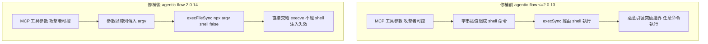
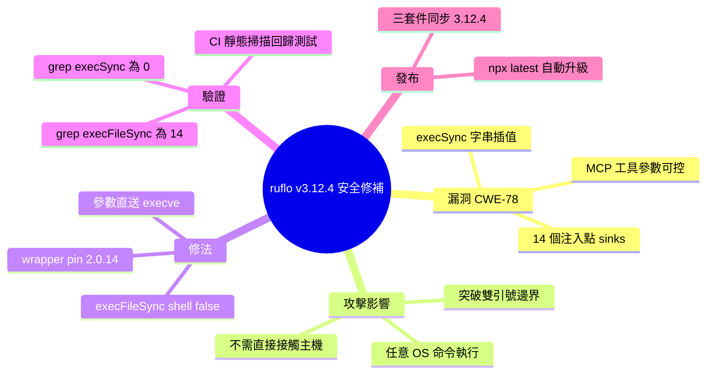

## v3.12.4 — CWE-78 security patch (agentic-flow ≥ 2.0.14)

ruflo v3.12.4 發布重大安全補丁，修復 agentic-flow ≤2.0.13 中的 CWE-78 OS 命令注入漏洞。該漏洞影響 MCP 伺服器工具（standalone-stdio、http-sse、http-streaming-updated、stdio-full、claude-flow-sdk 等），因其將使用者控制的參數直接插入傳遞給 execSync() 的 shell 命令字串。攻擊者可透過注入 `"; touch /tmp/INJECTED; id > /tmp/rce.txt; echo "` 等有效負載突破雙引號邊界執行任意 OS 命令。修復將所有 14 個 execSync 呼叫替換為 execFileSync，每個參數以陣列形式直接傳遞給 execve(2)，完全規避 shell 解析。ruflo 同時在 wrapper 級別新增防禦性 pin `"agentic-flow": ">=2.0.14"`（因為 wrapper 不繼承根 package.json 的 override），確保多層防禦。驗證方式：grep 新版 standalone-stdio.js 得 execSync 計數 = 0、execFileSync 計數 = 14。ruflo、claude-flow、@claude-flow/cli 三個包同步發布 3.12.4。

### 重點
- CWE-78 命令注入漏洞修復：14 個 execSync(string_interpolation) 呼叫改用 execFileSync('npx', argv, {shell: false})，參數直接傳遞 execve(2)，規避 shell 參數注入
- agentic-flow 版本升級：2.0.13 → 2.0.14；ruflo 三個發布物同步 3.12.4；wrapper 層級新增版本 pin 防禦，解決 wrapper 不繼承根 override 的問題（#2112 lesson）
- 多層影響：standalone-stdio、http-sse、http-streaming-updated、stdio-full、claude-flow-sdk、fastmcp/tools/{agent,swarm,hooks} 等六種 MCP 伺服器實作均受保護

**原文：** [ruflo-releases](https://github.com/ruvnet/ruflo/releases/tag/v3.12.4)

---


<!-- deep-analysis:begin -->
## 📌 摘要 (TL;DR)

- **ruflo**、**claude-flow**、**@claude-flow/cli** 三個套件同步從 3.12.3 升到 **3.12.4**，這是一個安全修補版，連帶引入 **agentic-flow@2.0.14**。
- 修補目標是 agentic-flow ≤ 2.0.13 的 **CWE-78 作業系統命令注入（OS command injection）** 漏洞：其 MCP 伺服器工具把攻擊者可影響的參數，直接插值組進傳給 `execSync()` 的 shell 命令字串。
- 概念驗證（proof of concept，簡稱 PoC）payload `x"; touch /tmp/INJECTED; id > /tmp/rce.txt; echo "` 可突破外層雙引號邊界，以**執行 MCP 伺服器的使用者權限**執行任意命令。
- 修法是把 **14 個** `execSync(字串插值)` 注入點 **1:1 全部換成** `execFileSync('npx', argv, { shell: false })`，每個參數直接交給 `execve(2)`，完全不經過 shell 解析。
- 為什麼該關注：在 MCP 處理不受信任內容（網頁、檔案、第三方工具輸出）的部署中，攻擊**不需要直接接觸主機**就能被觸發。

## 🎯 核心概念

- **作業系統命令注入** (OS command injection，CWE-78)：把未經處理的使用者輸入拼進 shell 命令字串，導致攻擊者能執行任意系統指令。
- **模型情境協定** (Model Context Protocol，簡稱 MCP)：AI agent 與外部工具溝通的協定；此處的漏洞就出在 MCP 伺服器工具實作裡。
- **縱深防禦** (defense-in-depth)：在多個層級重複設防，即使單一層失效仍有後備；本版除了根套件升級，還在 wrapper 層加 pin。
- **靜態掃描回歸測試** (static-scan regression test)：以 grep/CI 檢查程式碼是否再次出現危險呼叫，避免漏洞被重新引入。

## 📖 整理分析

### 1. 漏洞本質：execSync 字串插值

根據上游公告，agentic-flow ≤ 2.0.13 的 MCP 伺服器工具——`standalone-stdio`、`http-sse`、`http-streaming-updated`、`stdio-full`、`claude-flow-sdk`、`poc-stdio`，以及 `fastmcp/tools/{agent,swarm,hooks}` 等出口（sink）——把可被攻擊者影響的 MCP 工具參數，直接插值組成 shell 命令字串後丟給 `execSync()`。問題不在 agentic-flow 的業務邏輯，而在「用字串拼命令、交給 shell 解析」這個寫法本身。

### 2. 攻擊路徑與權限影響

當參數值帶有 `x"; touch /tmp/INJECTED; id > /tmp/rce.txt; echo "` 這類內容時，前面的 `"` 會關閉原本包住參數的雙引號，後面的 `;` 串接任意命令，最後的 `echo "` 再補回引號讓命令字串合法。結果是以**執行 MCP 伺服器的使用者權限**執行任意 OS 命令。關鍵風險在於：MCP agent 常會處理網頁、檔案、第三方工具輸出等不受信任內容，因此攻擊者**無需直接登入或接觸主機**即可達成遠端命令執行。

### 3. 修法：execFileSync 取代 execSync

修補前程式碼有 **14 個** `execSync(stringInterp)` 注入點，修補後降為 **0 個**，全部 1:1 改寫為 `execFileSync('npx', argv, { shell: false })`。差別在於：`execFileSync` 把 `argv` 陣列的每個元素**原封不動**交給 `execve(2)`，從頭到尾不啟動 shell，因此引號、分號等 shell 元字元失去特殊意義，注入直接失效。這是把「資料」與「命令」徹底分離的標準做法。

### 4. 縱深防禦：wrapper 層的版本 pin

本版做了兩處變更：根 `package.json` 把 `agentic-flow` 從 `^2.0.13` 提到 `^2.0.14`；同時 ruflo 的 wrapper overrides **額外**加上 `"agentic-flow": ">=2.0.14"` 的縱深防禦 pin。原因記在 #2112 的教訓——**wrapper 不會繼承根 package.json 的 override**，因此必須在 wrapper 層再釘一次，才能確保多層安裝路徑都拿到修補版。

### 5. 驗證與 CI 回歸測試

使用者可在任何安裝了 agentic-flow 的目錄自行驗證：

```bash
$ grep -c "execSync(" node_modules/agentic-flow/dist/mcp/standalone-stdio.js
0
$ grep -c "execFileSync(" node_modules/agentic-flow/dist/mcp/standalone-stdio.js
14
```

CWE-78 公告最初由 `hackchang_pipeline` 紅隊報告包（`npm_agentic-flow_report_package_20260618_163017.zip`）提報。其完整的出口清單與最小化 PoC payload，讓團隊能寫出一條靜態掃描回歸測試——**只要 MCP 伺服器樹中再被引入任何新的 `execSync()` 呼叫，CI 就會失敗**。

升級方式：`npx ruflo@latest` / `npx claude-flow@latest` / `npx @claude-flow/cli@latest` 會自動取得 3.12.4；本機安裝則 `npm install ruflo@latest` 或 `npm install agentic-flow@^2.0.14`。

## 🧭 流程圖 / 架構圖

修補前後的命令執行路徑對比：



## 🧠 Mindmap


<!-- deep-analysis:end -->
### 📄 原文內容

<details>
<summary>點此展開 / 收合</summary>

🔒 Security release — CWE-78 fix 
 This release picks up agentic-flow@2.0.14 , which closes an OS command injection vulnerability in its MCP server tools. 
 What the upstream advisory found 
 agentic-flow ≤ 2.0.13's MCP server tools ( standalone-stdio , http-sse , http-streaming-updated , stdio-full , claude-flow-sdk , poc-stdio , plus the fastmcp/tools/{agent,swarm,hooks} sinks) interpolated attacker-influenceable MCP tool parameters directly into shell command strings passed to execSync() . A malicious value like: 
 x"; touch /tmp/INJECTED; id &gt; /tmp/rce.txt; echo "
 
 would break out of the surrounding double-quoted argument and execute arbitrary OS commands with the privileges of the user running the MCP server. In MCP deployments where untrusted content (web pages, files, third-party tool output) is processed by the AI agent, this was reachable without direct attacker access to the host. 
 What changed in this release 
 
 Root package.json : agentic-flow ^2.0.13 → ^2.0.14 
 ruflo/ wrapper overrides : adds "agentic-flow": "&gt;=2.0.14" defense-in-depth pin (per the #2112 lesson — wrapper does not inherit root overrides ) 
 All three packages bumped from 3.12.3 → 3.12.4 
 
 
 
 
 Package 
 latest 
 alpha 
 v3alpha 
 
 
 
 
 @claude-flow/cli 
 3.12.4 
 3.12.4 
 3.12.4 
 
 
 claude-flow 
 3.12.4 
 3.12.4 
 3.12.4 
 
 
 ruflo 
 3.12.4 
 3.12.4 
 3.12.4 
 
 
 
 How to upgrade 
 npx ruflo@latest # picks up 3.12.4 automatically 
npx claude-flow@latest # picks up 3.12.4 automatically 
npx @claude-flow/cli@latest # picks up 3.12.4 automatically 
 If you have a local install, refresh: 
 npm install ruflo@latest
 # or 
npm install agentic-flow@^2.0.14 
 Verifying the fix 
 Anywhere agentic-flow is installed in your tree: 
 $ grep -c " execSync( " node_modules/agentic-flow/dist/mcp/standalone-stdio.js
0
$ grep -c " execFileSync( " node_modules/agentic-flow/dist/mcp/standalone-stdio.js
14 
 The pre-fix code had 14 execSync(stringInterp) sinks; the fixed code has zero, replaced 1:1 with execFileSync('npx', argv, { shell: false }) where every argv element is passed straight to execve(2) and the shell is never invoked. 
 Cross-references 
 
 🔗 Upstream advisory + fix: ruvnet/agentic-flow#169 
 🔗 Upstream PR: ruvnet/agentic-flow#170 (merged at 0c2ec96 ) 
 🔗 Downstream tracking issue: #2414 
 🔗 Downstream PR: #2415 (merged at da901d0 ) 
 🔗 Published agentic-flow@2.0.14 : https://www.npmjs.com/package/agentic-flow/v/2.0.14 
 
 Credit 
 CWE-78 advisory originally reported via the hackchang_pipeline red-team report package ( npm_agentic-flow_report_package_20260618_163017.zip ). Thanks to hackchang for the report — the sink inventory + minimized PoC payload made it straightforward to write the static-scan regression test that fails CI if any new execSync() call is ever reintroduced into the MCP server tree. 
 
 🤖 Generated with RuFlo

</details>