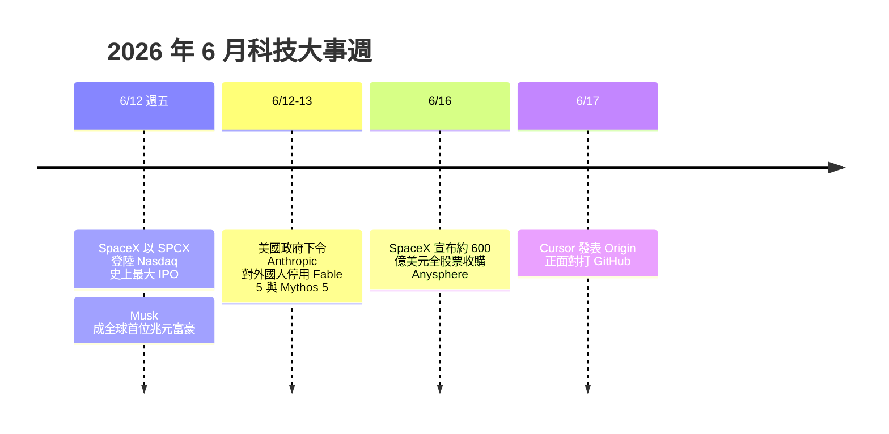
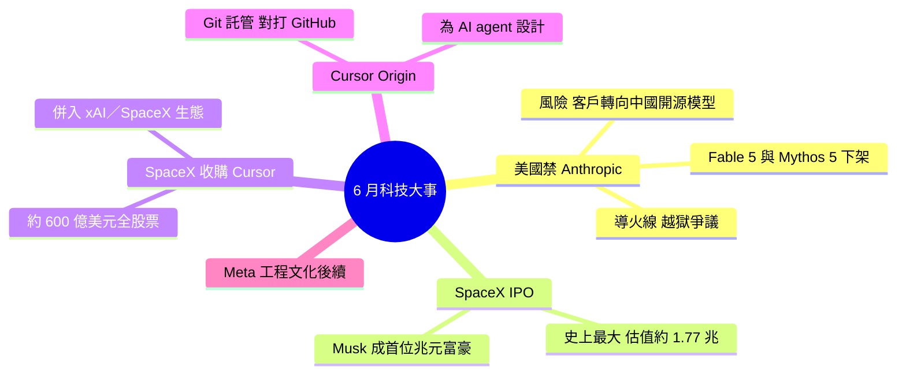

## The Pulse: Big implications of US banning Anthropic’s new model, Fable

Pragmatic Engineer newsletter 報導美國禁止 Anthropic 推出的新模型 Fable，帶來重大影響。同期涵蓋多個科技大事：Meta 工程文化衰退、SpaceX IPO 計劃、SpaceX 收購 Cursor（AI IDE 工具）、Cursor 推出 GitHub 競爭產品等。反映出 AI 監管升級和 AI 開發工具市場整合加速的雙重趨勢。

### 重點
- 美國監管禁止 Anthropic Fable 模型——AI 監管政策升級的信號
- SpaceX 並購 Cursor——AI IDE 工具與火箭公司的跨域整合
- Cursor 推出 GitHub 替代品——AI IDE 開始侵蝕傳統代碼協作平臺

**原文：** [substack-pragmatic-engineer](https://newsletter.pragmaticengineer.com/p/the-pulse-big-implications-of-us)

---

<!-- deep-analysis:begin -->
## 📌 摘要 (TL;DR)

- 美國政府以國家安全為由，下令 Anthropic 對所有「非美國公民」（含自家外籍員工）停用最強模型 Fable 5 與 Mythos 5；Anthropic 已將模型下架，並對 6/9–6/14 期間註冊的用戶退款（截止 6/20）。
- 觸發點是一個被指稱的 Fable 5「越獄」：誘導模型讀取程式碼庫並找出軟體漏洞——但相同能力在 OpenAI 的 GPT-5.5 等公開模型早已存在。
- 文章核心 insight：此舉恐把美國以外的客戶推向「能力夠強的開源模型」，而這類模型多數來自中國，反而可能提升中國的全球影響力。
- 同一週，SpaceX 以每股 135 美元、發行約 5.556 億股完成史上最大 IPO，募資約 750 億美元、估值約 1.77 兆美元；以代號 SPCX 在 Nasdaq 開盤跳至 150 美元（+11%），Elon Musk 成為全球首位兆元富豪（淨資產約 1.05 兆美元）。
- IPO 後數日，SpaceX 宣布以約 600 億美元全股票收購 Cursor 母公司 Anysphere，預計 2026 Q3 完成；Cursor 將成 SpaceX 部門，使用 Colossus 超級電腦訓練模型。
- Cursor 於 6/17 發表 Git 託管平台 Origin，主打「為 AI agent 而生」、正面挑戰 GitHub；加上 2025/12 收購的 Graphite，補齊「寫碼→審查→合併」全鏈。

## 🎯 核心概念

- **出口管制（export control）**：政府限制特定技術或產品輸出給外國人／外國的法規工具，此次被用來限制 AI 模型的存取權。
- **越獄（jailbreak）**：繞過模型安全限制、誘導其產生本應被攔下之行為的手法。
- **全股票交易（all-stock deal）**：以股票而非現金支付的併購，SpaceX 收購 Cursor 即屬此類。
- **Git 託管（git hosting）**：存放與協作程式碼的平台（GitHub 為代表），Cursor Origin 切入此市場。
- **開源模型（open models）**：權重公開、可自行部署的模型；文中指此類多由中國團隊釋出。

## 📖 整理分析

### 1. 美國禁用 Fable 5／Mythos 5：起因與越獄爭議
Anthropic 於週五下午 5:21 收到政府命令，要求對所有外國人（連自家外籍員工都包含）停用其最強的 Fable 5 與 Mythos 5 模型，理由是國家安全，但信中未說明具體疑慮。據 Anthropic 理解，導火線是一個被指稱的 Fable 5 越獄：僅為口頭證據、屬「狹義、非普遍」的漏洞，手法是讓模型讀取特定程式碼庫並找出軟體缺陷——然而相同能力在 OpenAI 的 GPT-5.5 等公開模型早已具備。Anthropic 已派資深工程師赴華府，與商務部（Department of Commerce）官員進行被形容為「危機談判」的面對面溝通，並對 6/9–6/14 期間註冊的訂閱者退款，截止日 6/20。

### 2. 連鎖效應：把客戶推向中國開源模型
Pragmatic Engineer 點出的關鍵影響：當美國以外的國家、非美國企業無法使用最強的美系封閉模型時，他們會轉向「能力夠強的開源模型」，而這類模型目前多數來自中國。換言之，意在防堵的出口管制，反而可能讓中國模型的全球影響力上升，形成對美國 AI 戰略的反諷式風險。對美國境內企業而言，最直接的衝擊是部分外籍員工無法使用 Anthropic 工具，影響開發生產力。

### 3. SpaceX 史上最大 IPO，Musk 成全球首位兆元富豪
同一週，SpaceX 以每股 135 美元、發行約 5.556 億股 A 類普通股完成史上最大規模 IPO，募資約 750 億美元，估值約 1.77 兆美元。股票以代號 SPCX 在 Nasdaq 上市，開盤即跳升至每股 150 美元（較發行價 +11%）。Elon Musk 因此成為全球首位兆元（trillionaire）富豪——加計約 2,800 億美元的 Tesla 持股，淨資產約 1.05 兆美元；這場 IPO 也讓眾多員工一夕成為百萬與億萬富翁。

### 4. SpaceX 600 億收購 Cursor，並推 Origin 對打 GitHub
IPO 後數日，SpaceX 宣布以約 600 億美元全股票收購 AI 編程工具 Cursor 的母公司 Anysphere，預計 2026 第三季完成（待監管核准）。Cursor 由四名 MIT 畢業生於 2022 年創立、CEO 為 Michael Truell，從 VS Code 分支（fork）起家，客戶涵蓋 Uber、Stripe、Nvidia，並滲透超過半數《財星》500 大企業。併入後 Cursor 將作為 SpaceX 部門，使用約等同百萬張 H100 GPU 算力的 Colossus 超級電腦訓練更強的編程模型，補上 xAI／SpaceX 生態的最後一塊。緊接著在 6/17，Cursor 發表 Git 託管平台 Origin，主打為 AI agent 而生：可同時處理數十個 agent 平行 clone／分支／合併、AI 自動解決合併衝突（merge conflict），demo 中達每秒約 22 次 commit、每小時近 30 萬次 clone。加上 2025 年 12 月收購的程式碼審查（code review）公司 Graphite，Cursor 補齊「寫碼→審查→合併」全鏈，正面挑戰 GitHub（預計 2026 秋季開放，已開放候補）。

### 5. Meta 工程文化的後續（follow-up）
本期亦延續先前「Meta 親手摧毀自家工程文化」的批評，談及裁減與重組對非工程團隊、以及本已人力吃緊的誠信（integrity）團隊的衝擊。此段完整數據位於付費牆後，故此處僅點出主題、不臆測具體數字。

## 🧭 流程圖 / 架構圖

## 🧠 Mindmap

*說明：原文為付費電子報，正文位於付費牆後。以上具體數字與事實已交叉比對 Al Jazeera、Time、TechCrunch、CNBC、Variety、Bloomberg、Unite.AI 等多家外部報導後整理；Meta 段落因缺乏可驗證細節而從簡，未臆測數字。*
<!-- deep-analysis:end -->
### 📄 原文內容

點此展開 / 收合

Also: a follow-up on Meta destroying its own engineering culture, the SpaceX IPO, SpaceX buys Cursor, Cursor&#8217;s GitHub competitor, and more.

