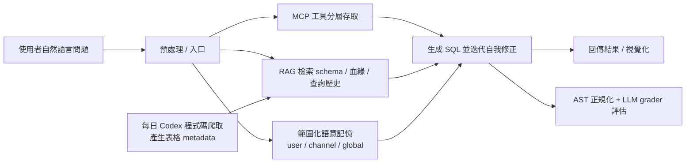
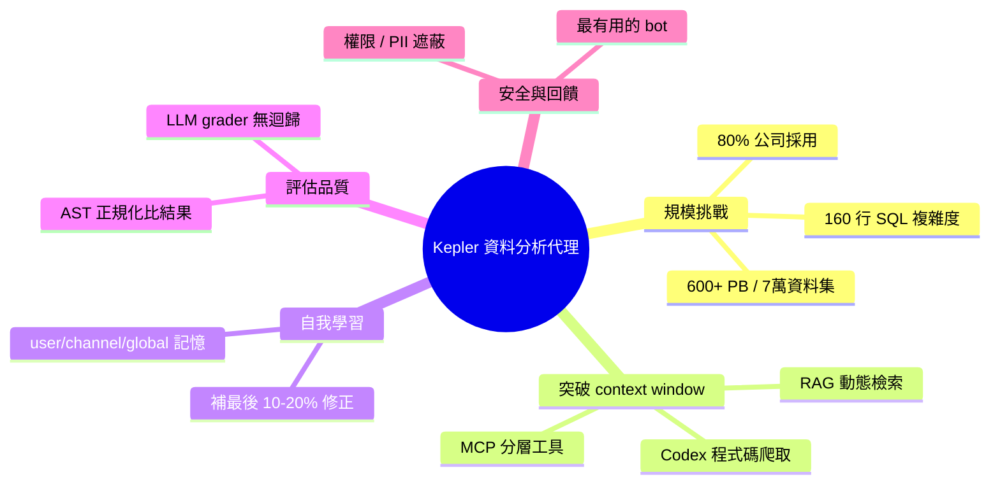

## Presentation: AI Agents to Make Sense of Data at OpenAI

OpenAI 研究員 Bonnie Xu 分享 Kepler——內部 AI 資料分析代理的設計，該系統可查詢超過 600 petabytes 資料。突破 context window 限制的核心技術包括：MCP 進行資料存取分層、自動化代碼爬行、RAG 動態檢索；採用 scoped semantic memory 實現代理自我學習，利用 AST-based LLM grading 構建無迴歸評估管線，確保在規模化部署中的穩定性與可信度。

### 重點
- 超大規模資料存取架構：600+ PB 資料查詢，突破單次 context window 限制的 agent 設計模式
- 技術棧組合：MCP 分層存取、自動化代碼爬行、RAG、scoped semantic memory 自學習機制
- 評估管線創新：AST-based LLM grading 實現無迴歸、程式化驗證

**原文：** [infoq-ai-ml](https://www.infoq.com/presentations/data-aware-ai-agents/?utm_campaign=infoq_content&utm_source=infoq&utm_medium=feed&utm_term=AI%2C+ML+%26+Data+Engineering)

---

<!-- deep-analysis:begin -->
## 📌 摘要 (TL;DR)

- OpenAI 資料生產力團隊（Data Productivity team）技術主管 Bonnie Xu 分享內部 AI 資料分析代理 **Kepler**，核心目標是讓「簡單的數據問題不再又難又耗時」。
- Kepler 服務的資料平台規模驚人：每日處理 600+ petabytes、超過 70,000 個資料集（dataset），全公司約 80% 員工使用，團隊維運約 15 種工具。
- 突破上下文視窗（context window）限制的三招：用 MCP 分層存取工具、每日跑 Codex 自動爬取程式碼產生表格 metadata、用 RAG 動態檢索 schema／查詢歷史／資料血緣（lineage）。
- 用三層「範圍化語意記憶」（scoped semantic memory，分 user／channel／global）讓代理自我學習團隊慣例與修正，補足「context 只能帶你到 80–90%」的最後一哩。
- 評估不比對 SQL 字面，而是用抽象語法樹（AST）正規化 + 結果集比對 + LLM 推理評分（grader），打造可除錯、無迴歸的 eval pipeline。
- 內部口碑極高：被稱為「公司最有用的 bot」、「最接近 AGI 的體驗」。

## 🎯 核心概念

- **Kepler**：OpenAI 內部用自然語言查資料的 AI 資料分析代理。
- **模型情境協定（Model Context Protocol，簡稱 MCP）**：把資料存取拆成多個工具，讓代理可迭代呼叫、發現錯誤後回頭重試。
- **程式碼爬取（code crawling）**：每日並行跑 Codex 任務掃描程式碼庫，自動產生表格用途、主鍵、粒度（grain）、新鮮度等 metadata。
- **檢索增強生成（Retrieval-Augmented Generation，簡稱 RAG）**：離線預先嵌入（embedding）schema，執行時依問題檢索相關表、查詢歷史與血緣。
- **範圍化語意記憶（scoped semantic memory）**：分 user／channel／global 三層、可檢索的記憶，存放修正與查詢慣例。
- **抽象語法樹（Abstract Syntax Tree，簡稱 AST）評分**：將 SQL 正規化後比結果，而非比字面。

## 📖 整理分析

### 1. 問題：簡單問題不該這麼難
規模驅動複雜度：600+ PB、7 萬+ 資料集、15 種工具。Xu 以一段 160 行 SQL 當例子，說明資料分析的真實負擔——「漏掉一個細微差異，答案可能就差一個數量級，後果可能是災難性的」。她也用 NYC 計程車分析、調查 ChatGPT 成長暴衝、視覺化請求等三個案例示範 Kepler 的實際用法。

### 2. 突破 context window 的三招
直接把 7 萬張表塞進上下文不可行。做法是：(1) **MCP 分層工具**讓代理迭代、發現問題後回頭自我修正；(2) **每日並行 Codex 任務**爬程式碼，自動生成表格 metadata（用途、下游使用、主鍵、粒度、新鮮度、何時該改用其他表、欄位為何可為空）；(3) **RAG** 離線嵌入 schema、執行時只檢索相關片段，並做權限檢查。重點是「減少工具呼叫次數、更快得到答案」。團隊還發現一個反直覺教訓：「給模型過多、又互相重疊的資訊，反而會讓它混亂」，過度具體的指令會製造模型走不通的邏輯分支。

### 3. 範圍化語意記憶讓代理自學
記憶分三層：**user**（個人偏好）、**channel**（團隊共享）、**global**（全公司通用修正）。使用者可手動提交修正，代理也能主動建議「要不要把這個存成記憶」，再由使用者確認；內容存成 embedding、執行時檢索。範例包括：特定功能的字串識別碼、時區與 ID 型別慣例、過濾規則（排除外部資料、要求最低門檻）。Xu 的關鍵觀察：「context 大概能帶你到 80–90%，但有時你就是需要最後那一點小修正。」未來規劃記憶壓縮與離線剪枝，移除冗餘或錯誤條目。

### 4. AST + LLM 評分的無迴歸 eval
「SQL 字面相等並不是衡量一個 eval 有沒有通過的好標準」——同樣語意常有不同寫法。流程是：以「問題 + 人工標註的期望 SQL」為題庫 → 同時執行生成的 SQL 與期望 SQL → 用 AST 正規化（例如日期過濾、語法變體）→ 比對結果集，並對「不影響答案意義」的差異留彈性空間（如浮點 vs 整數）→ 最後由 LLM grader 給出分數與理由，並暴露思路鏈（chain-of-thought）以便除錯失敗案例。

### 5. 安全、回饋與心得
系統內建授權、PII 遮蔽與權限檢查。團隊體會到推廣的關鍵是「讓大家直接在群裡 ping Kepler 問分析問題」，而非自己硬查。Bonnie Xu 本人是該團隊 tech lead，先前在 Stripe 做資料平台 4 年，並待過 Meta 與 Google。核心心得：快速迭代、以使用者為中心設計、持續優化 prompt；未來路線圖包含微調（fine-tuning）、加入驗證步驟與 dashboard 對齊。

## 🧭 流程圖

## 🧠 Mindmap

<!-- deep-analysis:end -->
### 📄 原文內容

點此展開 / 收合

OpenAI’s Bonnie Xu discusses Kepler, an internal AI data analyst agent built to query 600+ petabytes of data. She explains how they overcome context window limits using MCP, automated code crawling, and RAG. Xu also shares how their team leverages scoped semantic memory for self-learning and utilizes AST-based LLM grading to build a robust, regression-free evaluation pipeline. By Bonnie Xu

