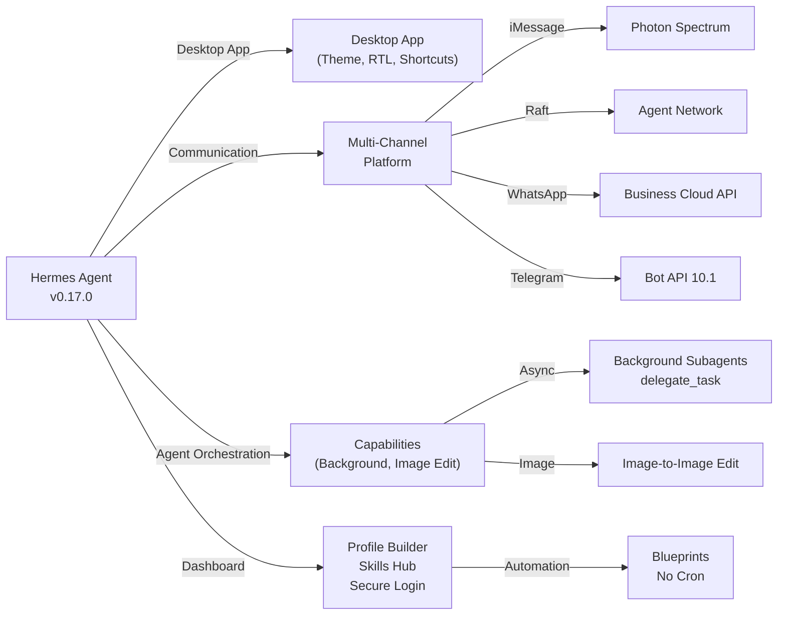
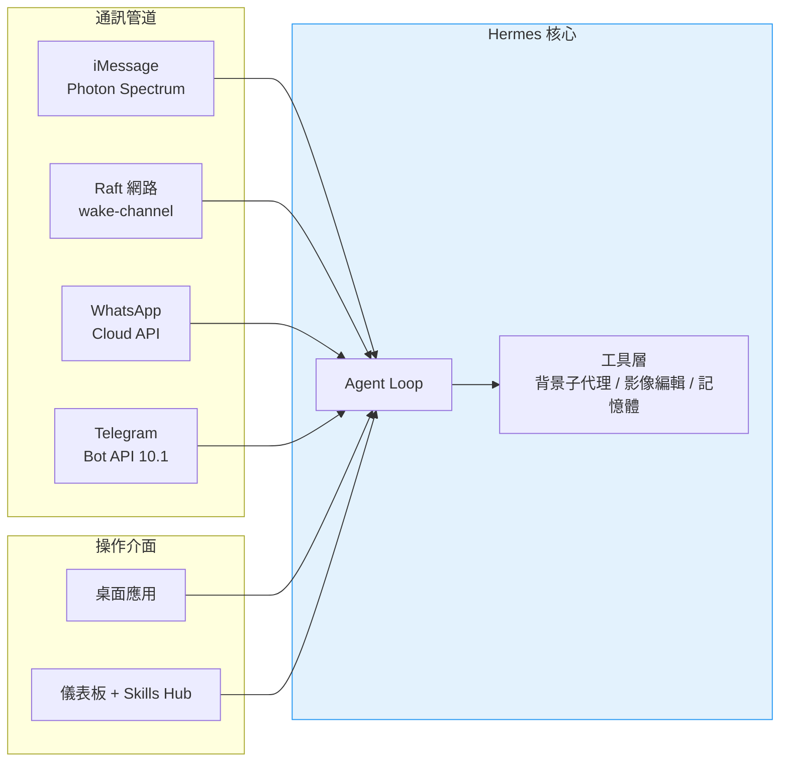
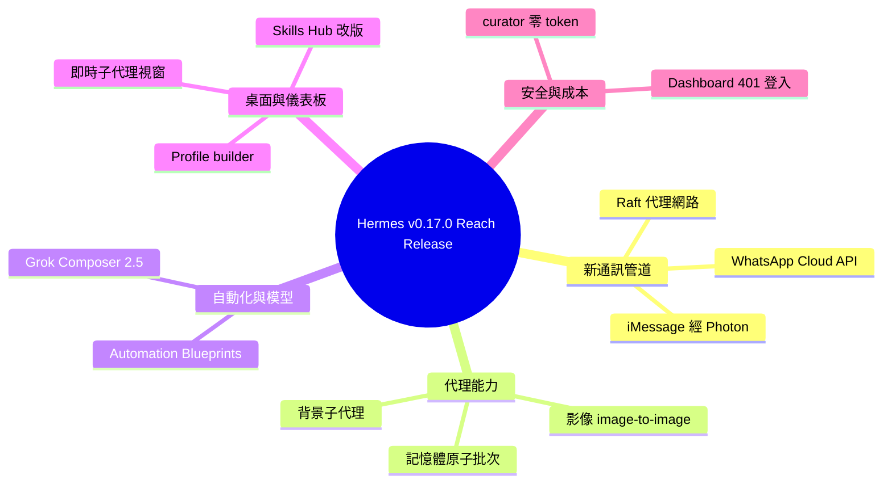

## Hermes Agent v0.17.0 (v2026.6.19)

Hermes Agent v0.17.0（"Reach Release"）是一個涵蓋 1,475+ commits、800+ merged PRs 和 300+ issues 的旗艦版本發布，重點擴展通訊渠道和 agent 能力。通訊層面新增三個重要管道：iMessage 無中繼支援（基於 Photon Spectrum）、Raft agent 網路集成（隱私合約設計、元數據喚醒）和官方 WhatsApp Business Cloud API。核心 agent 能力升級包括 background async subagents（delegate_task(background=true)），允許委派工作同步進行並立即返回 handle；image-to-image 編輯擴展現有的 image_generate 工具；automation blueprints 消除 cron 語法學習曲線，透過互動式表單設置例行工作。桌面應用實現質的提升，新增快捷鍵重綁、原生通知、live subagent watch-windows、VS Code theme 匯入和 RTL/bidi 文本支援。儀表板完整重構包括 profile 構建器、Skills Hub 瀏覽體驗升級和強化安全登入。此版本使 Hermes 成為多通訊聚合和高階 agent 協調的成熟平台。

### 重點
- Background async subagents（delegate_task(background=true)）允許委派工作同步進行，回傳 handle 立即返回，完成時結果重新進入對話
- iMessage 無中繼支援（Photon Spectrum）+ Raft agent 網路集成（隱私合約、元數據喚醒）+ 官方 WhatsApp Business Cloud API
- Automation blueprints 消除 cron 語法學習曲線、image-to-image 編輯、desktop 快捷鍵重綁/原生通知/live subagent watch-windows、profile builder 統一管理

**原文：** [hermes-agent-releases](https://github.com/NousResearch/hermes-agent/releases/tag/v2026.6.19)

---

<!-- deep-analysis:begin -->
## 📌 摘要 (TL;DR)

- NousResearch 於 2026 年 6 月 19 日發布 Hermes Agent v0.17.0（代號「Reach Release」），自 v0.16.0 起累積約 1,475 commits、800 merged PRs、1,693 個檔案變更，關閉 300+ issues，由 245 位社群貢獻者參與。
- 新增兩個通訊管道：基於 Photon Spectrum 的 iMessage（不需 Mac 中繼或 BlueBubbles 橋接），以及加入 Raft 代理網路（隱私合約設計，喚醒酬載只帶 metadata）。
- 代理能力升級：`delegate_task(background=true)` 可派出背景子代理並立即回傳 handle；`image_generate` 新增影像編輯（image-to-image）；自動化藍圖（Automation Blueprints）讓使用者免學 cron 語法即可排程。
- 模型整合：xAI OAuth 模型選單新增 grok-composer-2.5-fast（Cursor 背後的 Composer 編碼模型），context window 對齊到完整 200k，可直接用 Grok 訂閱而非另開 API key。
- 桌面應用與儀表板大幅成熟：可重綁快捷鍵、原生通知、即時子代理觀察視窗、完整 profile builder、Skills Hub 改版與安全登入。
- 周邊優化：記憶體工具支援原子化批次操作、官方 WhatsApp Business Cloud API、Telegram Bot API 10.1 富文本，curator 例行執行不再花用 aux-model 預算。

## 🎯 核心概念

- **Photon Spectrum**：Photon 提供的代管線路池（managed line pool），讓 Hermes 透過裝置代碼（device code）認證即可收發 iMessage，定位為 BlueBubbles 的後繼方案。
- **Raft 代理網路**：外部代理可透過喚醒管道橋接（wake-channel bridge）喚醒 Hermes 處理訊息；採隱私合約設計（privacy-by-contract），喚醒酬載只含事件 ID、時間戳等 metadata。
- **背景子代理（background subagents）**：委派任務後不阻塞主對話，子代理完成時結果會以新一輪對話自動回流。
- **自動化藍圖（Automation Blueprints）**：一份藍圖定義可在所有介面原生呈現——儀表板表單、CLI/TUI/messenger 的 slash command、與代理的對話、文件目錄。
- **影像編輯（image-to-image）**：在既有的 `image_generate` 工具上擴充來源影像編輯，路由到後端的 edit endpoint。

## 📖 整理分析

### 1. 兩個全新通訊管道
iMessage 透過 Photon Spectrum 的代管線路池接入：執行 `hermes photon login`、以裝置代碼認證後即可收發訊息，不再需要放一台 Mac 跑中繼，也不必維護 BlueBubbles 橋接，主打免費起步、零自架（#32348、#42582、#44713，作者 @teknium1）。另一管道是 Raft：設定 `RAFT_PROFILE` 並啟動橋接後，Raft 可喚醒 Hermes 處理訊息，喚醒酬載只攜帶事件 ID 與時間戳等 metadata、不含訊息內文（#48210）。

### 2. 背景子代理與影像編輯
`delegate_task(background=true)` 會派出在背景執行的子代理並立即回傳 handle，使用者與模型可繼續其他工作，子代理完成後完整結果會以新一輪對話自動插回，適合長時間研究或多步驟建置（#40946、#46968）。同時 `image_generate` 學會 image-to-image：傳入既有影像加上 prompt 即路由到後端 edit endpoint，與 `video_generate` 同一模式，涵蓋所有支援的影像供應商，可做「把 logo 變藍」「去背」「草稿轉算圖」等操作（#48705）。

### 3. 自動化藍圖與 Grok Composer 整合
自動化藍圖消除 cron 語法的學習門檻：選定自動化名稱後 Hermes 以問答方式收集所需參數，「每天早上 8 點新聞簡報」不再需要記憶 `0 8 * * *`；同一份定義在儀表板、CLI/TUI、對話與文件目錄都能原生呈現（#41309）。模型側，xAI OAuth 模型選單新增 grok-composer-2.5-fast——即 Cursor 背後的快速編碼模型 Composer，context window 已對齊到完整 200k；持有 xAI Grok 訂閱者可直接以 OAuth 指向它，無須另開 API key（#47908）。

### 4. 桌面應用大幅強化
v0.16.0 推出桌面應用，v0.17.0 在數十個 PR 中將它深化為日常主力：可重綁的鍵盤快捷鍵、可分類開關的原生 OS 通知、把受委派代理活動串流到獨立窗格的即時子代理觀察視窗（live subagent watch-windows）、含 per-model preset 的 composer 模型選擇器、自動 RTL/bidi 文字方向、可調整大小的 VS Code 主題終端窗格、per-thread 草稿，以及直接安裝任何 VS Code Marketplace 主題（#45866、#40660、#47060 等，作者 @OutThisLife、@teknium1）。

### 5. 儀表板、記憶體與成本優化
儀表板新增完整 profile builder，可在瀏覽器中挑模型、選 skills、掛 MCP server，免手改 `config.yaml`，並把多 profile 管理整合成全機統一檢視與全域切換器（#39084、#44007）；Skills Hub 改版為含 Featured、安裝前完整預覽與逐一安全掃描的瀏覽體驗，來源涵蓋 OpenAI、Anthropic、HuggingFace、NVIDIA（#40384、#43398）。記憶體工具新增 operations 陣列，可針對最終字元預算原子化套用一批 add/replace/remove 編輯（#48507）。安全登入讓所有需 token 的 endpoint 在 OAuth gate 後正確回 401（#42578）。成本上，curator 預設仍清理停用的 skills，但 LLM 驅動的整併不再預設執行，需設定 `curator.consolidate: true` 或執行 `hermes curator run --consolidate` 才啟動，例行背景維護零 token 花費（#47840）。此外也加入官方 WhatsApp Business Cloud API（與既有 Baileys 橋接並存，#44331、#43921）與 Telegram Bot API 10.1 富文本（預設開啟、可關閉，#44829 等）。

## 🧭 架構圖

新增的通訊管道全部匯入 Hermes 核心代理迴圈，並由桌面應用與儀表板兩個操作介面驅動：

## 🧠 Mindmap

<!-- deep-analysis:end -->
### 📄 原文內容

點此展開 / 收合

Hermes Agent v0.17.0 (v2026.6.19) 
 Release Date: June 19, 2026 
 Since v0.16.0: ~1,475 commits · ~800 merged PRs · 1,693 files changed · 235,390 insertions · 50,730 deletions · 300+ issues closed · 245 community contributors 
 
 The Reach Release. v0.16.0 put Hermes on your desktop. v0.17.0 is about how far that reach extends — across new places to talk to it, deeper into the tools you already use, and out to the people running Hermes for a team. Hermes reached two new channels (iMessage via Photon, and the Raft agent network), the desktop app gained substantial new capability, subagents can now run in the background, image generation learned to edit, and Cursor's Composer model is reachable through an xAI Grok subscription. The dashboard got a full profile builder and secure login, the Skills Hub browser was rehauled, the memory tool got a major upgrade, and the curator stopped spending aux-model budget on every routine run. 300+ issues closed ride along, plus a security round. 
 
 ✨ Highlights 
 
 
 Hermes reaches iMessage — Photon Spectrum, no Mac relay required — There's now an iMessage platform plugin built on Photon's managed line pool. Run hermes photon login , authenticate with a device code, and Hermes can send and receive iMessage — no Mac sitting in a closet running a relay, no BlueBubbles bridge to babysit. It's positioned as the successor to BlueBubbles: free to start, nothing to self-host. If your friends and family live in the blue bubbles, Hermes lives there now too. ( #32348 , #42582 , #44713 — @teknium1 ) 
 
 
 Raft — Hermes joins the Raft agent network as a gateway channel — A new bundled Raft platform adapter lets Hermes connect to Raft as an external agent through a wake-channel bridge. Set RAFT_PROFILE , run the bridge, and Raft can wake Hermes to handle messages — with a privacy-by-contract design where wake payloads carry only metadata (event IDs, timestamps), never message bodies. Another surface where Hermes can show up and do work. ( #48210 — @xxchan , @teknium1 ) 
 
 
 A substantially more capable desktop app — v0.16.0 shipped the desktop app; v0.17.0 deepened it across dozens of PRs. Rebindable keyboard shortcuts, native OS notifications with per-type toggles, live subagent watch-windows that stream a delegated agent's activity into its own pane, a composer model selector with per-model presets, automatic RTL/bidi text direction, a resizable VS Code-themed terminal pane, per-thread composer drafts, and the ability to install any VS Code Marketplace theme directly into the app. The desktop is now a serious daily driver, not a preview. ( #45866 , #40660 , #47060 , #46959 , #43292 , #44596 — @OutThisLife , @teknium1 ) 
 
 
 Background / async subagents — delegate work and keep going — delegate_task(background=true) now dispatches a subagent that runs in the background and returns a handle immediately. You and the model keep working while it churns, and the full result re-enters the conversation as a new turn the moment it finishes. Kick off a long research dive or a multi-step build, then carry on with something else instead of sitting blocked waiting on it. ( #40946 , #46968 — @teknium1 ) 
 
 
 Edit images, not just generate them — image-to-image in image_generate — image_generate can now edit and transform a source image, not only create one from scratch. Pass an existing image and a prompt and it routes to the backend's edit endpoint (same tool, same pattern as video_generate ), across every supported image provider. "Make this logo blue," "remove the background," "turn this sketch into a render" — all from the tool you already use. ( #48705 — @teknium1 ) 
 
 
 Automation Blueprints — schedule things without learning cron — Pick an automation by name and Hermes asks you for what it needs — no cron syntax, no slot=value typing. One blueprint definition renders natively on every surface: a form in the dashboard, a slash command in the CLI/TUI/messenger, a conversation with the agent, an entry in the docs catalog. "Daily news briefing at 8am" becomes a thing you set up by answering questions, not by memorizing 0 8 * * * . ( #41309 — @teknium1 ) 
 
 
 Cursor's Composer model, through your xAI Grok subscription — grok-composer-2.5-fast is now in the xAI OAuth model picker, with its context window reconciled to the full 200k. Composer is the fast coding model behind Cursor — and if you have an xAI Grok subscription, you can now point Hermes at it directly over OAuth, no separate API key. Your Grok plan, Hermes's agent loop, Composer's coding speed. ( #47908 , #6f89e17 — @teknium1 ) 
 
 
 Full profile builder in the dashboard — Build a complete Hermes profile from the browser — pick its model, choose its skills, attach its MCP servers — without hand-editing config.yaml . The dashboard also unified multi-profile management into one machine-wide view with a global profile switcher, so you manage every profile from a single place. ( #39084 , #44007 — @teknium1 ) 
 
 
 Skills Hub browser rehaul — The dashboard's Skills Hub got a ground-up rework: connected hubs, a Featured section, full skill previews before you install, and a security scan on each skill. Browsing and installing skills from the trusted taps (OpenAI, Anthropic, HuggingFace, NVIDIA) is now a real browsing experience, not a flat list. ( #40384 , #43398 — @teknium1 ) 
 
 
 The memory tool got a major upgrade — atomic batch operations — The memory tool gained an operations array that applies a batch of add/replace/remove edits atomically against the final character budget . The model can free up space and add new entries in a single call — even when an add alone would overflow the budget — collapsing what used to be a fragile multi-turn dance into one reliable operation. Memory updates are now faster and far less likely to fail mid-edit. ( #48507 — @teknium1 ) 
 
 
 Secure dashboard login — The dashboard's authentication was hardened: every token-required endpoint now correctly returns 401 behind the OAuth gate, websocket auth uses the served dashboard token, and a warning fires when a public_url override is silently rejected. Exposing your dashboard to the network is safer by default. ( #42578 , #42578 — @benbarclay , @teknium1 ) 
 
 
 Official WhatsApp Business Cloud API adapter — Alongside the existing Baileys bridge, Hermes now speaks the official WhatsApp Business Cloud API — Meta's first-party, hosted, no-bridge-process path. Point it at your Business API credentials and Hermes talks WhatsApp through the supported channel, with no QR-scanning bridge process to keep alive. ( #44331 , #43921 — @jquesnelle , @teknium1 ) 
 
 
 Rich text for Telegram — Bot API 10.1 rich messages — Telegram replies now render as proper rich messages via Bot API 10.1: better formatting, cleaner long-message handling, native markup instead of flattened text. It's on by default with an opt-out, so your Telegram conversations look the way they should without any configuration. ( #44829 , #45584 , #45953 — @teknium1 ) 
 
 
 Curator cost optimization — no aux-model spend on routine runs — The skill curator now prunes stale skills by default but no longer runs its LLM-powered consolidation pass unless you opt in ( curator.consolidate: true or hermes curator run --consolidate ). The deterministic inactivity sweep keeps running for free; the opinionated, aux-model-spending "build umbrella skills" fork is now off by default. Routine background curation costs you zero tokens . ( #47840 — @teknium1 ) 
 
 
 🖥️ Hermes Desktop App 
 New surfaces &amp; UX 
 
 Rebindable keyboard shortcuts panel; native OS notifications with per-type toggles; curated turn-completion cue + dismissable error banners ( #40660 , #45866 , #42480 , #47985 — @OutThisLife , @teknium1 ) 
 Live subagent watch-windows — stream a delegated agent's activity into its own pane; composer status stack + editable prompts; open any chat in its own window; new-session-in-compact-window hotkey ( #47060 , #44630 , #43219 , #46951 — @OutThisLife , @teknium1 ) 
 Composer model selector + per-model presets + external-provider disconnect; surface every provider/model from hermes model in the GUI; unify provider list to one source; warn when a main-model switch leaves auxiliary tasks pinned elsewhere ( #46959 , #40563 , #49080 , #40286 — @teknium1 , @OutThisLife ) 
 Install any VS Code Marketplace theme ; assignable themes per profile; window translucency slider; unified overlay design system + BrandMark + onboarding redesign ( #43292 , #42286 , #45086 , #40708 — @teknium1 , @OutThisLife ) 
 Resizable VS Code-themed terminal pane + palette polish; auto-detect RTL/bidi text direction in chat; Mac-style session switcher (^Tab / ^1-9); worktree-aware sidebar grouping; hover-reveal collapsed sidebars; messaging source folders in sidebar ( #42521 , #44596 , #43111 , #45273 , #41670 , #41751 — @OutThisLife ) 
 Arrow-key history + queue editing in composer; expand full command inline from the approval bar; follow-streaming-at-bottom + jump-to-bottom button; first-class cron jobs in the sidebar + dashboard scheduler ( #40234 , #44864 , #45263 , #40684 — @OutThisLife , @teknium1 ) 
 Desktop pets — pop-out overlay + notifications ( #47938 — @teknium1 ) 
 Full tool-backend config (pickers + per-backend settings) in Settings; run tool-backend post-setup installs from the GUI; uninstall the Chat GUI without removing the agent; Shift+click status-bar zap to toggle YOLO globally; /browser connect on a local gateway ( #41232 , #40559 , #40355 , #41666 , #47245 — @teknium1 , @OutThisLife ) 
 Japanese + Traditional Chinese language switching ( #40114 ) 
 "Restart gateway" action (renamed from "Restart messaging") surfaced in the statusbar + on messaging save/toggle toasts; rendered logs are selectable/copyable ( #49094 — @OutThisLife ) 
 
 Remote-gateway &amp; multi-profile 
 
 Remote media relay — attach images/PDFs and display agent-written images over the network for the first time; remote-gateway file attachments via file.attach ( #41336 , #42634 — @teknium1 ) 
 Client + backend version buttons + remote-backend update flow; browse remote backend files; route global-remote profile REST calls; recover chat after sleep/wake by revalidating a stale remote backend ( #42181 , #44326 , #47011 , #41350 — @OutThisLife , @teknium1 ) 
 Multi-profile fallout cleanup — WS auth + cross-profile session reads; release profile backends before delete; scope session list/model switch/timer per session ( #44529 , #42613 , #41103 , #41120 , #41182 — @OutThisLife , @teknium1 ) 
 Stream subagent activity into watch windows; keep streaming painting in unfocused secondary chat windows; recover stranded session windows ( #47060 , #47919 , #47655 — @OutThisLife ) 
 
 📊 Web Dashboard 
 
 Full-featured profile builder (model + skills + MCPs); unify multi-profile management — one machine dashboard + global profile switcher; profile-scoped skills &amp; toolsets; session switcher panel on the Chat tab ( #39084 , #44007 , #43808 , #49077 — @teknium1 ) 
 Skills hub browser rehaul — connected hubs, featured, preview + security scan; SKILL.md editor on Skills page + attach-skill selector in cron modals; full per-MCP catalog detail; full tool-backend config in the GUI ( #40384 , #44231 , #48520 , #40418 — @teknium1 ) 
 Enable webhooks from the Webhooks page; idempotent hermes dashboard register ; auto-restart gateway after Telegram QR onboarding; file browser; change UI font from the theme picker; reasoning-effort picker in the chat sidebar ( #44021 , #42455 , #43424 , #43512 , #41145 , #49141 — @teknium1 ) 
 
 🏗️ Core Agent &amp; Architecture 
 God-file refactor wave (run_agent.py / cli.py / gateway/run.py) 
 
 cli.py main() 3297 → 954 lines — extracted 28 subcommand parsers into hermes_cli/subcommands/ , then promoted 9 closure handlers; 32 slash-command handlers → CLICommandsMixin ; 18 model-flow wizard functions → model_setup_flows ; agent-construction cluster → CLIAgentSetupMixin ( #41798 , #41835 , #41942 , #4

[... truncated for safety ...]

