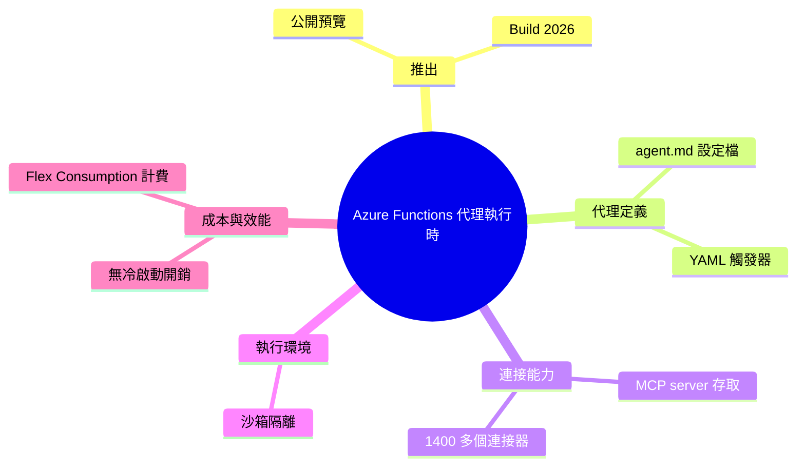

## Azure Functions Ships Serverless Agents Runtime at Build 2026

Microsoft Azure Functions 在 Build 2026 推出無伺服器代理執行時（公開預覽）。代理定義使用 .agent.md markdown 檔案搭配 YAML 觸發器，提供 MCP server 存取、1,400+ 內建連接器、沙箱執行環境。Azure Functions 團隊確認該執行時無冷啟動開銷，計費模式與標準 Flex Consumption 一致，無額外成本。

### 重點
- .agent.md 配置創新：以 markdown + YAML 簡化代理定義，降低配置複雜度
- 生態豐富度：1,400+ 連接器、MCP server 擴展支援、沙箱隔離執行
- 成本效能最優化：零冷啟動、無額外計費（Flex Consumption），降低代理部署門檻

**原文：** [infoq-ai-ml](https://www.infoq.com/news/2026/06/azure-functions-serverless-agent/?utm_campaign=infoq_content&utm_source=infoq&utm_medium=feed&utm_term=AI%2C+ML+%26+Data+Engineering)

---

<!-- deep-analysis:begin -->
## 📌 摘要 (TL;DR)

- Microsoft 在 Build 2026 開發者大會推出 Azure Functions 的無伺服器代理執行時（serverless agents runtime），目前為公開預覽（public preview）。
- 代理（agent）以 `.agent.md` markdown 檔定義，搭配 YAML 觸發器（trigger）描述啟動條件，把「代理定義」變成可版本控管的宣告式設定檔。
- 執行時內建 MCP server 存取、超過 1,400 個連接器（connector），以及沙箱（sandboxed）執行環境。
- Azure Functions 團隊向 InfoQ 確認：此執行時沒有冷啟動（cold start）額外開銷。
- 計費沿用標準的 Flex Consumption 方案，相較既有 Functions 不額外加價。
- 報導作者為 Steef-Jan Wiggers，來源為 InfoQ。

## 🎯 核心概念

- **無伺服器代理執行時（serverless agents runtime）**：在 Azure Functions 上直接託管 AI 代理的執行環境，開發者免自管伺服器。
- **`.agent.md`**：用 markdown 檔定義代理的設定格式，搭配 YAML 觸發器設定啟動條件。
- **模型情境協定（Model Context Protocol，簡稱 MCP）**：讓 AI 代理以標準化方式連接外部工具與資料來源的協定。
- **連接器（connector）**：預先整合好的外部服務／資料來源接點，文中稱有 1,400+ 個可用。
- **冷啟動（cold start）**：無伺服器函式在閒置後首次被呼叫時的啟動延遲；文中強調此執行時無此額外開銷。
- **Flex Consumption**：Azure Functions 既有的計費／裝載方案，此代理執行時沿用同一計費模式。

## 📖 整理分析

### 1. 用 markdown 定義代理
報導指出，代理以 `.agent.md` markdown 檔搭配 YAML 觸發器來定義。意義在於把代理的行為與啟動條件寫成宣告式設定檔，可進版本控管、可被審閱，降低用程式碼從零搭建代理的門檻。（註：原文僅說明定義方式，未公開 `.agent.md` 的完整欄位規格。）

### 2. MCP 與 1,400+ 連接器
執行時提供 MCP server 存取，並內建超過 1,400 個連接器。MCP 讓代理用標準化方式取用外部工具與資料；大量連接器則代表代理可直接串接既有 SaaS 與資料來源，而不必為每個整合各寫一套介接。

### 3. 沙箱執行環境
代理在沙箱環境中執行。對於會自動呼叫工具、執行外部動作的 AI 代理而言，沙箱隔離是控管權限、降低風險的基礎機制。（原文僅點出「sandboxed execution」，未詳述隔離邊界細節。）

### 4. 無冷啟動、無額外計費
Azure Functions 團隊向 InfoQ 確認兩個關鍵點：執行時不帶來冷啟動額外開銷，且計費沿用標準 Flex Consumption、無額外加價。對開發者而言，這代表把代理跑在此執行時，延遲與成本模型與既有無伺服器函式一致，不需為「代理」這個身分多付費。

## 🧠 Mindmap

<!-- deep-analysis:end -->
### 📄 原文內容

點此展開 / 收合

Azure Functions shipped a serverless agents runtime in public preview at Build 2026. Agents are defined in .agent.md markdown files with YAML triggers, MCP server access, 1,400+ connectors, and sandboxed execution. The Functions team confirmed to InfoQ that the runtime adds no cold start overhead and no billing premium beyond standard Flex Consumption. By Steef-Jan Wiggers

