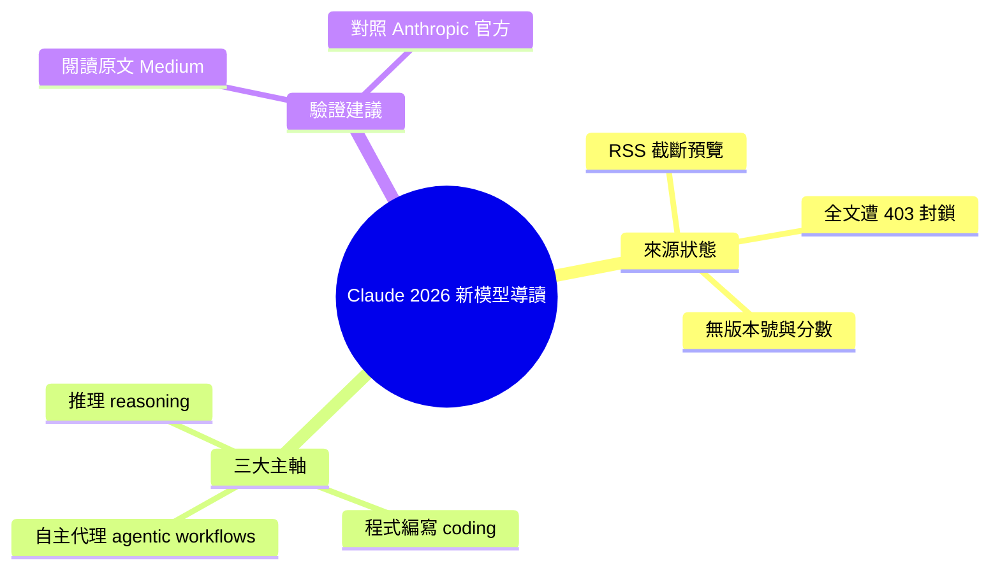

## Claude’s newest models: what you need to know in 2026

Anthropic 2026 年最新 Claude 模型系列推出三大核心改進。首先，推理能力顯著提升，使複雜邏輯推導和多層次問題求解精準度大幅提高。其次，編碼能力進一步進化，支援更複雜的軟體工程任務和高難度程式碼生成。第三，新增自主代理工作流程功能，能協調多步驟自動化任務執行。這些改進對依賴 AI 輔助編程、自動決策和問題求解的開發團隊與企業具有深遠實踐意義。

### 重點
- 推理能力提升：複雜邏輯推導與多層次問題求解的精準度優化
- 編碼能力進化：支援進階軟體工程任務和複雜程式碼生成能力
- 自主代理工作流程：新增多步驟自動化任務協調與執行功能

**原文：** [medium-tag-claude](https://medium.com/@krishna.kaloni09/claudes-newest-models-what-you-need-to-know-in-2026-28f923d3fe6c?source=rss------claude-5)

---

<!-- deep-analysis:begin -->
## 📌 摘要 (TL;DR)

- ⚠️ **來源限制（重要）**：本則為 Medium 文章（作者 krishna.kaloni09）的 RSS 截斷預覽，原文位於 Medium 登入／付費牆後。多次嘗試抓取全文皆被阻擋（Medium 直連回 HTTP 403、Jina reader 被 robots.txt 封鎖、鏡像站連線失敗），以下僅依「可確認的預覽段落」整理，不含原文未提供的細節。
- 文章主題：盤點 Anthropic 在 2026 年推出的最新 Claude 模型，定位為一篇「你需要知道的重點」導讀。
- 預覽段落點名三項主要進展：更強的推理能力（stronger reasoning）、更進階的程式編寫能力（advanced coding abilities）、以及自主代理工作流程（autonomous agent workflows）。
- 預覽段落**未提供**任何具體版本號、benchmark 分數、發布日期或定價；這些可能存在於被截斷的全文中，但無法從現有來源證實，故本文不臆測補充。
- 為什麼值得關注：這三條主軸正是 2025–2026 年 LLM 競爭的核心戰場（推理深度、程式自動化、agentic 工作流），可作為追蹤 Claude 路線圖的方向性指標；若需精確數據，建議直接開啟原文或對照 Anthropic 官方公告。

## 🎯 核心概念

（以下為文章點名之三個能力領域的通用定義，用以理解術語，**非原文逐字內容**）
- **推理能力**（reasoning）：模型進行多步邏輯推導、規劃與問題拆解的能力。
- **程式編寫能力**（coding）：理解需求並生成、修改、除錯程式碼，處理軟體工程任務的能力。
- **自主代理工作流程**（autonomous agent workflows）：模型能自主規劃並串接多個步驟、呼叫工具完成任務，而非單次問答；對應業界常說的 agentic workflow。

## 📖 整理分析

### 1. 文章定位與可確認範圍
這是一篇 2026 年的 Claude 模型導讀文，標題承諾說明「最新模型你該知道什麼」。但透過 RSS 取得的內容僅有一句導言，原文主體在 Medium 牆後無法擷取。因此以下各節只能還原導言點名的三大主軸，無法補充原文細節；任何超出此範圍的數字或宣稱皆無來源佐證。

### 2. 主軸一：更強的推理
導言指出新模型帶來「stronger reasoning」。在現有來源中，這是一句方向性宣稱，未附任何 benchmark 數字或對比前代的量化幅度。先前產出的 brief 摘要將其延伸為「複雜邏輯推導與多層次問題求解精準度提高」——屬合理推測，但非導言原文，請勿視為確定事實。

### 3. 主軸二：進階程式編寫
導言指出新模型具備「advanced coding abilities」。同樣僅為定性描述，未在可取得內容中說明支援哪些語言、工具整合或測試分數。此方向呼應 Claude 系列一貫主打的 coding 應用場景定位。

### 4. 主軸三：自主代理工作流程
導言點名「autonomous agent workflows」，顯示文章將 agentic 能力列為本次更新重點之一。可確認的僅止於「此主題被提及」；具體的代理架構、工具呼叫機制或多步驟協調細節，在現有來源中缺席。

### 5. 如何取得完整且可信的資訊
由於關鍵數據（版本、分數、日期、定價）皆不在可取得內容中，若要深入，需直接造訪原文 URL 並登入 Medium。更穩妥的做法是改以 Anthropic 官方公告或 release notes 作為一手來源交叉查證，避免把二手導讀的定性描述當成確定事實。

## 🧠 Mindmap

<!-- deep-analysis:end -->
### 📄 原文內容

點此展開 / 收合

Anthropic&#x2019;s latest AI models bring stronger reasoning, advanced coding abilities, and autonomous agent workflows. Continue reading on Medium »

