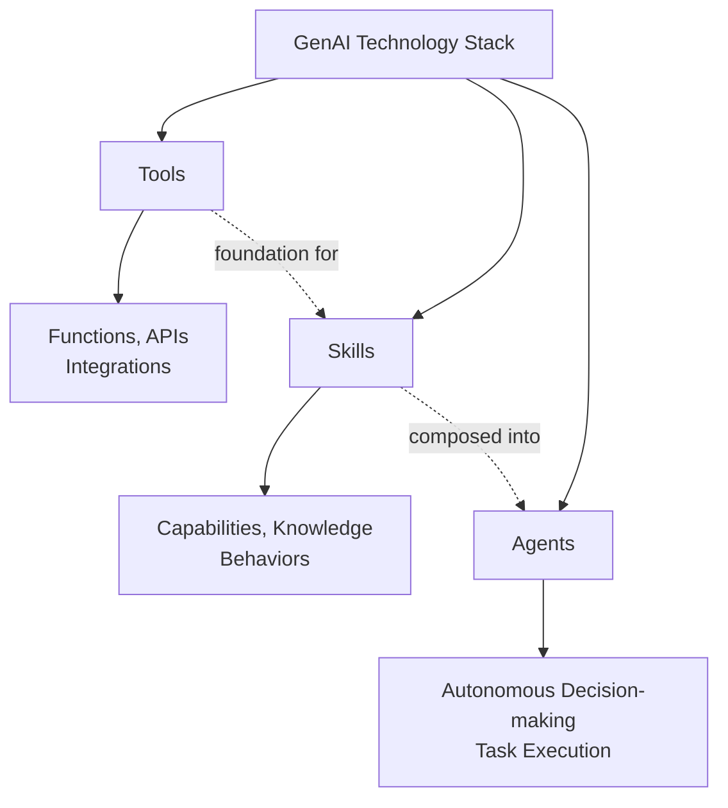
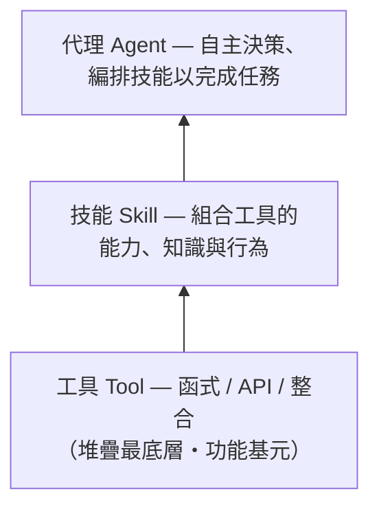
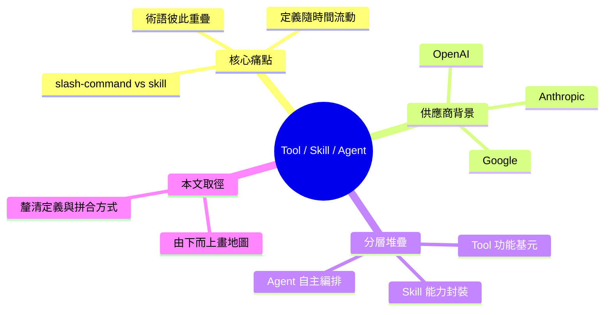

## Is This a Tool, a Skill, or an Agent?

該文提供 Generative AI 技術棧的概念地圖，系統釐清「Tool」「Skill」「Agent」三概念的區別與層級關係。Tool 為技術基層，提供函數、API 和整合能力；Skill 在 Tool 基礎上構建，代表系統的特定能力、知識與行為；Agent 則為高層自主決策與任務執行單位。作者通過此分層框架幫助開發者在實際應用中正確選擇、組合各層元件，對設計 AI-driven 系統架構至關重要。

### 重點
- 三層架構清晰區分：Tools（工具層）、Skills（能力層）、Agents（自主層）各司其職
- 層級組合關係：Tool 為基礎函數集，Skill 整合 Tool 構建能力，Agent 協調 Skill 執行任務
- 架構決策工具：掌握層級關係是正確設計 AI 系統的必要前提

**原文：** [medium-tag-claude](https://itnext.io/is-this-a-tool-a-skill-or-an-agent-b3cc78c66673?source=rss------claude-5)

---

<!-- deep-analysis:begin -->
## 📌 摘要 (TL;DR)

- 作者 **Dave Taubler** 在 ITNext（Medium）發表〈Is This a Tool, a Skill, or an Agent?〉，22 分鐘閱讀、會員限定文；目標是把快速演變、彼此重疊的生成式 AI 術語「Tool / Skill / Agent」拆解清楚，並從技術堆疊（stack）最底層由下而上畫出一張地圖。
- 作者點出的痛點：OpenAI、Anthropic、Google 等供應商幾乎每週都丟出新「東西」，這些概念互相重疊——他舉的實例是「你是否寫過斜線指令（slash-command），事後卻懷疑它其實該寫成 skill？」。
- 更棘手的是，定義本身會隨週月流動：作者直言「去年算 AI agent 的東西，今天可能已經不符合那個定義」，且多數解釋文都預設你已懂底層概念。
- 文章的整理框架（依標題、副標與既有摘要）：最底層是工具（Tool，函式／API／整合等功能基元），往上是技能（Skill，組合工具的特定能力、知識與行為），最上層是代理（Agent，自主決策與編排任務的單位）。
- 為什麼值得讀：開發者每天都在「這該做成 tool、skill 還是 agent？」之間抉擇，一個清楚的分層心智模型能避免把編排邏輯硬塞進工具、或把單純函式過度包裝成 agent。
- ⚠️ 來源限制：本文為 Medium 會員限定，僅開頭導論可公開存取。以下分析以「可驗證的導論原文 + 既有 brief 摘要」為依據；付費內文中逐層的精確命名、具體範例與圖表無法讀取，未予杜撰。

## 🎯 核心概念

- **生成式 AI（Generative Artificial Intelligence，GenAI）**：作者特別強調社群對其周邊術語「尚未達成共識」，定義仍在變動。
- **工具（Tool）**：可被模型呼叫的功能基元，如函式、API、整合；位於堆疊最底層。
- **技能（Skill）**：建立在工具之上、封裝特定能力、知識與行為的單元。
- **代理（Agent）**：能自主決策、編排技能以完成任務的最上層單位；作者明指其定義近一年已明顯改變。
- **斜線指令（slash-command）**：作者用「該寫成 slash-command 還是 skill」作為術語重疊、難以分辨的具體例子。

## 📖 整理分析

### 1. 為何這些術語讓人混亂
作者開篇指出 AI 進展太快，OpenAI、Anthropic、Google「或其他供應商」幾乎每週都推出需要跟上的新「東西」，而這些「東西」開始彼此重疊。他用一個開發者很有感的例子收束：寫了一個斜線指令，事後卻懷疑它是否該寫成 skill——說明邊界並不清楚。

### 2. 定義本身會隨時間流動
作者強調混亂不只來自重疊，還來自「定義會隨週月變化」。他以 agent 為例：去年被視為 AI agent 的東西，按今天的標準可能已不算。他並批評坊間多數解釋文都預設讀者已具備底層概念，對「正在實際使用這些東西的人」格外令人挫折。

### 3. 本文方法：由下而上畫一張 stack 地圖
副標題即點明全文定位——「A map of the Generative AI stack, and how everything fits」。作者宣告要「從堆疊最底層開始」逐層往上拆解、釐清定義並說明各組件如何拼合。（可公開存取的導論在進入第一層說明時即被付費牆截斷。）

### 4. 三層框架的選型直覺（Tool → Skill → Agent）
依標題與既有摘要可還原的分層關係：工具是被呼叫的功能基元、技能在其上把工具組合成可重複的能力與行為、代理在最上層做自主決策並編排技能。對應到實務選型的直覺是：純函式／API 呼叫 → Tool；要封裝知識與固定行為的「能力」 → Skill；需要自主規劃、多步驟執行 → Agent。（此層級的精確措辭出自摘要與堆疊結構推得，非引用付費內文。）

## 🧭 流程圖 / 架構圖

作者主張由下而上理解整個堆疊，可整理為三層：

## 🧠 Mindmap

<!-- deep-analysis:end -->
### 📄 原文內容

點此展開 / 收合

A map of the Generative AI stack, and how everything fits Continue reading on ITNEXT »

