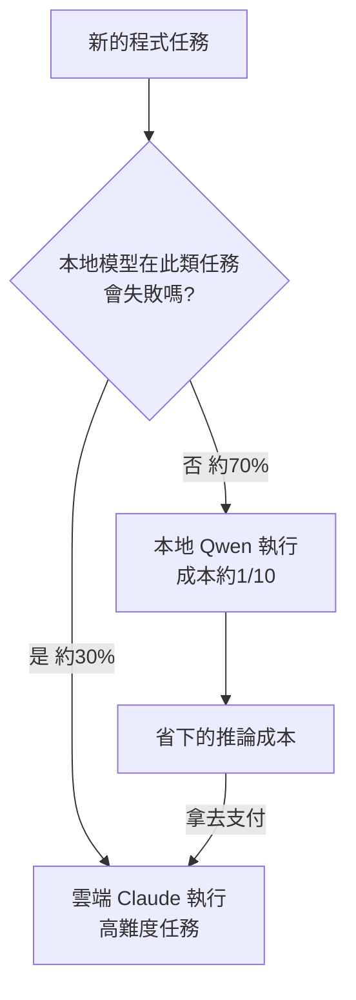
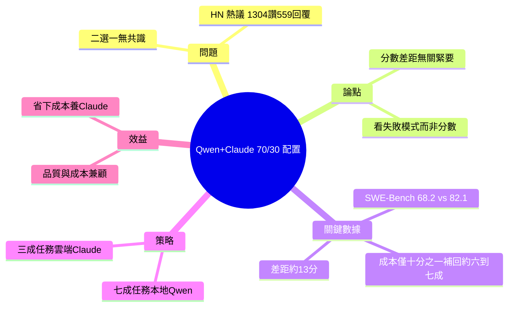

## Stop Choosing Between Qwen and Claude. The 70/30 Split That Pays for Both.

該文提出實務策略：不必在 Qwen 和 Claude 間二選一，而應採用 70/30 組合配置，根據各模型的實際失敗模式（而非 benchmark 分數）分配工作負載。作者指出 benchmark gap 相對無關緊要，真正決策依據應是理解各模型的實際限制所在。採用組合策略反而能同時支付兩個模型的成本，達成成本效益與性能的最佳平衡。此一做法對開發團隊選擇模型架構具有重要實踐指導價值。

### 重點
- 70/30 組合配置：根據任務特性分配 Qwen 和 Claude 的使用比例，而非單一模型忠誠度
- 以失敗模式決策優於 benchmark：理解各模型的實際任務限制，比分數排名更有用
- 成本效益反轉：組合策略反而比單一旗艦模型更經濟且靈活

**原文：** [medium-tag-claude](https://deshpandetanmay.medium.com/stop-choosing-between-qwen-and-claude-the-70-30-split-that-pays-for-both-9e24b2be5bd6?source=rss------claude-5)

---

<!-- deep-analysis:begin -->
## 📌 摘要 (TL;DR)

- 作者 Tanmay Deshpande 在 Medium 主張：不要在 Qwen 與 Claude 之間二選一，而是用「70/30 配置」同時使用兩者——本地模型承接大宗任務，雲端 Claude 只處理本地模型會失敗的少數任務。
- 核心論點：基準測試（benchmark）的分數差距「真實、可量測，但幾乎無關緊要」；真正該看的是各模型在哪裡失敗，而非它考幾分。
- 具體數據：文中稱 Qwen3.6 在 SWE-Bench Verified 落後 Claude Opus 約 13 分（68.2 vs 82.1），但以約十分之一的成本補回其中 60–70% 的差距。
- 開場引用 Hacker News 本月最熱門的程式問題「有人用本地模型取代 Claude 來日常寫程式了嗎？」——1,304 讚、559 則回覆、零共識，凸顯此題爭議之大。
- 「pays for both」的意涵：把 70% 任務放本地、以低成本執行所省下的錢，足以支付剩下 30% 高難度任務的 Claude 費用，等於讓兩個模型互相養活。
- ⚠️ 此文為 Medium 會員限定，詳細任務分類與成本回收算式受付費牆保護、無法完整取得；本整理僅依標題、副標、開頭可見段落與已揭露數據撰寫。

## 🎯 核心概念

- **基準測試差距（benchmark gap）**：模型在標準測試上的分數落差；作者認為它可量測卻近乎無關。
- **失敗模式（failure modes）**：模型實際出錯的地方與型態；作者主張用它（而非分數）來決定任務該放雲端還是本地。
- **SWE-Bench Verified**：衡量模型解真實 GitHub issue 能力的程式基準；文中用來比較 Qwen3.6 與 Claude Opus。
- **本地模型（local model）**：在自有硬體上執行的開源模型（此處指 Qwen），成本約為雲端的十分之一。

## 📖 整理分析

### 1. 問題：本地模型能取代 Claude 嗎
作者以 Hacker News 本月最高票的程式討論開場——「有人用本地模型取代 Claude 來日常寫程式了嗎？」獲 1,304 讚、559 則回覆，卻「零共識」。這顯示開發者社群對「二選一」的答案高度分歧，正是本文要打破的框架。

### 2. 論點：分數差距真實但無關緊要
文章點出 Qwen3.6 在 SWE-Bench Verified 得 68.2，落後 Claude Opus 的 82.1 約 13 分；但作者強調這差距「真實、可量測、卻幾乎不重要」，因為本地模型能以約十分之一的成本補回其中 60–70% 的落差。決策依據應從「分數」轉向「各模型在什麼任務上會失敗」。

### 3. 解法：70/30 配置，而非二選一
標題揭示的策略是「70/30 split」：把工作負載拆成兩塊——本地模型（Qwen）承接大宗、可靠完成的任務；Claude 留給本地會失敗的少數高難度任務。配置比例的依據是實測的失敗模式，而非排行榜分數。

### 4. 為何「能同時養活兩者」
「the 70/30 split that pays for both」的邏輯是：70% 任務在本地以約 1/10 成本執行，省下的費用足以支付剩餘 30% 任務的 Claude 用量。於是不必犧牲品質、也不必只付一邊的錢，兩個模型反而互補共存。

### 5. 取得範圍與限制（重要）
本文為 Medium 會員限定文章，原文 RSS 僅提供截斷引言；正文（含詳細任務分類、完整失敗模式清單、成本回收試算）受付費牆保護而無法完整取得。以上整理皆來自可驗證的標題、副標、開頭段落與已揭露數據，文中未明列的具體任務分配清單恕不臆測補完。

## 🧭 流程圖：70/30 任務路由

依文章論點還原的決策流程（節點比例為文章框架，非逐項清單）：

## 🧠 Mindmap

<!-- deep-analysis:end -->
### 📄 原文內容

點此展開 / 收合

The benchmark gap is real and almost irrelevant. What local models fail at, not what they score, tells you which tasks to keep in the&#x2026; Continue reading on Medium »

