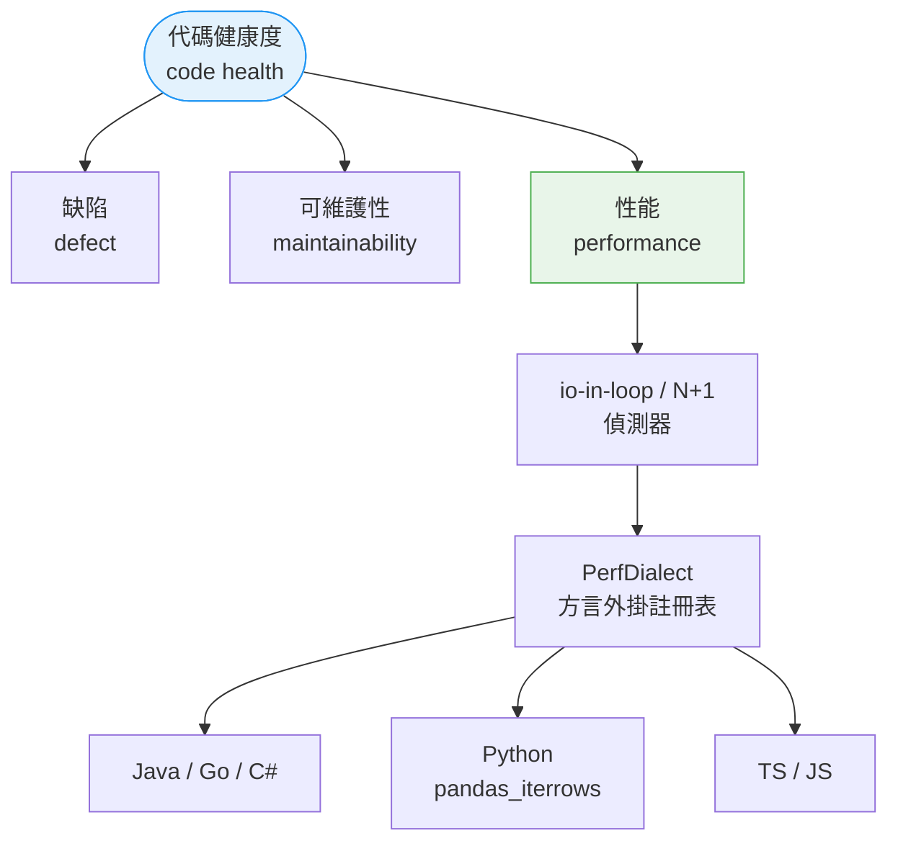
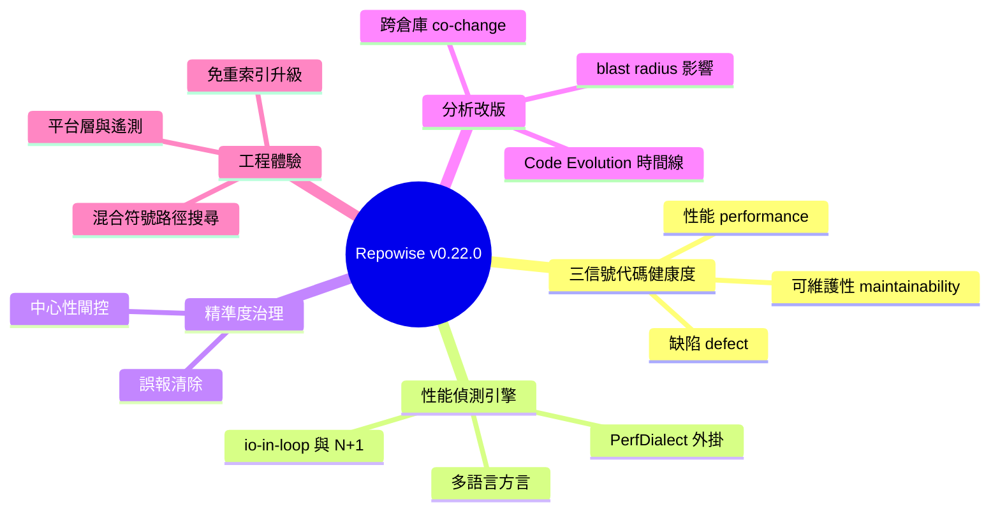

## v0.22.0

Repowise v0.22.0 推出「三信號 Code Health 框架」重大版本。首次將代碼健康度分解為三個獨立且等權的維度：缺陷（defect）、可維護性（maintainability）、性能（performance），各維度單獨評分與配置。新增多語言性能檢測方言覆蓋 Java、Go、C#、Python、Rust，引入語言特定標記如 pandas_iterrows_in_loop。新增確定性重構檢測（Extract Class、Extract Helper 等）。Code Evolution 時間線為 headline、churn × complexity 象限識別高風險檔案、per-file 健康度時序追蹤。Cross-repo co-change 聚合、blast radius 分析。新增 MCP-native AI prompt 風格、hybrid symbol/path 搜尋。支援無重索引升級、平台層與匿名遙測。

### 重點
- 三信號框架：health = {defect, maintainability, performance} 各維度獨立評分且可配置閾值，改變健康度認知模式
- 多語言性能檢測覆蓋 Java、Go、C#、Python、Rust，支援循環層級標記與 centrality-gating 避免誤報
- Code Evolution 時間線、churn × complexity 象限、cross-repo blast radius，支援 per-file 健康度時序與人員/流程/拓撲信號

**原文：** [repowise-releases](https://github.com/repowise-dev/repowise/releases/tag/v0.22.0)

---

<!-- deep-analysis:begin -->
## 📌 摘要 (TL;DR)

- Repowise v0.22.0（PR #566）是重大版本，主軸是把代碼健康度（code health）從單一分數拆成「缺陷、可維護性、性能」三個獨立且等權的信號（#528、#531、#533），並在 Web UI 將性能列為共同支柱（#544）。
- 新增性能偵測引擎：偵測迴圈內 I/O（io-in-loop，#530）與跨函式 N+1 查詢（#532），抽象成 PerfDialect 方言外掛註冊表（plugin registry，#536），覆蓋 Java、Go、C#（#537）、Python（pandas_iterrows_in_loop，#542）與 TypeScript/JavaScript（#545）。
- 以中心性閘控（centrality-gated）標記加上可複用的嚴重度排序器（#539），並消除 C#／Go／Python 三類誤報（#540），同步兼顧召回與精準度。
- 提交與影響分析全面改版：Code Evolution 時間線升為主視覺（#549）、重新設計 blast-radius 影響分頁（#550）、owners 以知識分佈為標題（#551），並新增跨倉庫共同變更（co-change）依倉庫配對聚合與下鑽（#543，由首位外部貢獻者 @d3vpool 提交）。
- 工程體驗升級：search_codebase 支援符號與路徑混合搜尋（#558）、MCP-native 的 AI 提示風格（#546）、儲存格式版本化達成免重索引升級（#553）、中央平台層與可退出的匿名遙測（#555）。

## 🎯 核心概念

- **三信號代碼健康度**（three-signal code health）：把健康度拆成 defect、maintainability、performance 三個共同等權維度，各自評分與設定。
- **迴圈內 I/O**（io-in-loop）／ **N+1**：在迴圈中重複呼叫 I/O 或資料庫查詢的效能反模式，v0.22.0 連跨函式的情況也能偵測。
- **PerfDialect 方言外掛註冊表**（PerfDialect plugin registry）：把各語言的性能偵測規則抽成可插拔外掛，方便逐語言擴充。
- **中心性閘控**（centrality-gated）：依符號在程式碼圖中的中心性決定是否標記，避免在邊緣程式碼產生雜訊。
- **共同變更**（co-change）／ **影響半徑**（blast radius）：前者指常一起被修改的檔案、可跨倉庫聚合；後者指一處改動會波及的範圍。

## 📖 整理分析

### 1. 代碼健康度拆成三個信號
過去 code health 是單一綜合分數，v0.22.0 將它切分為缺陷（defect）、可維護性（maintainability）、性能（performance）三個獨立維度：先做計分切分（#528），接著把可維護性列為第二信號（#531），再把性能列為共同等權的第三支柱（#533），最後在 Web UI 同步呈現（#544）。三者分開評分與設定，讓使用者能各別追蹤，不再被單一數字掩蓋問題。

### 2. 多語言性能偵測引擎
性能信號背後是一組新偵測器：先加入迴圈內 I/O 偵測（#530），再擴充到跨函式的 io-in-loop／N+1（#532）。為支援多語言，把偵測邏輯抽成 PerfDialect 外掛註冊表（#536），陸續加入 Java、Go、C# 方言（#537）、跨語言的迴圈層級標記（#538），以及 Python 專屬的 pandas_iterrows_in_loop 標記（#542）。

### 3. 精準度與誤報治理
為了讓標記真正可用，v0.22.0 引入中心性閘控標記與可複用的嚴重度排序器（severity ranker，#539），並一次清除 C#／Go／Python 三類誤報（#540），再做語言特定標記與精度精修（#541）。針對 TypeScript/JavaScript，會略過對常數集合的 for...of 迴圈（#545），避免把無害寫法誤判為效能問題。

### 4. 提交、影響與所有權分析改版
分析儀表板換上以資料為主的版面：Code Evolution 時間線升為頁面主視覺（#549）、blast-radius 影響分頁重新設計（#550）、owners 頁以知識分佈為標題（#551），commits 頁補上全寬 agent 區塊、可收合風險面板與倉庫級統計卡（#552）。跨倉庫面向則新增依倉庫配對聚合的 co-change 與下鑽（#543），另有 repo Stats「By the Numbers」頁（#548）。

### 5. MCP、升級與平台化
工程面：search_codebase 改為符號與路徑混合搜尋（#558）、加入 MCP-native AI 提示風格與發現數上限（#546）並推廣到整個儀表板（#547）。升級體驗上，儲存格式版本化讓使用者免重索引升級（#553），並提供版本提示與「what's new」（#554、#556）。此外導入中央平台層與可退出的匿名遙測（#555），並依 I/O 邊界種類分類相依（#529）。

## 🧭 架構圖

## 🧠 Mindmap

<!-- deep-analysis:end -->
### 📄 原文內容

點此展開 / 收合

What's Changed 
 
 fix(freshness): keep CLAUDE.md stamp and indexed commit current by @RaghavChamadiya in #524 
 refactor(ingestion): flatten deep nesting in heritage extractors by @RaghavChamadiya in #526 
 Split code-health score into defect, maintainability, and performance dimensions by @RaghavChamadiya in #528 
 feat(external-systems): classify dependencies by I/O boundary kind by @RaghavChamadiya in #529 
 refactor(mcp): decompose high-complexity MCP tool handlers by @RaghavChamadiya in #527 
 feat(health): add io-in-loop performance detector by @RaghavChamadiya in #530 
 feat(health): surface maintainability as a second health signal by @RaghavChamadiya in #531 
 feat(health): cross-function io-in-loop / N+1 detection by @RaghavChamadiya in #532 
 feat(health): surface performance as a co-equal third health signal by @RaghavChamadiya in #533 
 docs(readme): surface three-signal code health + star CTAs by @RaghavChamadiya in #534 
 docs(banner): add a subtle star CTA to the header image by @RaghavChamadiya in #535 
 refactor(health): extract perf detection into a PerfDialect plugin registry by @RaghavChamadiya in #536 
 feat(health): add Java, Go, and C# performance dialects by @RaghavChamadiya in #537 
 Add loop-level performance markers across language dialects by @RaghavChamadiya in #538 
 feat(health): centrality-gated performance markers + reusable severity ranker by @RaghavChamadiya in #539 
 fix(health): eliminate three perf-detector false-positive classes (C#/Go/Python) by @RaghavChamadiya in #540 
 feat(health): language-specific perf markers + precision refinements by @RaghavChamadiya in #541 
 feat(health): add pandas_iterrows_in_loop performance marker by @RaghavChamadiya in #542 
 feat(health): surface performance as a co-equal pillar in the web UI by @RaghavChamadiya in #544 
 fix(health): skip for...of over constant collections in TS/JS perf detector by @RaghavChamadiya in #545 
 feat(health): MCP-native AI prompt flavor + finding-count cap by @RaghavChamadiya in #546 
 feat(health): roll AI prompt actions across the dashboard by @RaghavChamadiya in #547 
 feat(web): repo Stats "By the Numbers" page by @RaghavChamadiya in #548 
 feat: aggregate cross-repo co-changes by repo pair with drill-down (Resolves #482 ) by @d3vpool in #543 
 feat(commits): Code Evolution timeline as the headline by @RaghavChamadiya in #549 
 feat(impact): redesign the blast-radius impact tab by @RaghavChamadiya in #550 
 feat(owners): lead with a knowledge-distribution headline by @RaghavChamadiya in #551 
 fix(commits): commits-page follow-ups (full-width agent strip, collapsible risk panel, repo-wide stat cards) by @RaghavChamadiya in #552 
 feat(upgrade): store-format versioning for reindex-free upgrades by @RaghavChamadiya in #553 
 feat(cli): release advisory and "what's new" for upgrades by @RaghavChamadiya in #554 
 feat(web): surface upgrades in the dashboard by @RaghavChamadiya in #556 
 feat(cli): central platform layer + anonymous opt-out telemetry by @RaghavChamadiya in #555 
 refactor(health): split complexity walker into focused modules by @RaghavChamadiya in #557 
 feat(mcp): hybrid symbol and path search in search_codebase ( #484 ) by @RaghavChamadiya in #558 
 feat(distill): seamless rewrite permissions + re-read savings by @RaghavChamadiya in #559 
 fix(dead-code): rescue Python symbols used only within their own file by @RaghavChamadiya in #563 
 README release refresh: banner, numbers-first lead, combined demo GIF by @swati510 in #562 
 Hosted ⇄ Web UI parity by @swati510 in #561 
 fix(web): reflect CLI auto-syncs in overview "Last synced" by @RaghavChamadiya in #564 
 README: drop the redundant prose tagline (already in the banner) by @swati510 in #565 
 release: v0.22.0 — three-signal code health, reindex-free upgrades, hybrid search by @RaghavChamadiya in #566 
 
 New Contributors 
 
 @d3vpool made their first contribution in #543 
 
 Full Changelog : v0.21.0...v0.22.0

