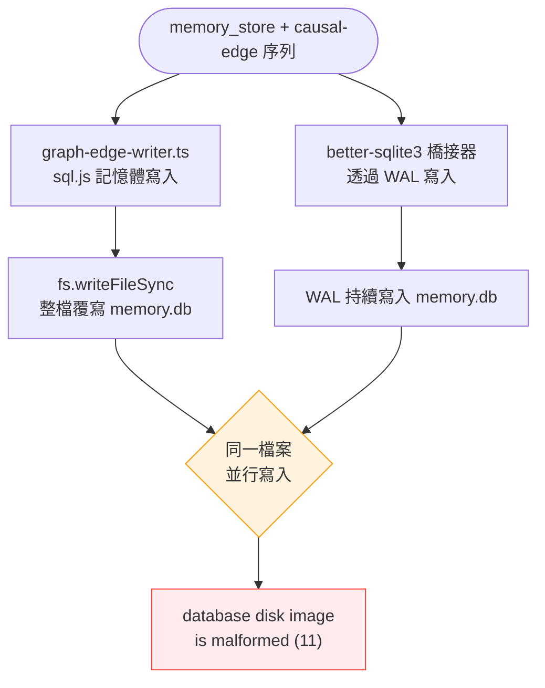
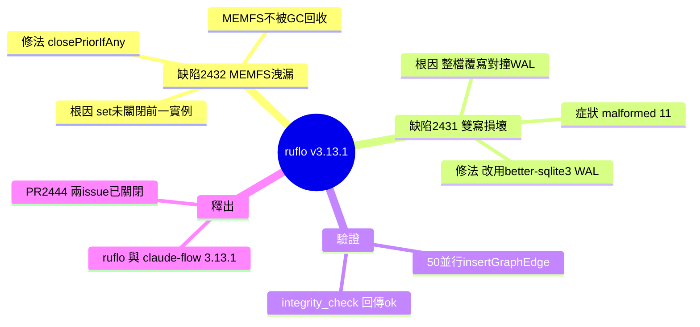

## v3.13.1 — #2432 sql.js MEMFS leak + #2431 graph-edge dual-write corruption

ruflo v3.13.1 修復兩項臨界漏洞。#2432：無界 sql.js MEMFS 洩漏（觀察 ~36 GB），根因是 ControllerRegistry.initController() 呼叫 set() 而未關閉前一實例，每個 SqlJsRvfBackend 包裝器持有 ~11 MB MEMFS 檔案，需顯式 .close() 才釋放；修復：增加 closePriorIfAny() helper 在每個 set() 位置前呼叫。#2431：graph-edge-writer 雙寫破損 memory.db（ADR-130 迴歸），fs.writeFileSync() 與 better-sqlite3 WAL 寫入競爭；症狀：「database disk image is malformed (11)」；修復：遷移至 better-sqlite3 + WAL 模式（與橋接器同引擎，無競爭）。驗證：50 並行 insertGraphEdge() + PRAGMA integrity_check → ok。

### 重點
- 單例資源洩漏：~11 MB per 實例，僅 close() 釋放；fix 在變異前強制 closePriorIfAny()
- 雙寫競爭：整個檔案 fsync 與 WAL 活躍寫入混用導致破損；解決方案：單一原子存儲引擎 + WAL 取代混合
- 驗證規模：50 並行插入 + integrity_check 通過，證實修復堅實

**原文：** [ruflo-releases](https://github.com/ruvnet/ruflo/releases/tag/v3.13.1)

---


<!-- deep-analysis:begin -->
## 📌 摘要 (TL;DR)

- ruflo v3.13.1 為純 bug-fix 釋出，修復兩個 HIGH 級臨界漏洞（Issue #2432、#2431 皆已關閉），由 PR #2444 發布。
- **#2432 記憶體洩漏**：`ControllerRegistry.initController()` 每次 `controllers.set()` 都沒關閉前一個 `SqlJsRvfBackend`，每個包裝器持有約 11 MB 的 MEMFS 檔案，實測累積觀察到約 36 GB。
- **#2431 資料損壞**：`graph-edge-writer.ts` 每插一條 edge 就用 `fs.writeFileSync()` 整檔覆寫 `memory.db`，與 better-sqlite3 橋接器的 WAL 寫入對撞，觸發 `database disk image is malformed (11)`。
- **共同教訓**：JavaScript 的垃圾回收救不了 Emscripten 的 MEMFS；同一個資料庫檔案不可由兩套引擎並行寫入。
- **修復已驗證**：#2431 移植到 better-sqlite3 + WAL 後，以 50 個並行 `insertGraphEdge()` 加 `PRAGMA integrity_check` 回傳 `ok`，且公開 API 維持不變。
- 升級方式：執行 `npx ruflo@latest` 或 `npx claude-flow@latest` 即可取得 3.13.1。

## 🎯 核心概念

- **sql.js**：以 WebAssembly 編譯的 SQLite，整個資料庫存放在記憶體內檔案系統中。
- **記憶體內檔案系統**（MEMFS）：Emscripten 提供的虛擬檔案系統；sql.js 把 `memory.db` 整份放在這裡，是本次洩漏的源頭。
- **better-sqlite3**：原生（native）的 SQLite 綁定，本次用來取代 sql.js 以消除競爭。
- **預寫式日誌**（Write-Ahead Logging，簡稱 WAL）：SQLite 的寫入模式，寫入先進日誌再合併，避免整檔覆寫。
- **控制器登錄表**（ControllerRegistry）：管理後端 controller 實例的登錄表，洩漏的 `set()` 呼叫就發生在這裡。
- **雙寫競爭**（dual-write race）：兩個寫入者同時寫同一檔案造成的損壞，正是 ADR-068（#1257）當初移除過的問題。
- **架構決策紀錄**（Architecture Decision Record，簡稱 ADR）：記錄架構決策的文件，本次牽涉 ADR-068 與 ADR-130。

## 📖 整理分析

### 1. #2432 根因：MEMFS 不被 GC 回收
`ControllerRegistry.initController()` 呼叫 `controllers.set(name, ...)` 註冊新後端，卻沒先關掉舊的。每個 `SqlJsRvfBackend` 包裝器底層都掛著一個 Emscripten MEMFS 檔案，大小約等於 `memory.db`（約 11 MB）。關鍵在於 sql.js 模組是行程層級的單例（process singleton），所以即使 JavaScript 把包裝器物件 GC 掉，MEMFS 內的檔案也不會被回收——唯有顯式呼叫 `.close()` 才釋放。結果每次重建 controller 就洩漏約 11 MB，最終觀察到約 36 GB 佔用。

### 2. #2432 修法：closePriorIfAny()
修復方式是新增 `closePriorIfAny(name)` helper，並在每一個 `controllers.set()` 呼叫點之前先執行它，先關閉同名舊實例再放入新實例。它採「盡力而為」（best-effort）關閉，會捕捉並吞掉關閉過程的錯誤，確保替換動作一定能繼續，不會因舊實例關閉失敗而卡住新實例的註冊。

### 3. #2431 根因：整檔覆寫對撞 WAL
`graph-edge-writer.ts` 以 sql.js 開啟資料庫、在記憶體完成寫入，然後在「每插入一條 edge 之後」呼叫 `fs.writeFileSync(dbPath, db.export())`，把整份資料庫一次性 flush 回磁碟。問題是此時 better-sqlite3 橋接器正透過 WAL 主動寫入同一個 `memory.db`；整檔覆寫直接蓋掉橋接器的寫入，重現了 ADR-068（#1257）已移除的雙寫競爭。症狀是：只要跑一次 `memory_store` + `causal-edge` 序列，`PRAGMA integrity_check` 就回傳 `database disk image is malformed (11)`。

### 4. #2431 修法：改用 better-sqlite3 + WAL
解法是把 graph-edge-writer 從 sql.js 移植到 better-sqlite3 + WAL 模式，與橋接器使用同一個原生引擎，因此不再有整檔 fsync、也就沒有競爭。公開 API 維持不變。煙霧測試（smoke test）以 50 個並行 `insertGraphEdge()` 呼叫加上 `PRAGMA integrity_check`，結果為 `ok`。發行說明也標註：這是「最小安全修復」，更乾淨的架構修法（依 ADR-068 把 edge 寫入導向橋接器的 controller 層）留待未來 ADR 處理。

### 5. 釋出與升級
本次同步發布 `ruflo`、`claude-flow`、`@claude-flow/cli` 皆為 3.13.1，`@claude-flow/memory` 為 3.0.0-alpha.21，且 latest / alpha / v3alpha 三個通道版本一致。升級執行 `npx ruflo@latest` 或 `npx claude-flow@latest`。交叉引用包含 PR #2444、已關閉的 Issue #2432 與 #2431，以及同期的 #2443（v3.13.0 doctor 修復）。

## 🧭 流程圖：#2431 雙寫競爭



## 🧠 Mindmap


<!-- deep-analysis:end -->
### 📄 原文內容

<details>
<summary>點此展開 / 收合</summary>

🔧 Bug-fix release 
 #2432 — Unbounded sql.js MEMFS leak (HIGH, ~36 GB observed) 
 `ControllerRegistry.initController()` was calling `controllers.set(name, ...)` without closing the prior instance. `SqlJsRvfBackend` wrappers held an Emscripten MEMFS file (~11 MB each = sizeof `memory.db`) that only releases on explicit `.close()` — JS GC of the wrapper does NOT reclaim MEMFS because the sql.js module is a process singleton. 
 Fix: added `closePriorIfAny(name)` helper, called before every `controllers.set()` site. Best-effort close (catches errors so replacement always proceeds). 
 #2431 — graph-edge-writer dual-write corrupts memory.db (HIGH, ADR-130 regression) 
 `graph-edge-writer.ts` opened sql.js, did in-memory writes, then called `fs.writeFileSync(dbPath, db.export())` after every edge insert. The whole-file flush overwrote `memory.db` while the better-sqlite3 bridge was actively writing through its WAL — the exact dual-write race ADR-068 ( #1257 ) removed. 
 Symptom: `PRAGMA integrity_check` returns `database disk image is malformed (11)` after one `memory_store` + `causal-edge` sequence. 
 Fix: ported from sql.js to better-sqlite3 + WAL mode. Same native engine as the bridge → no whole-file fsync → no race. Public API unchanged. Smoke-tested: 50 concurrent `insertGraphEdge()` calls + `PRAGMA integrity_check` → `ok`. 
 
 Note: this is the minimum-safe fix. The architecturally cleaner fix (route edge writes through the bridge's controller layer per ADR-068) is deferred to a future ADR. 
 
 Distribution 
 
 
 
 Package 
 latest 
 alpha 
 v3alpha 
 
 
 
 
 `@claude-flow/memory` 
 3.0.0-alpha.21 
 3.0.0-alpha.21 
 3.0.0-alpha.21 
 
 
 `@claude-flow/cli` 
 3.13.1 
 3.13.1 
 3.13.1 
 
 
 `claude-flow` 
 3.13.1 
 3.13.1 
 3.13.1 
 
 
 `ruflo` 
 3.13.1 
 3.13.1 
 3.13.1 
 
 
 
 Upgrade 
 ```bash 
npx ruflo@latest # picks up 3.13.1 
npx claude-flow@latest # picks up 3.13.1 
``` 
 Cross-references 
 
 🔗 PR #2444 (this release) 
 🔗 Issue #2432 (MEMFS leak, closed) 
 🔗 Issue #2431 (dual-write corruption, closed) 
 🔗 Companion #2443 (v3.13.0 doctor fix, merged) 
 🔗 Related ADR-068 / ADR-130 (architectural context) 
 
 
 🤖 Generated with RuFlo

</details>