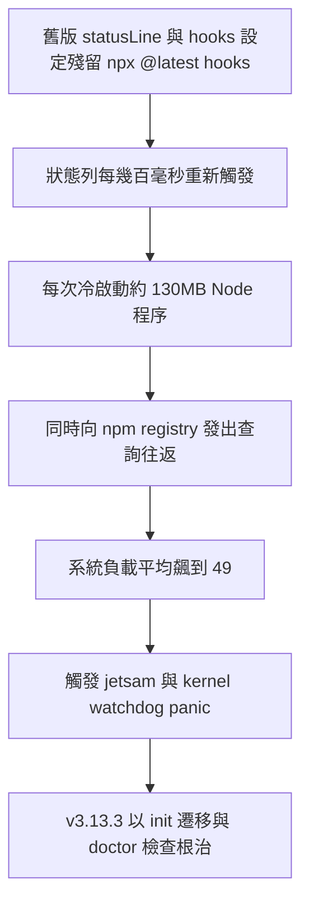
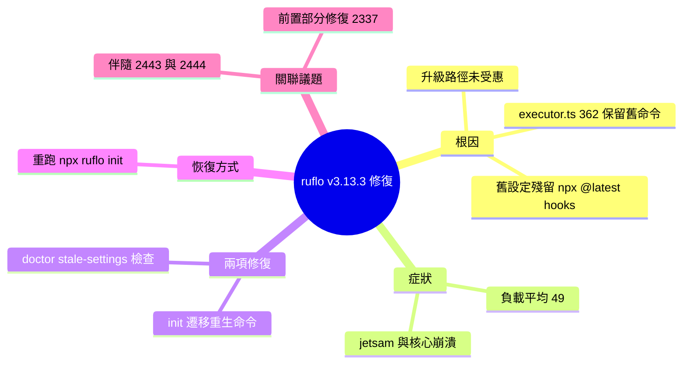

## v3.13.3 — #2448 stale npx @latest statusLine/hooks migration (kernel-panic class)

ruflo v3.13.3 修復臨界 kernel panic（macOS 負載平均 49、jetsam、watchdog panic）。根因：pre-#2337 使用者配置中 statusLine 包含 `npx @claude-flow/cli@latest hooks`，每隔數百毫秒冷啟動 ~130 MB Node 程序並查詢 npm 登錄檔。v3.13.3 包含兩項修復：(1) init 遷移偵測並重新生成破損的 npx @latest 命令為本地助手形式；(2) `doctor --component stale-settings` 檢查驗證。恢復步驟單一：`npx ruflo@latest init` 自動重新生成。所有套件（3.13.3）已包含修復。

### 重點
- 冷啟動重型程序於高頻回呼是反模式：statusLine 每 100ms 重火，130 MB Node 啟動時間 + npm 延遲造成系統癱瘓
- 本地助手緩存模式：預先載入/緩存工具，避免每次呼叫都執行完整 npm 解析
- 單一指令修復所有受影響使用者：`npx ruflo@latest init` 冪等、保留原意、自動升級

**原文：** [ruflo-releases](https://github.com/ruvnet/ruflo/releases/tag/v3.13.3)

---


<!-- deep-analysis:begin -->
## 📌 摘要 (TL;DR)

- ruflo 發布 v3.13.3，修復一個被列為 CRITICAL 的問題 #2448：有使用者在 macOS 上出現負載平均（load average）衝到 49、觸發 jetsam 記憶體回收與核心看門狗崩潰（kernel watchdog panic）。
- 根因是 #2337 之前的 init 把 `npx @claude-flow/cli@latest hooks` 寫進了狀態列（statusLine）與每個動作的掛鉤（hooks）；狀態列每幾百毫秒重新觸發一次，每次都冷啟動（cold-spawn）約 130 MB 的 Node 程序並向 npm registry 來回查詢。
- 雖然新版 init 的產生器已改用本地助手形式（local-helper form），但 `executor.ts:362` 在重新 init 時會保留使用者既有命令，導致 #2337 前安裝、之後才升級的人從未真正拿到修復。
- v3.13.3 帶來兩項修復：init 遷移會偵測並重新生成壞掉的命令；新增 `doctor --component stale-settings` 檢查可直接驗證。
- 恢復方式很單純：重跑 `npx ruflo@latest init`。三個套件（`@claude-flow/cli`、`claude-flow`、`ruflo`）的 latest / alpha / v3alpha 通道全部都是 3.13.3。

## 🎯 核心概念

- **狀態列**（statusLine）：持續刷新的介面狀態顯示，本案中每幾百毫秒重新觸發一次。
- **掛鉤**（hooks）：在特定動作前後自動執行的命令清單。
- **本地助手形式**（local-helper form）：直接呼叫專案內已安裝的本地腳本，取代每次都上網抓取最新版的 `npx @latest`。
- **冷啟動**（cold-spawn）：每次呼叫都重啟一個全新程序，本案每次約耗 130 MB 記憶體並附帶一次 npm registry 往返。
- **jetsam**：macOS 在記憶體吃緊時強制終止程序的機制；負載過高時連帶觸發 kernel watchdog panic。
- **冪等**（idempotent）：對已正確的設定重複執行遷移，不會造成額外變化。

## 📖 整理分析

### 1. 症狀：macOS 負載平均衝到 49
受影響使用者回報系統負載平均達 49，並出現 jetsam 與核心看門狗崩潰。這屬於 kernel-panic 等級的嚴重事故，因此 #2448 被標記為 CRITICAL 並已關閉。

### 2. 根因：狀態列裡的 npx @latest 風暴
#2337 之前的 init 把 `npx @claude-flow/cli@latest hooks` 寫進 statusLine 與每個 per-action hook。狀態列每幾百毫秒就重新觸發一次，而每次觸發都會冷啟動約 130 MB 的 Node 程序，並向 npm registry 發出一次版本查詢往返——高頻率乘上高成本疊加，把系統資源吃光。

### 3. 為何升級也修不好：executor.ts:362
新版 init 的產生器其實早已改輸出本地助手形式，但 `executor.ts:362` 在重新 init 時會「保留使用者既有命令」。結果是：在 #2337 之前安裝、之後才升級的使用者，他們設定檔裡壞掉的命令一直被沿用，等於從未收到修復。換句話說，#2337 只修好了產生器，沒修好升級路徑。

### 4. 兩項修復：遷移 + 體檢
- **init 遷移**：偵測 `existing.statusLine.command` 以及每一個 `hooks.[].hooks[].command` 裡壞掉的 `npx @latest hooks` 樣式，重新生成為本地助手形式；對已正確的設定維持冪等，並從壞字串中擷取原本的子命令以保留原意。
- **doctor 檢查**：新增 `checkStaleSettingsNpx`，只要在專案本地或 `$HOME/.claude/settings.json` 任一處偵測到壞樣式，就回報 `fail`。

### 5. 恢復步驟
```bash
# 偵測（不做任何更動）
npx ruflo@latest doctor --component stale-settings
# 遷移（重跑 init 合併邏輯，重新生成壞命令）
npx ruflo@latest init
# 驗證（此時應顯示 ✓）
npx ruflo@latest doctor --component stale-settings
```
本次同步發布的伴隨修復還有 #2443（doctor MetaHarness locator）與 #2444（sql.js MEMFS leak）。

## 🧭 流程圖

以下是這次 kernel-panic 的因果鏈：



## 🧠 Mindmap


<!-- deep-analysis:end -->
### 📄 原文內容

<details>
<summary>點此展開 / 收合</summary>

🔧 Critical fix — #2448 
 Affected user reported load average 49 / jetsam / kernel watchdog panic on macOS. Pre- #2337 init wrote `npx @claude-flow/cli@latest hooks ` into the statusLine + per-action hooks. Each invocation cold-spawns ~130 MB Node + npm registry round-trip; statusLine refires every few hundred ms. 
 The current init source already emits the local-helper form — but `executor.ts:362` preserved the user's existing command on re-init, so anyone who installed pre- #2337 and upgraded never received the fix. 
 Two changes 
 
 init migration: detect the broken `npx @latest hooks ` pattern in `existing.statusLine.command` AND every `hooks.[].hooks[].command`. Regenerate to local-helper form. Idempotent on already-correct settings. Captures the subcommand from the broken string so intent is preserved. 
 doctor check: new `checkStaleSettingsNpx` reports `fail` if the broken pattern is detected anywhere in project-local or `$HOME/.claude/settings.json`. Run `ruflo doctor --component stale-settings` to check directly. 
 
 How to recover if you're affected 
 ```bash 
 Detect (no changes) 
 npx ruflo@latest doctor --component stale-settings 
 Migrate (re-runs init merge logic, regenerates the broken commands) 
 npx ruflo@latest init 
 Verify 
 npx ruflo@latest doctor --component stale-settings # should now ✓ 
``` 
 Distribution 
 
 
 
 Package 
 latest 
 alpha 
 v3alpha 
 
 
 
 
 `@claude-flow/cli` 
 3.13.3 
 3.13.3 
 3.13.3 
 
 
 `claude-flow` 
 3.13.3 
 3.13.3 
 3.13.3 
 
 
 `ruflo` 
 3.13.3 
 3.13.3 
 3.13.3 
 
 
 
 Cross-references 
 
 🔗 Issue: #2448 (CRITICAL, closed) 
 🔗 Prior partial fix: #2337 (statusline storm) — fixed the generator but not the upgrade path 
 🔗 Companion: #2443 (doctor MetaHarness locator), #2444 (sql.js MEMFS leak) 
 
 
 🤖 Generated with RuFlo

</details>