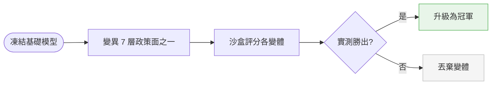
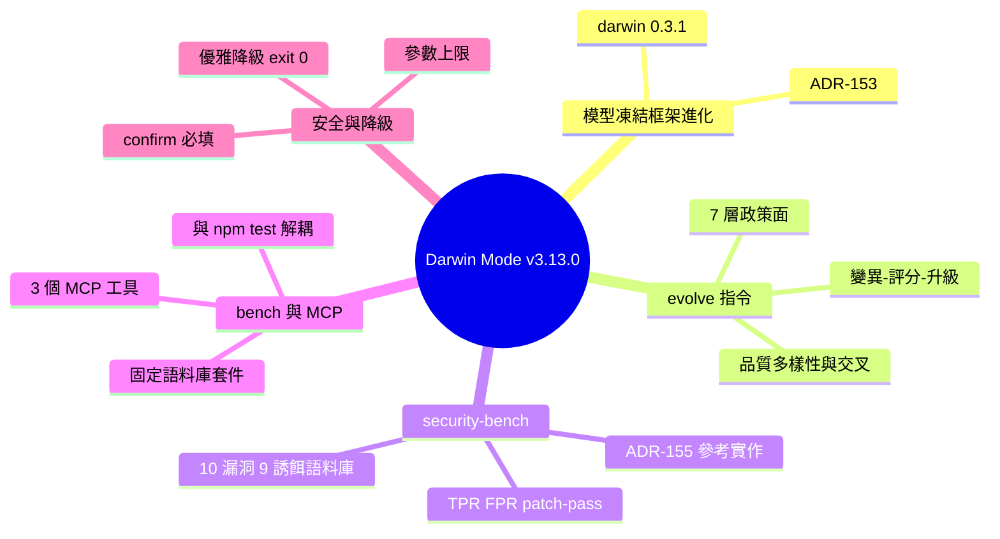

## v3.13.0 — Darwin Mode integration (@metaharness/darwin)

ruflo v3.13.0 整合 @metaharness/darwin@0.3.1，實現基礎模型凍結、harness 進化的架構（ADR-153）。核心概念：「模型凍結，harness 進化」。三項新指令：(1) `metaharness evolve` — 變異 7 層 harness 政策（planner/contextBuilder/reviewer/retryPolicy/toolPolicy/memoryPolicy/scorePolicy），sandbox-score 各變體，僅升級量化獲勝者；(2) `metaharness security-bench` — 在 10 漏洞/9 誘餌 ground-truth 語料庫進化檢測 harness，評分 TPR/FPR/patch-pass；(3) `metaharness bench` — 建立/驗證固定語料庫評估套件。3 個新 MCP 工具可供 Claude Code agents 呼叫。安全機制：--confirm 必填，代次上限 1–50、子代 1–20、並行 1–8、族群 1–20、週期 1–100。缺少上游依賴時優雅降級。

### 重點
- 模型凍結 + harness 獨立優化迴圈：不重新訓練基礎模型，只演化執行層；7 層政策面可變異
- 沙箱評分 + 晉升獲勝者：量化多目標（quality-diversity 選擇、進化交叉）取代人工調整
- 安全沙盒：--confirm 必填、上限強制、缺省 @metaharness 時回傳 {degraded: true}；安全異常出口碼 99 用於 CI 區隔

**原文：** [ruflo-releases](https://github.com/ruvnet/ruflo/releases/tag/v3.13.0)

---

<!-- deep-analysis:begin -->
## 📌 摘要 (TL;DR)

- ruflo v3.13.0 整合 @metaharness/darwin@0.3.1 作為「框架進化（harness-evolution）」層，對應架構決策紀錄 ADR-153，核心理念是「模型凍結，框架進化（The model is frozen; the harness evolves）」；同時把 metaharness 主套件升到 ~0.2.6，帶入 harness validate / compare / score / genome / threat-model 等新子指令。
- 新增 `metaharness evolve`：對 7 層政策面（planner、contextBuilder、reviewer、retryPolicy、toolPolicy、memoryPolicy、scorePolicy）進行變異，在沙盒（sandbox）為每個變體評分，只升級「實測勝出」的版本——基礎模型完全不動，動的是它周圍的作業系統。
- 新增 `metaharness security-bench`（Darwin Shield）：對 10 漏洞 / 9 誘餌的 ground-truth 語料庫進化一個冠軍安全偵測框架，並以 TPR / FPR / patch-pass / repro / unsafe / cost 對比 4 條基線評分，是 ruflo 自家 ADR-155 夜間自學安全框架（#2417）最接近的參考實作。
- 新增 `metaharness bench`：建立並驗證固定語料庫的評估套件，供 `evolve --bench` 使用，把評分機制與 `npm test` 解耦。
- 三項功能同步提供 3 個新 MCP 工具（metaharness_evolve、metaharness_security_bench、metaharness_bench），任何 Claude Code agent 都能直接呼叫。
- 安全與相容性：`evolve` 必須加 `--confirm`，否則只回 dry-run 計畫；代次、子代、並行、族群、週期皆設上限；缺少選用相依套件時優雅降級並以 exit 0 結束，符合 ADR-150 的 4 項可移除性約束。

## 🎯 核心概念

- **達爾文模式（Darwin Mode）**：把生物演化的「變異 → 篩選 → 保留」套用到 AI agent 的外圍框架，讓框架自我優化而非重訓模型。
- **框架（harness）**：包在基礎模型外的那層「作業系統」，涵蓋規劃、上下文建構、審查、重試等政策的總和。
- **七層政策面（seven policy surfaces）**：可被變異的 7 個介面——planner、contextBuilder、reviewer、retryPolicy、toolPolicy、memoryPolicy、scorePolicy。
- **品質多樣性取樣（quality-diversity sampling）**：一種選擇策略，不只挑最高分、也保留行為多樣的變體，可搭配交叉（crossover）混血。
- **架構決策紀錄（Architecture Decision Record，簡稱 ADR）**：本版牽涉 ADR-153（Darwin 整合）、ADR-155（夜間安全框架）、ADR-150（選用相依約束）。
- **TPR / FPR / patch-pass**：安全評分指標，分別為真陽性率、假陽性率、修補通過率，另含 repro、unsafe、cost。

## 📖 整理分析

### 1. 模型凍結，框架進化
本版中心命題是「The model is frozen; the harness evolves」——不去微調或重訓基礎模型，而是進化模型周邊的框架。整套能力以 @metaharness/darwin@0.3.1 形式落地，對應 ADR-153，並把 metaharness 主套件升到 ~0.2.6，以取得 harness validate、compare、score、genome、threat-model、oia-manifest、analyze-repo 及 `--wizard`、`--with-wasm` 等子指令。

### 2. evolve：變異—評分—升級
`metaharness evolve` 會對 7 層政策面其中之一做變異，在沙盒中為每個變體評分，並只升級「量測到的勝出」。實務上：不加 `--confirm` 時 `npx ruflo metaharness evolve --repo .` 只回 dry-run 計畫；`--confirm --generations 3 --children 3` 才會真正進化（規模小、約數分鐘）；再加 `--selection quality-diversity --crossover` 則啟用品質多樣性取樣與交叉。

### 3. security-bench：Darwin Shield 安全進化
`metaharness security-bench`（Darwin Shield）包裝上游 ADR-155：針對 10 漏洞 / 9 誘餌的 ground-truth 語料庫，進化出一個冠軍安全偵測框架，並用 TPR / FPR / patch-pass / repro / unsafe / cost 對比 4 條基線。它是 ruflo 自家 ADR-155 夜間自學安全框架（#2417）最接近的參考實作，定期執行可為「Loop A」提供經驗性的獎勵訊號下限。`npx ruflo metaharness security-bench` 為 1 週期快速冒煙測試；`--population 4 --cycles 3 --alert-on-fail` 則作為 CI 關卡（任一驗收門檻失敗即 fail）。

### 4. bench 與 3 個 MCP 工具
`metaharness bench` 建立並驗證固定語料庫的評估套件，供 `evolve --bench` 使用，將評分與 `npm test` 解耦（`--op create ... --out /tmp/suite.json`、`--op verify --suite ...`）。三項功能同時對外提供 MCP 工具：metaharness_evolve（完整參數面，含 concurrency、sandbox、epistasis、curriculum、risk-budget、fdr、ruvllm-url 等）、metaharness_security_bench、metaharness_bench，任何 Claude Code agent 皆可直接呼叫。

### 5. 安全機制與優雅降級
`evolve` 強制 `--confirm`，是在上游 safety.ts 之上的縱深防禦。ruflo 另設上限：`--generations 1..50`、`--children 1..20`、`--concurrency 1..8`、`--population 1..20`、`--cycles 1..100`。上游 exit code 99（safety-disqualified）原樣傳遞、不重新映射，讓 CI 能區分「進化失敗」與「變體觸發安全檢查」。缺少選用相依時，三支腳本一律輸出 `{degraded: true, reason: 'metaharness-darwin-not-available'}` 並以 exit 0 結束，符合 ADR-150 四項約束（可移除、僅列 optionalDependencies、優雅降級、CI 缺套件路徑覆蓋，測試 16/16 通過）。

## 🧭 流程圖 / 架構圖

evolve 的「變異—評分—升級」管線：

## 🧠 Mindmap

<!-- deep-analysis:end -->
### 📄 原文內容

點此展開 / 收合

✨ Darwin Mode integration 
 Ships @metaharness/darwin@0.3.1 as ruflo's harness-evolution layer per ADR-153 . Also bumps the metaharness umbrella to ~0.2.6 to pick up new subcommands ( harness validate , compare , score , genome , threat-model , oia-manifest , analyze-repo , --wizard , --with-wasm ). 
 
 The model is frozen; the harness evolves. 
 
 What this lets you do 
 Mutate, score, promote — harness-evolve mutates one of seven policy surfaces (planner / contextBuilder / reviewer / retryPolicy / toolPolicy / memoryPolicy / scorePolicy), sandbox-scores each variant, and promotes only measured wins. The foundation model never changes; the operating system around it does. 
 # Dry-run plan (no --confirm yet) 
npx ruflo metaharness evolve --repo . 

 # Actually evolve (small shape — minutes) 
npx ruflo metaharness evolve --repo . --confirm --generations 3 --children 3

 # Quality-diversity sampling with crossover 
npx ruflo metaharness evolve --repo . --confirm --selection quality-diversity --crossover 
 Darwin Shield — harness-security-bench wraps the upstream's own ADR-155: evolves a champion security-detection harness against a 10-vuln / 9-decoy ground-truth corpus and grades it on TPR / FPR / patch-pass / repro / unsafe / cost vs four baselines. This is the closest reference implementation for ruflo's own ADR-155 nightly self-learning security harness (#2417) — running it periodically gives Loop A its empirical reward-signal floor. 
 # Quick smoke (1 cycle, default population) 
npx ruflo metaharness security-bench

 # Deeper run (CI gate: fail if any acceptance gate fails) 
npx ruflo metaharness security-bench --population 4 --cycles 3 --alert-on-fail 
 Bench suites — harness-bench creates and verifies fixed-corpus evaluation suites for evolve --bench . Decouples scoring from npm test . 
 npx ruflo metaharness bench --op create --repo . --out /tmp/suite.json
npx ruflo metaharness bench --op verify --suite /tmp/suite.json 
 MCP tools (3 new) 
 All three are also callable from any Claude Code agent: 
 
 metaharness_evolve — full param surface (generations / children / concurrency / sandbox / selection / crossover / epistasis / curriculum / risk-budget / fdr / tie / bench / mutator / ruvllm-url / confirm / alert-on-no-improvement) 
 metaharness_security_bench — population / cycles / seed / alert-on-fail 
 metaharness_bench — op / repo / suite / out 
 
 Safety 
 
 evolve requires --confirm ; without it, returns a dry-run plan (defense in depth over the upstream safety.ts layer) 
 Ruflo caps: --generations 1..50 , --children 1..20 , --concurrency 1..8 , --population 1..20 , --cycles 1..100 
 Upstream exit code 99 ("safety-disqualified") propagates verbatim — not remapped — so CI can distinguish evolution failure from a variant tripping the safety inspection layer 
 All three scripts emit {degraded: true, reason: 'metaharness-darwin-not-available'} and exit 0 when the optional dep is absent 
 
 Architectural compliance 
 All four ADR-150 constraints honored: 
 
 
 
 # 
 Constraint 
 How 
 
 
 
 
 1 
 Removable 
 npm ls --without @metaharness/* still produces a working CLI 
 
 
 2 
 Optional in package.json 
 Added to optionalDependencies only, never dependencies 
 
 
 3 
 Graceful degradation 
 _darwin.mjs catches MODULE_NOT_FOUND / 404 / network errors; emits structured degraded payload; exits 0 
 
 
 4 
 CI-absent-path coverage 
 test-graceful-degradation.mjs extended; 16/16 assertions pass (8 skills × 2 contracts) 
 
 
 
 Distribution 
 
 
 
 Package 
 latest 
 alpha 
 v3alpha 
 
 
 
 
 @claude-flow/cli 
 3.13.0 
 3.13.0 
 3.13.0 
 
 
 claude-flow 
 3.13.0 
 3.13.0 
 3.13.0 
 
 
 ruflo 
 3.13.0 
 3.13.0 
 3.13.0 
 
 
 
 How to try it 
 # Pulls 3.13.0 + @metaharness/darwin 
npx ruflo@latest metaharness evolve --repo /path/to/your/repo
npx ruflo@latest metaharness security-bench 
 Or in Claude Code, add the MCP server and use the new tools directly: 
 claude mcp add claude-flow -- npx -y @claude-flow/cli@latest
 # Then in Claude Code: call mcp__claude-flow__metaharness_evolve, etc. 
 Cross-references 
 
 🔗 ADR-153 (Darwin Mode integration): ruvnet/ruflo 
 🔗 Feature PR: #2440 (merged at a67e0ea ) 
 🔗 Release PR: #2441 (merged at 0b00665 ) 
 🔗 Companion ADR-155 (nightly self-learning security harness): #2417 + #2418 
 📦 Upstream Darwin: @metaharness/darwin@0.3.1 
 📦 Upstream umbrella: metaharness@0.2.6 
 
 
 🤖 Generated with RuFlo

