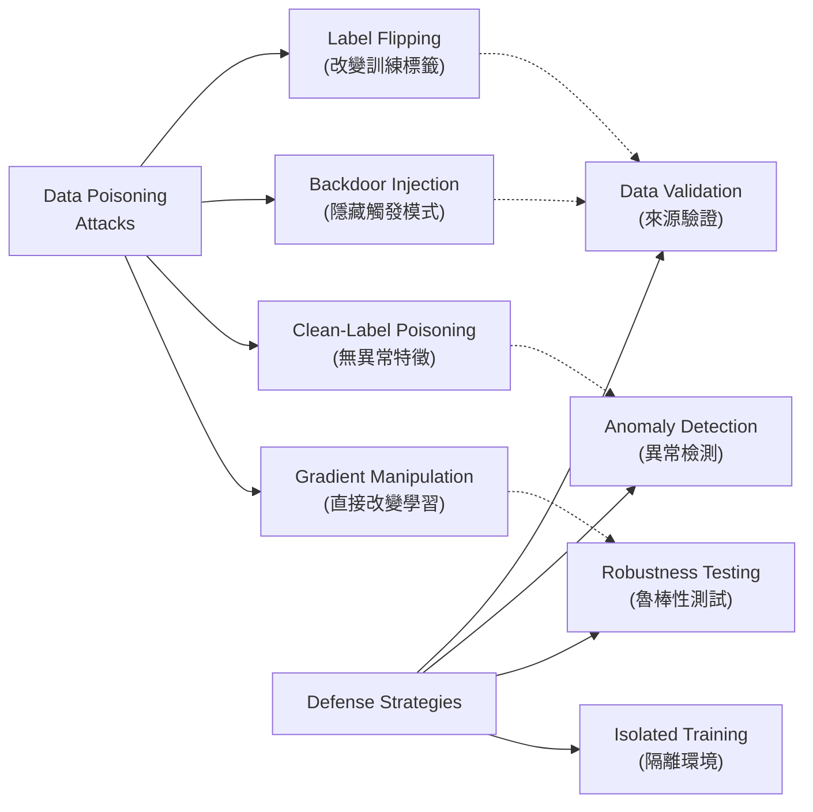

## Article: Understanding ML Model Poisoning: How It Happens and How to Detect It

本文深入探討數據毒化（data poisoning）對機器學習系統的威脅，介紹標籤翻轉、後門注入、清標籤毒化與梯度操縱等四類主要攻擊技術。文章回顧真實案例，討論毒化數據的檢測困難——許多攻擊可在無異常特徵的情況下隱形進行。提出多層防禦策略包括數據驗證、異常檢測、魯棒性測試、離線隔離訓練等實踐建議，強調 ML 訓練管道安全性與數據源驗證的關鍵重要性。

### 重點
- 數據毒化涵蓋四類技術：標籤翻轉（改變訓練標籤）、後門注入（隱藏觸發模式）、清標籤毒化（無異常特徵的隱形攻擊）、梯度操縱（直接改變模型學習方向）
- 檢測困難在於某些毒化樣本無法被異常檢測識別，攻擊者可以製造看起來正常但包含隱藏目標的數據
- 實操防禦包括數據來源驗證、訓練前異常檢測、模型魯棒性測試、離線隔離訓練環境等多層策略組合

**原文：** [infoq-architecture](https://www.infoq.com/articles/understanding-ml-model-poisoning/?utm_campaign=infoq_content&utm_source=infoq&utm_medium=feed&utm_term=Architecture+%26+Design)

---

### 📄 原文內容

點此展開 / 收合

In this article, the author explores data poisoning as a threat to machine learning systems, covering techniques such as label flipping, backdoors, clean-label poisoning, and gradient manipulation. The article reviews real-world incidents, discusses the challenges of detecting poisoned data, and presents practical defenses, tools, and operational practices for securing ML training pipelines. By Igor Maljkovic

