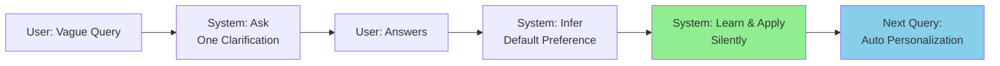

## When RAG Users Ask Vague Questions: Clarify Once, Learn the Default

本文為企業文件智能系列第六期，提出一套針對 RAG 系統中模糊查詢的交互策略：當用戶提出籠統問題時，系統提問一次有焦點的澄清問題，從用戶回答中推斷其預設偏好與查詢意圖，後續自動應用學到的預設而保持沉默。這一框架減少重複交互，提升用戶體驗，實現通過單次澄清達成個性化知識檢索行為的自動適應。

### 重點
- 澄清一次原則：面對模糊查詢僅提問一個有焦點的澄清問題，避免過度交互疲勞用戶
- 推斷預設偏好：從用戶的澄清回答中學習其隱含的查詢預設與查詢意圖模式
- 自動化應用：後續查詢自動應用學到的預設，沉默而高效，實現個性化而無須重複說明

**原文：** [medium-towards-data-science](https://towardsdatascience.com/when-rag-users-ask-vague-questions-clarify-once-learn-the-default/)

---

### 📄 原文內容

點此展開 / 收合

Enterprise Document Intelligence [Vol.1 #6bis] - Ask one focused clarification, learn the default from the answer, stay silent next time 
 The post When RAG Users Ask Vague Questions: Clarify Once, Learn the Default appeared first on Towards Data Science .

