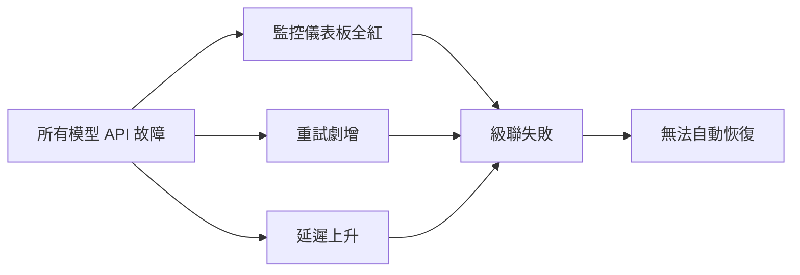

## Handling Multi-Model API Outages Without Melting Production

當多個 AI 模型 API 同時故障時，系統會進入級聯失敗狀態：監控儀表板全部變紅、重試機制劇增、延遲快速上升，且系統無法自行恢復。此情景在多模型部署架構中特別危險，因為故障不再局限於單一模型，而是波及整個依賴鏈。文章討論在生產環境中設計多模型系統時，如何應對此類全面性故障，以及防止級聯崩潰的架構策略。

### 重點
- 多模型 API 同時故障引發級聯失敗：儀表板全紅、重試堆積、延遲劇增
- 級聯故障無法自動恢復，需要人工介入才能恢復服務
- 多模型架構需要針對全面故障的隔離設計和降級策略

**原文：** [medium-tag-llm](https://medium.com/@sebuzdugan/handling-multi-model-api-outages-without-melting-production-965f70d4c99a?source=rss------large_language_models-5)

---

### 📄 原文內容

點此展開 / 收合

Your dashboards go red. Not one model. All of them. Retries spike. Latency climbs. Nothing recovers. Continue reading on Medium »

