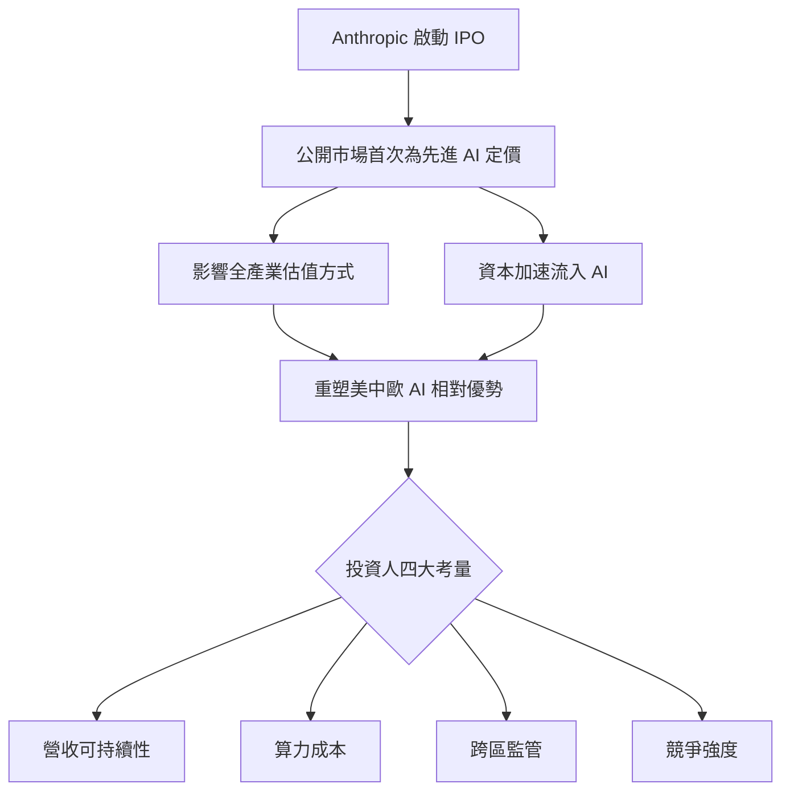
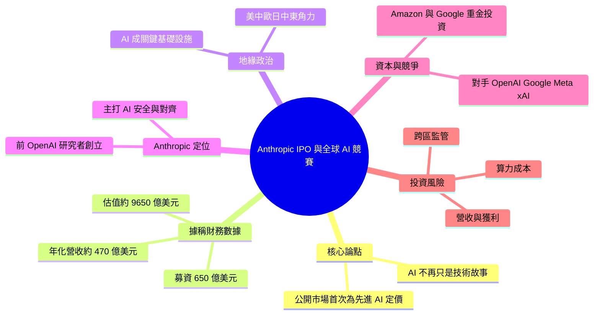

## Anthropic’s IPO Could Become a Defining Moment in the Global AI Race

讨论 Anthropic（Claude 开发者）的 IPO 事件可能成为全球 AI 竞赛的分水岭。作者论点：AI 已不再仅仅是技术赛道，更是地缘政治和资本竞争的战场。Anthropic 作为仅次于 OpenAI 的主要 foundation model 公司，其融资和上市估值将直接影响全球对 AI 投资的信心和优先级。IPO 可能重塑美国、中国、欧洲在 AI 开发中的相对优势。

### 重點
- Anthropic IPO 涉及全球 AI 战略竞争
- AI 产业从技术转向地缘政治和资本层面
- Claude 背后的公司融资事件影响全球 AI 格局

**原文：** [medium-tag-claude](https://medium.com/@valpolhovskiy/anthropics-ipo-could-become-a-defining-moment-in-the-global-ai-race-0d1c6344fec9?source=rss------claude-5)

---

<!-- deep-analysis:begin -->
## 📌 摘要 (TL;DR)

- 本文是一篇觀點分析：作者主張 Anthropic（Claude 開發商）一旦啟動首次公開募股（Initial Public Offering，簡稱 IPO），將成為全球 AI 競賽的分水嶺——因為 AI 已從「技術議題」升級為地緣政治與資本競爭的戰場。
- 文章據稱引用的數字：最近一輪募資 650 億美元、估值約 9,650 億美元，申報前後年化營收約 470 億美元。作者全程以「reportedly（據稱）」口吻表述，且 IPO 屬「could become（可能成為）」的前瞻情境，故應視為作者引用、未經官方證實的數據。
- Anthropic 由前 OpenAI 研究者創立，以 AI 安全與對齊（AI safety and alignment）為差異化定位；Amazon 與 Google 皆已重金投資。
- 為何關鍵：IPO 將是公開市場首次大規模為「先進 AI 的未來」定價，可能左右投資人對整個產業的評價方式。
- 作者提醒，估值之外要盯四件事：營收可持續性、算力基礎設施成本、跨區監管複雜度，以及與 OpenAI／Google／Meta／Microsoft／xAI 的競爭強度。

## 🎯 核心概念

- **基礎模型公司**（foundation model company）：開發底層大型語言模型（large language model，簡稱 LLM）的公司；文章將 Anthropic 定位為此領域的主要玩家之一。
- **AI 安全與對齊**（AI safety and alignment）：Anthropic 的核心訴求，在全球監管趨嚴下被作者視為差異化優勢。
- **關鍵基礎設施**（critical infrastructure）：文章指美、中、歐等政府已把 AI 提升到此戰略層級看待，而非僅當成新興技術。

## 📖 整理分析

### 1. 核心論點：IPO 不只是財務事件
作者開宗明義：「AI 已不再只是一則技術故事。」他主張 Anthropic 的 IPO 會是地緣政治與資本的標誌性時刻，因為它將提供「公開市場首次大規模為先進 AI 開發的未來定價」的機會，進而影響投資人如何評估整個 AI 產業。

### 2. 據稱的估值與營收
文章引述：最近一輪募資「據稱」籌得 650 億美元，使 Anthropic 估值達約 9,650 億美元；申報前後年化營收「據稱」約 470 億美元。由於作者全程使用「reportedly」、且 IPO 本身仍是假設情境，這些數字宜理解為作者轉述而非確認事實。

### 3. AI 升格為國家戰略
文章指出，美國、中國、歐盟、英國、日本與中東國家都已宣布強化自身 AI 地位的計畫，並把 AI 當成關鍵基礎設施看待。在此背景下，一場大型 IPO 可能重塑各國在 AI 開發上的相對優勢。

### 4. Anthropic 的定位與資本流向
Anthropic 由前 OpenAI 研究者創立，以 Claude 系列大型語言模型聞名，應用涵蓋研究、分析、程式撰寫、商業自動化與企業場景。Amazon 與 Google 都已重金投資，凸顯大型科技平台把「AI 領導地位」視為長期戰略核心。

### 5. 投資人該盯緊的四個風險
作者提醒，估值之外有四個關鍵變數：(1) 營收可持續性與能否轉為獲利；(2) 算力等基礎設施的成本控管；(3) 不同地區的監管複雜度；(4) 與 OpenAI、Google、Meta、Microsoft、xAI 及眾多新創之間的激烈競爭。

## 🧭 流程圖 / 架構圖

下圖整理作者的因果論證鏈——IPO 事件如何外溢到全球 AI 競賽：

## 🧠 Mindmap

<!-- deep-analysis:end -->
### 📄 原文內容

點此展開 / 收合

Artificial intelligence is no longer just a technology story. Continue reading on Medium »

