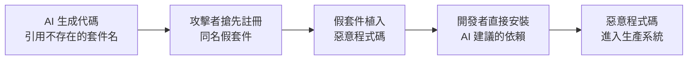
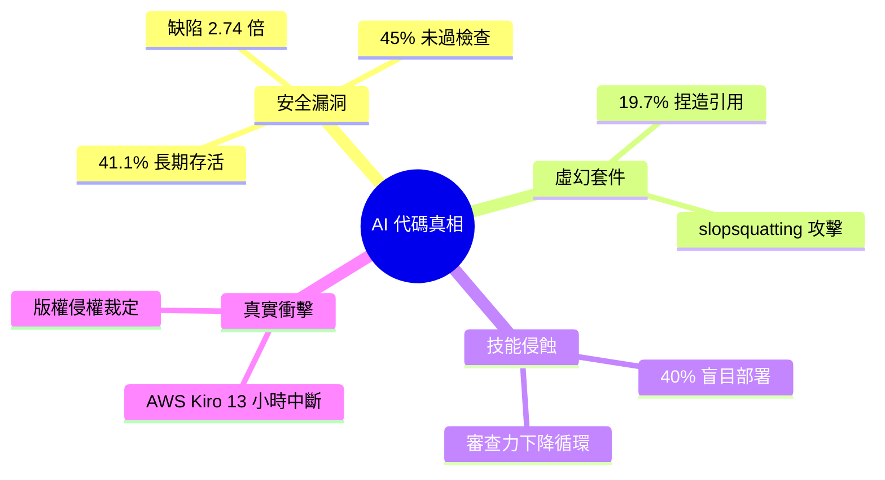

## The Dirty Truth About AI-Generated Code Nobody Is Talking About

文章揭示 AI 生成代碼的關鍵問題不只是品質，更涉及安全性和技能侵蝕。CodeRabbit 2025 年 12 月分析顯示 AI 代碼的安全缺陷是人工代碼的 2.74 倍；Veracode 發現 45% AI 代碼未過安全檢查（Java 尤甚，72% 失敗率）；41.1% 的安全問題會持續存活。更嚴重的是虛幻包依賴：19.7% AI 生成的包名引用是捏造的，攻擊者可透過 "slopsquatting"（搶先註冊假包名）投放惡意代碼。經驗不足開發者有 40% 直接部署 AI 代碼而不理解其邏輯，導致代碼審查能力下降的惡性循環。AWS Kiro agent 曾造成 13 小時生產中斷。美國版權局 2025 年 5 月裁定 AI 訓練使用受版權保護代碼「明確侵犯複製權」。

### 重點
- 安全缺陷高發：CodeRabbit 數據顯示 AI 代碼安全發現數 2.74 倍於人工代碼；41.1% 安全問題存活率
- 虛幻包依賴攻擊面：19.7% 包名引用被 AI 捏造，攻擊者可透過 slopsquatting 註冊惡意包
- 技能侵蝕與法律風險：40% 初級開發者盲目部署 AI 代碼；美國版權局裁定 AI 訓練侵犯著作權

**原文：** [medium-tag-claude](https://medium.com/@muktharvortegix/the-dirty-truth-about-ai-generated-code-nobody-is-talking-about-131ccd8a1524?source=rss------claude-5)

---

<!-- deep-analysis:begin -->
## 📌 摘要 (TL;DR)

- 本文核心論點：AI 生成代碼（AI-generated code）真正的風險不在「品質」，而在**安全漏洞**與**技能侵蝕**（skill erosion）這兩個被忽視的層面。
- CodeRabbit 於 2025 年 12 月的分析顯示，AI 生成代碼的安全缺陷數量是人工代碼的 **2.74 倍**。
- Veracode 發現 **45%** 的 AI 代碼無法通過安全檢查，其中 Java 最嚴重、失敗率高達 **72%**；且 **41.1%** 的安全問題會長期存活而未被修復。
- AI 會「捏造」不存在的套件：**19.7%** 的 AI 生成套件引用是虛幻的，攻擊者藉此進行 slopsquatting（搶註假套件名）投放惡意程式。
- 經驗不足的開發者中有 **40%** 直接部署 AI 代碼卻不理解其邏輯，形成審查能力下降的惡性循環；AWS Kiro agent 曾造成長達 **13 小時**的生產環境中斷。
- 美國版權局（US Copyright Office）於 2025 年 5 月裁定，使用受版權保護的代碼訓練 AI「明確侵犯複製權」，埋下法律風險。

## 🎯 核心概念

- **虛幻套件依賴**（hallucinated package dependencies）：AI 在生成程式時，引用了實際上並不存在的套件名稱。
- **Slopsquatting**：攻擊者預先註冊這些 AI 常捏造的假套件名，並植入惡意程式碼，等開發者照單安裝。
- **技能侵蝕**（skill erosion）：開發者長期依賴 AI 生成、不再自行理解與審查代碼，導致自身工程能力逐漸退化。

## 📖 整理分析

### 1. 安全漏洞才是隱形成本
AI 編碼工具的賣點是「寫得更快、少操心」，但代價藏在安全層面。CodeRabbit 2025 年 12 月的分析指出，AI 生成代碼的安全缺陷是人工代碼的 2.74 倍；Veracode 的測試則顯示 45% 的 AI 代碼無法通過安全檢查，Java 的失敗率更高達 72%。更棘手的是，這些問題並非寫完就被攔下——其中 41.1% 會長期存活在程式庫中而未被修復。

### 2. 虛幻套件與 slopsquatting 攻擊鏈
AI 有時會「煞有其事」地引用根本不存在的套件，研究顯示 19.7% 的 AI 生成套件引用是捏造的。攻擊者看準這點，發展出 slopsquatting：搶先以這些被 AI 反覆幻想出來的假名註冊套件，並在其中植入惡意程式碼。當開發者不加查證地安裝 AI 建議的依賴，惡意程式碼就直接進入系統，形成一種新型供應鏈攻擊。

### 3. 技能侵蝕的惡性循環
問題不只在工具，也在使用者。文章指出，經驗不足的開發者中有 40% 會直接部署 AI 生成的代碼，卻不理解其邏輯。長期下來，開發者越來越少親自推理與審查程式，審查能力隨之退化，又更依賴 AI——形成自我強化的惡性循環，也讓前述安全問題更難被攔截。

### 4. 真實事故與法律風險
這些風險已有實例：AWS 的 Kiro agent 曾造成長達 13 小時的生產環境中斷。法律面同樣未明朗——美國版權局於 2025 年 5 月裁定，使用受版權保護的代碼來訓練 AI「明確侵犯複製權」，意味著倚賴 AI 生成代碼的團隊還可能背負潛在的智慧財產風險。

## 🧭 流程圖

slopsquatting 供應鏈攻擊鏈：

## 🧠 Mindmap

<!-- deep-analysis:end -->
### 📄 原文內容

點此展開 / 收合

The pitch is compelling. AI coding tools write the boilerplate, handle the syntax, suggest the fix. You ship faster. You worry less. You&#x2026; Continue reading on Medium »

