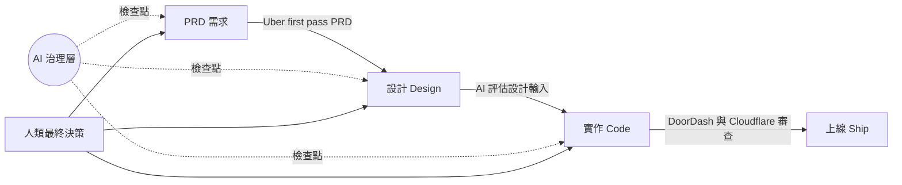
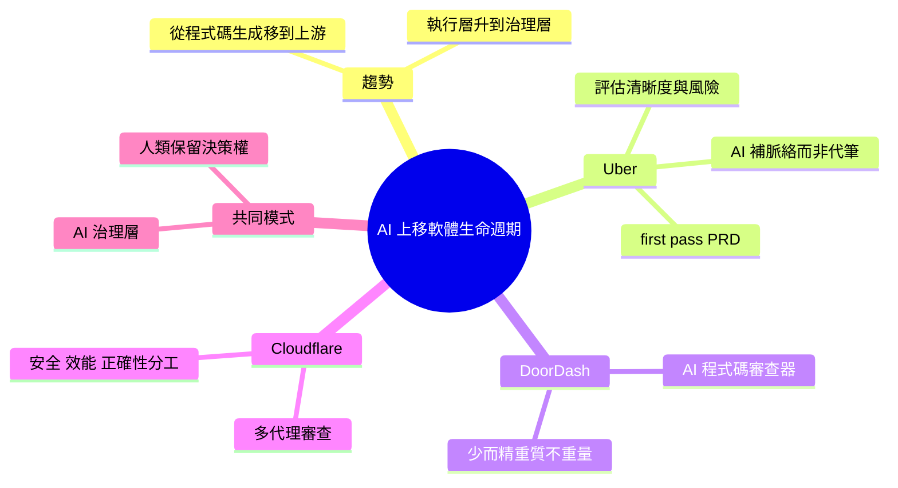

## AI Is Moving up the Software Lifecycle: From Code Review to PRD Governance

科技公司正將 AI 應用從代碼生成向軟件開發周期上游推進。Uber、DoorDash 和 Cloudflare 等企業已部署 AI 驅動的治理層，在 PRD 驗證、設計輸入、代碼審查階段評估工程產物，形成了「AI 治理層」模式：在代碼實施前由 AI 評估工程決策，同時保持人類監督和決策權。此趨勢反映了企業 AI 應用的根本轉變——從後端工具（代碼生成）向前端決策（PRD、設計治理）移動，AI 從執行層上升至治理層。

### 重點
- AI 應用從代碼生成向上游移動：PRD 驗證→設計→代碼審查，Uber/DoorDash/Cloudflare 案例
- 新模式是「AI 治理層」在實施前評估工程產物，而非代碼生成後檢查
- 保留人類監督的關鍵：AI 提供評估和建議，最終決策權仍由工程師主導

**原文：** [infoq-main](https://www.infoq.com/news/2026/06/ai-prd-code-review-governance/?utm_campaign=infoq_content&utm_source=infoq&utm_medium=feed&utm_term=global)

---

<!-- deep-analysis:begin -->
## 📌 摘要 (TL;DR)

- InfoQ 記者 Leela Kumili（2026/06/24）指出：大型科技公司正把 AI 從「程式碼生成」往軟體開發生命週期（software lifecycle）的上游推進，延伸到 PRD 驗證、系統設計與程式碼審查。
- Uber 導入「first pass PRD」：在產品需求文件（Product Requirement Document，PRD）送進工程團隊前，先由 AI 評估清晰度、完整性與潛在執行風險。
- DoorDash 自建 AI 程式碼審查器，主打「少而精」——少留言、多有用回饋，讓工程師在程式碼上線前真正改變行為。
- Cloudflare 採多代理（multi-agent）審查，把安全、效能、正確性拆給各自職責明確的 agent 處理。
- 三家共同形成「AI 治理層（AI governance layer）」模式：AI 做落地前的第一輪評估，人類保留最終決策權。
- 值得關注之處：AI 的角色從執行層（寫程式）上升到治理層（把關工程決策）。

## 🎯 核心概念

- **AI 治理層（AI governance layer）**：在生命週期各階段（PRD、設計、code review）設置自動化檢查點，AI 負責評估、人類負責監督與拍板。
- **first pass PRD**：Uber 的做法，由 AI 對需求文件做第一輪審查，找出缺漏與模糊假設。
- **多代理審查（multi-agent code review）**：Cloudflare 把單一通用審查器拆成多個範圍明確的專責 agent。
- **工程產物（engineering artifacts）**：PRD、設計文件、程式碼等可被 AI 評估的產出物。

## 📖 整理分析

### 1. AI 往生命週期上游移動
過去 AI 主要用於程式碼生成與審查，如今 Uber、DoorDash、Cloudflare 把它往前推到需求與設計階段。核心轉變是：AI 不再只是後端的執行工具，而是在程式碼實作「之前」就介入評估工程決策，同時保留人類監督。

### 2. Uber：PRD 的第一道把關
Uber 的「first pass PRD」讓 AI 在 PRD 送進工程團隊前先審一輪。Uber 工程團隊強調，價值不在於由 AI 代筆寫 PRD，而是「幫你把問題想透、帶進全公司相關的資料來源」。AI 會點出缺漏的依賴、矛盾與不清楚的假設，最終驗證權仍握在工程師手上。

### 3. DoorDash：少而精的程式碼審查
DoorDash 自建 AI 程式碼審查器，提供可執行、具上下文的回饋，重質不重量。團隊表示工具的設計是「為了贏得信任，而不是製造雜訊：更少留言、更有用的回饋，並在程式碼上線前帶來真正的行為改變」。

### 4. Cloudflare：多代理分工審查
Cloudflare 以多代理方式做 AI 輔助審查，分別負責安全分析、效能評估與正確性檢查。Cloudflare 指出，當每個 agent 的職責被嚴格限縮時，「專責 agent 的表現會勝過單一通用審查器」；而且定義「不要報什麼」和定義「要偵測什麼」一樣重要。

### 5. 共同模式：AI 評估、人類決策
三家的共通點，是把 AI 當成第一輪評估機制來輔助人類審查者，在各種工程產物上引入持續驗證，同時把決策權留給人。這形成跨生命週期的「AI 治理層」——檢查點前移，但人類監督並未缺席。

## 🧭 流程圖 / 架構圖

下圖呈現 AI 治理層如何在開發流程各階段前設下檢查點，而人類保留最終決策：

## 🧠 Mindmap

<!-- deep-analysis:end -->
### 📄 原文內容

點此展開 / 收合

Technology companies are extending AI beyond code generation into earlier stages of the software lifecycle, including PRD validation, design inputs, and code review. Initiatives from Uber, DoorDash, and Cloudflare highlight a shift toward AI-driven governance layers that evaluate engineering artifacts before implementation while preserving human oversight across the development pipeline. By Leela Kumili

