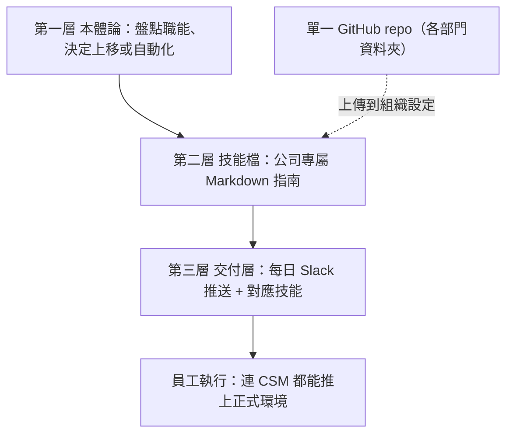
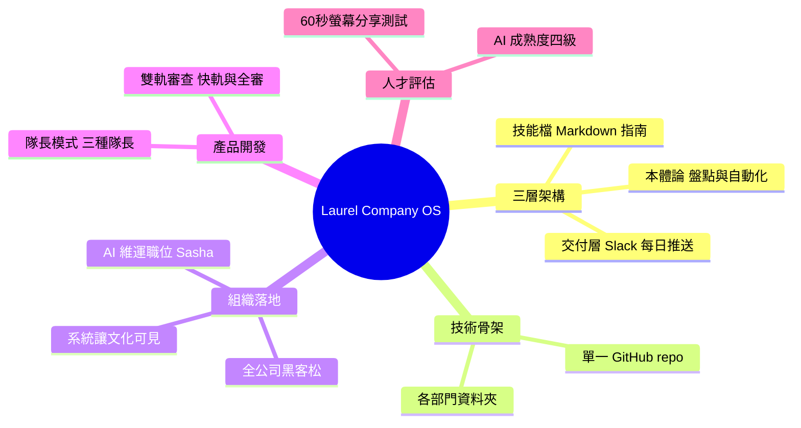

## How to Build a Company OS in Claude Code with Jiaona Zhang, CPO at Laurel

Laurel 通過在 Claude Code 上構建 Company OS（公司級作業系統），實現了 AI 驅動型組織的極致形態。該公司的 9 人 AI-native 團隊的產能已相當於傳統 90 人規模，達成 10 倍效能槓桿。CPO Jiaona Zhang 分享了完整方法論，包括工具整合、流程自動化、協作基礎設施的系統設計。Company OS 不僅是技術框架，更是組織架構與工作流的根本性重構。Claude Code 作為核心生產力平台，使得小團隊能處理企業級複雜度的項目。該案例展示了 AI 驅動型組織如何通過系統化工程重塑產能邊界。

### 重點
- 9 人團隊 vs 傳統 90 人：10 倍產能槓桿的具體實現
- Company OS 框架：統一整合開發工具、自動化工作流、協作基礎設施
- Claude Code 作為 AI-native 組織的核心生產力平台

**原文：** [substack-product-growth](https://www.news.aakashg.com/p/company-os-jz)

---

<!-- deep-analysis:begin -->
## 📌 摘要 (TL;DR)

- Laurel 產品長 Jiaona Zhang（JZ）在 Aakash Gupta 的 Product Growth 電子報分享：他們在 Claude Code 上打造「公司作業系統」（Company OS），讓 9 人的 AI 原生團隊產出相當於過去 90 人的工作量。
- 核心目標是讓「連客戶成功經理（Customer Success Manager，簡稱 CSM）都能把功能推上正式環境」，把 AI 從工程團隊擴散到全公司每個職能。
- Company OS 由三層組成：知識本體（Ontology）→ 技能檔（Skill File）→ 交付層（Delivery Layer），全部放在單一 GitHub repository，並依部門分資料夾。
- 組織面靠三招落地：設立「AI 維運」（AI Operations）職位（首位員工 Sasha）、辦全公司黑客松（約三個月前）、用系統把文化價值「浮現」出來。
- 產品開發改採「隊長模式」（Captain Model）＋雙軌審查，並用四級「AI 成熟度框架」與 60 秒螢幕分享測試來評估員工與應徵者的真實 AI 能力。

## 🎯 核心概念

- **公司作業系統**（Company OS）：把各職能的工作流程、知識與交付機制，編碼成可被 AI 執行的系統。
- **知識本體**（Ontology）：盤點每個職能的工作，決定哪些「往上」（保留更多人力時間）、哪些「往下」（自動化）。
- **技能檔**（Skill File）：一份 Markdown 文件，編碼「在這家公司怎麼做某件特定工作」，而非通用提示詞。
- **交付層**（Delivery Layer）：在對的時間，把對的技能推送到對的員工面前的機制。
- **隊長模式**（Captain Model）：依「最難的問題」把一個功能指派給單一負責人，而非逐站交接。

## 📖 整理分析

### 1. 三層架構：本體 → 技能 → 交付
Company OS 分三層。第一層知識本體先盤點每個職能的活動，決定哪些往上（更多人力時間）、哪些往下（自動化）；以產品團隊為例，停止人工做「競品分析寫作、利害關係人簡報、研究彙整」，把時間集中到「功能開發、QA、直接接觸客戶」。第二層技能檔是公司專屬的 Markdown 指南，回答像「在我們公司怎麼寫續約信」「好的功能需求長什麼樣」這類問題，上傳到 Claude 的組織設定後全公司皆可使用。第三層交付層讓每位面向客戶的成員，每天早上在 Slack 收到一則訊息，把行事曆、會議、check-in、onboarding 全部彙整，並附上該活動對應的技能檔。

### 2. 技術骨架：單一 GitHub repo
整套系統落在一個 GitHub repository，裡面依部門開資料夾：客戶成功、資料科學、設計、工程、財務、法務、行銷全都在內。這讓技能檔與流程像程式碼一樣被集中管理與版本控制。

### 3. 把 AI 推出工程團隊的三步
JZ 用三招讓非工程職能也採用 AI。第一，設立「AI 維運」職位，她稱之為「新的 BizOps」，專找「極度好奇、愛玩最新技術、執著於找效率」的人，從一位員工 Sasha 開始，需求自然擴張。第二，約三個月前辦了一場跨職能的全公司黑客松，證明「任何人都能 build」。第三，用系統讓文化價值可見——例如某位 CSM 即將有 check-in、卻很久沒和客戶面對面時，OS 會主動把這件事浮現出來。

### 4. 隊長模式與雙軌審查
功能開發不再逐站交接，而是依「最難的問題」指派單一隊長：架構風險（codebase risk）最大時由工程隊長帶；體驗為王、工程單純時由設計隊長帶；最難之處在於抓客戶理解與商業脈絡時，由 PM 隊長帶。審查分兩軌：快軌（Fast）處理單一隊長負責的小功能，走 Slack 頻道、視需要找工程師與設計師看；全審（Full Review）則用於核心互動的劇烈改動、架構決策等需要系統級思考的情況。

### 5. AI 成熟度四級與招募測試
文章提出團隊運作的四個層級：① 聊天模式（開 Claude 問問題，最常見）；② 工作流自動化（如 Slack 分流、行事曆簡報）；③ 打造應用（具備 UI、邏輯與狀態的工具）；④ 共享應用／推上正式環境（PM 提交 PR 直接上線）。JZ 招募時用「螢幕分享測試」：請應徵者花 60 秒展示自己怎麼用 AI，能立刻看出真實能力落在哪一級。

## 🧭 流程圖 / 架構圖

## 🧠 Mindmap

<!-- deep-analysis:end -->
### 📄 原文內容

點此展開 / 收合

One AI native team of 9 can now out-ship what used to take 90 people. Here is how Laurel built that team.

