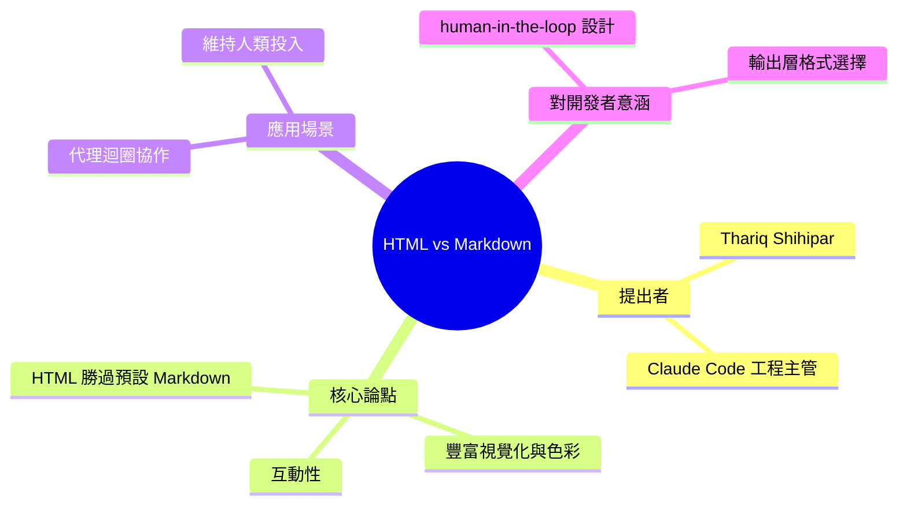

## Anthropic Lead: HTML Increasingly Better Than Markdown at Keeping Humans Engaged in Agentic Loops

Anthropic Claude Code 團隊工程主管 Thariq Shihipar 發布部落格文章《Using Claude Code: The Unreasonable Effectiveness of HTML》，指出 HTML 的豐富視覺化、色彩和互動性相比預設 Markdown 輸出，能顯著提升人機代理協作場景下的生產力。該發現基於 Claude Code 實際運作經驗，對於構建需要持續人機互動的代理系統的開發者具有直接指導意義。

### 重點
- HTML 輸出（豐富視覺化、色彩、互動性）相比 Markdown 在人機代理互動中提升生產力
- Thariq Shihipar 基於 Claude Code 實踐發布此發現
- 適用於需要密集人機反饋迴圈的代理 UI 設計

**原文：** [infoq-main](https://www.infoq.com/news/2026/06/anthropic-html-markdown-agent/?utm_campaign=infoq_content&utm_source=infoq&utm_medium=feed&utm_term=global)

---

<!-- deep-analysis:begin -->
## 📌 摘要 (TL;DR)

- Anthropic 旗下 Claude Code 團隊工程主管 Thariq Shihipar 發表部落格文章《Using Claude Code: The Unreasonable Effectiveness of HTML》，本則由 InfoQ 的 Bruno Couriol 報導。
- 核心論點：在許多人機協作情境下，HTML 憑藉更豐富的視覺化、色彩與互動性，比 Claude Code 預設的 Markdown 輸出更能提升生產力。
- 關鍵命題是「在代理迴圈（agentic loop）中維持人類的投入」—— 讓 human-in-the-loop 的監督者不會因純文字輸出而失焦或脫離。
- 為何關注：對打造需要持續人機互動的代理系統的開發者，這提供了「該用什麼格式呈現代理輸出」的具體方向。
- 注意：本則為 InfoQ 新聞簡述，僅摘錄部落格主論點，未包含原文的逐項範例或量化數據。

## 🎯 核心概念

- **代理迴圈**（agentic loop）：AI 代理反覆「執行動作 → 觀察結果 → 再決策」的循環；當人類需要在過程中審閱、修正或核可時，輸出的可讀性直接影響協作效率。
- **人在迴圈中**（human-in-the-loop）：由人類在代理運作的關鍵節點介入監督與決策的設計模式。
- **Markdown**：Claude Code 的預設輸出格式，以純文字為主、結構輕量，但視覺表達能力有限。
- **HTML**：可承載色彩、版面、圖表與互動元件，作者主張其表達力更能抓住人類注意力。

## 📖 整理分析

### 1. 誰提出、在哪提出
作者 Thariq Shihipar 是 Anthropic Claude Code 團隊的工程主管，文章標題為《Using Claude Code: The Unreasonable Effectiveness of HTML》。論點源自 Claude Code 的實際運作經驗，InfoQ 由 Bruno Couriol 整理報導。

### 2. 核心論點：HTML 優於預設 Markdown
文章主張，相較於 Claude Code 預設的 Markdown 輸出，HTML 因具備更豐富的視覺化、色彩與互動性，在「許多情境」下能提升人機溝通的生產力。重點不在文字內容本身，而在呈現形式如何影響人類的理解與參與。

### 3. 為什麼形式會影響「投入感」
標題的關鍵字是 keeping humans engaged。當代理長時間自動執行時，純文字輸出容易讓監督者疲乏、難以快速抓重點；具色彩與互動的 HTML 介面，更能讓人持續跟上代理狀態並適時介入。（此為對標題與論點的解讀說明，非原文逐字主張。）

### 4. 對開發者的意涵
對構建 human-in-the-loop 代理系統的團隊，這提示一個設計選擇：代理的輸出層不必預設綁定 Markdown，改以 HTML 呈現結果或儀表板，可能改善審閱與協作體驗。

### 5. 此摘要的邊界
本則內容取自 InfoQ 新聞簡述，僅涵蓋部落格的主要主張。原文可能包含的具體案例、適用與不適用的情境界線，以及量化證據，未在此摘要中呈現，建議點開原文補足細節。

## 🧭 概念對比圖

下圖以原文論點為基礎，對比兩種輸出形式在代理迴圈中的差異：

## 🧠 Mindmap

<!-- deep-analysis:end -->
### 📄 原文內容

點此展開 / 收合

Thariq Shihipar, engineering lead for the Claude Code team, recently published a blog post (Using Claude Code: The Unreasonable Effectiveness of HTML) arguing that HTML, with its richer visualizations, color, and interactivity, improves the productivity of human-agent communication in many settings, especially when compared to default Markdown outputs. By Bruno Couriol

