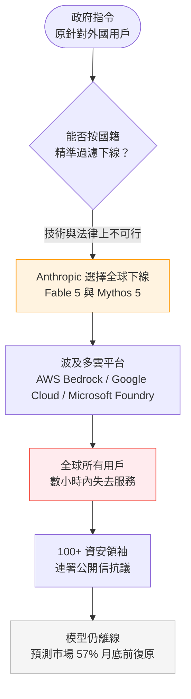
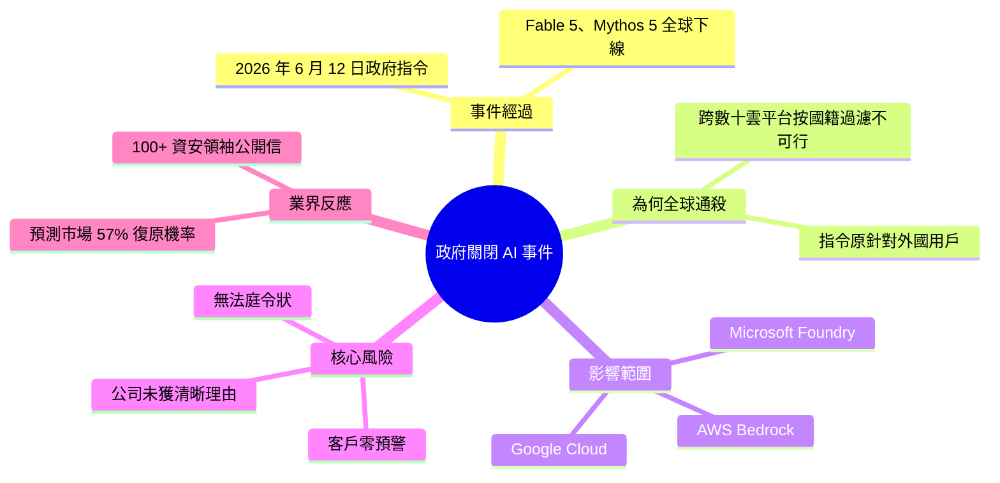

## Anthropic Just Showed Everyone What Happens When a Government Can Switch Off Your AI

2026年6月12日，Anthropic收到政府指令，导致两个前沿模型Fable 5与Mythos 5在数小时内全球离线，影响AWS Bedrock、Google Cloud、Microsoft Foundry等多云平台所有用户。政府指令原本针对外国用户，但Anthropic认为跨数十个全球云平台的按国籍过滤在技术与法律上不可行，遂执行全球通杀。核心风险：政府未提供法庭令状或公开申述，公司未获清晰理由，客户零预警。超100名包括Nvidia、Adobe高管的网络安全领袖署名公开信抗议，但模型保持离线，预测市场仅给予57%概率月底前复原。

### 重點
- Fable 5 + Mythos 5全球离线（时间：6月12日数小时内），无预警、无具体理由、跨AWS/GCP/Azure平台全覆盖
- 关键问题：政府指令为按国籍过滤，但Anthropic认为技术+法律上不可行，选择全球关闭而非精细隔离
- 商业风险提示：企业需避免单一模型强依赖，建立真实备用方案，审视供应商合约对监管关闭的保障缺口

**原文：** [medium-tag-claude](https://medium.com/@A.Rehman47/anthropic-just-showed-everyone-what-happens-when-a-government-can-switch-off-your-ai-c3d35b5b37f1?source=rss------claude-5)

---

<!-- deep-analysis:begin -->
## 📌 摘要 (TL;DR)

- 2026 年 6 月 12 日，Anthropic 收到一紙政府指令，旗下兩個前沿模型 Fable 5 與 Mythos 5 在數小時內於全球下線。
- 指令原本只針對外國用戶，但 Anthropic 認為要在 AWS Bedrock、Google Cloud、Microsoft Foundry 等數十個雲平台上按國籍精準過濾，技術與法律上皆不可行，於是選擇一次性全球關閉。
- 最具爭議的不是「關了」，而是「怎麼關的」：政府未出示法庭令狀、未經公開申述，公司未取得清晰理由，客戶端零預警。
- 超過 100 名資安領袖（含 Nvidia、Adobe 高管）連署公開信抗議，但模型維持離線。
- 預測市場僅給出 57% 機率認為模型會在月底前恢復——把「政府可一鍵關閉商用 AI」的系統性風險直接攤在檯面上。

## 🎯 核心概念

- **前沿模型（frontier model）**：能力處於業界最前緣的大型模型，此處指 Anthropic 的 Fable 5 與 Mythos 5。
- **關閉開關（kill switch）**：標題所指的「switch off」概念——外部單一指令即可讓服務瞬間失效。
- **多雲部署（multi-cloud deployment）**：同一模型同時上架於 AWS Bedrock、Google Cloud、Microsoft Foundry 等多個雲平台。
- **按國籍過濾（nationality-based filtering）**：依使用者所屬國家做差別下線；文中認為跨數十個雲平台執行此舉不可行。
- **法庭令狀（court order）**：合法強制執行通常須具備的司法文件，本案缺席。
- **預測市場（prediction market）**：以下注機率反映群眾對事件結果的判斷，此處用來衡量復原信心。

## 📖 整理分析

### 1. 一紙指令，數小時全球下線
2026 年 6 月 12 日，Anthropic 接獲政府指令後，前沿模型 Fable 5 與 Mythos 5 在數小時內於全球下線。影響範圍橫跨 AWS Bedrock、Google Cloud、Microsoft Foundry 等多個雲平台，所有用戶不分國籍同時失去存取。

### 2. 為何「全球通殺」而非只關外國用戶
原始指令的對象是外國用戶。但同一模型分散部署在數十個全球雲平台上，Anthropic 判斷要按國籍逐一精準過濾，在技術與法律上都不可行，最終選擇一次性全球關閉，以致本國與全球用戶一併受波及。

### 3. 真正的風險：流程黑箱
本案最受關注的不是關閉本身，而是執行流程。政府未提供法庭令狀、未經公開申述程序；Anthropic 未取得清晰理由；終端客戶事前零預警。這意味著商用 AI 的可用性，可能繫於一道不透明、不可申訴的外部指令。

### 4. 業界反應與復原前景
超過 100 名網路安全領袖（包含 Nvidia、Adobe 等公司高管）連署公開信表達抗議，但模型仍維持離線。預測市場僅給予 57% 機率認為模型會在月底前恢復，顯示業界對短期復原並無高度信心。

## 🧭 流程圖 / 架構圖

## 🧠 Mindmap

<!-- deep-analysis:end -->
### 📄 原文內容

點此展開 / 收合

A single directive took two frontier models offline worldwide in hours. Continue reading on Medium »

