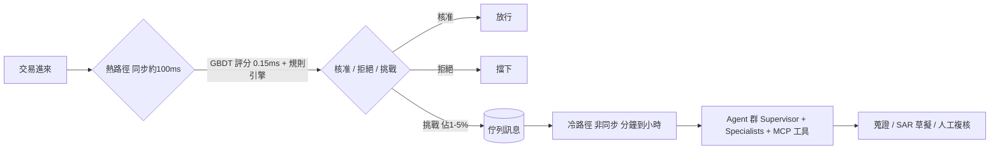
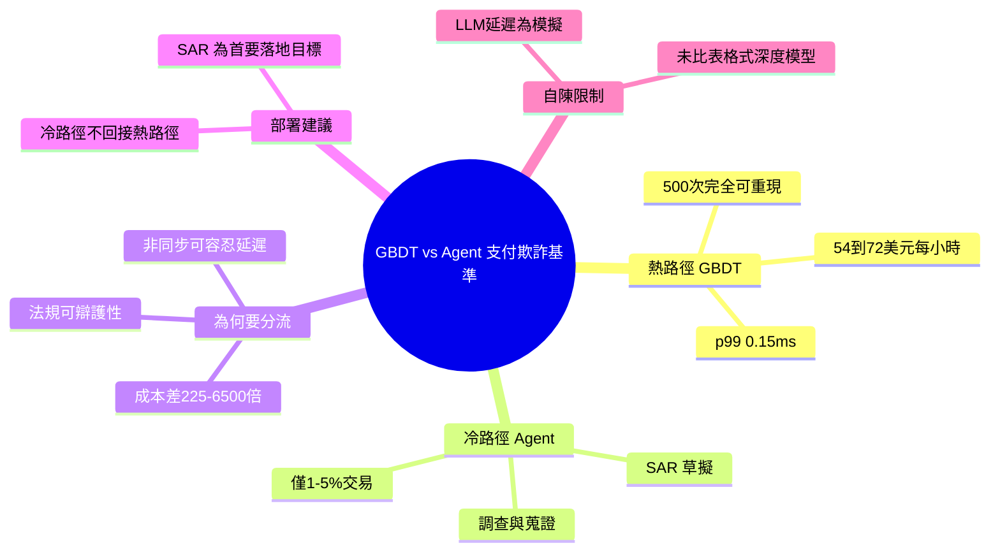

## The Hot Path Belongs to GBDTs, Agents Own the Cold Path: A Payment-Fraud Benchmark

作者發表支付欺詐檢測領域的可重複基準測試，比較 GBDT（梯度提升決策樹）和 AI agents 在延遲、成本和可重複性上的表現。研究發現：GBDT 適合處理高頻交易（熱路徑），低延遲且成本低；agents 適合低頻、需靈活判斷的調查場景（冷路徑）。這為實務應用中的技術選型提供了量化證據。

### 重點
- GBDT 優於 agents 在低延遲、成本敏感的熱路徑（high-frequency transactions）
- Agents 適合冷路徑（cold path）低頻調查場景，優勢在靈活性和適應性
- 支付欺詐檢測量化基準測試：各技術有最優應用邊界，不是絕對優劣

**原文：** [medium-towards-data-science](https://towardsdatascience.com/the-hot-path-belongs-to-gbdts-agents-own-the-cold-path-a-payment-fraud-benchmark/)

---

<!-- deep-analysis:begin -->
## 📌 摘要 (TL;DR)

- 作者 Sandeep Bharadwaj Mannapur 在 Towards Data Science（2026/6/25）發表可重複的支付欺詐基準，核心主張：**梯度提升決策樹（Gradient-Boosted Decision Trees，簡稱 GBDT）掌管同步的「熱路徑」，AI agent 則屬於非同步的「冷路徑」**。
- 延遲差距懸殊：GBDT 的 p99 為 **0.15 毫秒**（單顆 CPU 核心、batch size 1），模擬 LLM 的 p99 為 **1,212 毫秒**，相差約 **8,000 倍**；而 ISO 8583 授權預算僅約 **100 毫秒**，LLM 直接超標。
- 成本差距同樣巨大：以 50,000 TPS 跑 1 小時計，LightGBM 約 **$54/小時**、XGBoost 約 **$72/小時**；gpt-4o-mini 約 **$16,200/小時**、Claude Sonnet 4.6 約 **$351,000/小時**（約 225 倍到 6,500 倍）。
- 可重現性：GBDT 連跑 500 次都回傳**完全相同的 float64 分數**；模擬 LLM 在 500 次中產生 **498 個相異輸出**（標準差 0.077）。在受監管流程中，把非確定性評分放在客戶決策前「難以辯護」。
- 結論很實務：高頻、低延遲、要稽核的授權決策交給 GBDT；低頻（佔交易 1–5%）、需彈性推理的調查、蒐證與可疑活動報告草擬交給 agent，且**冷路徑不可回接熱路徑決策**。

## 🎯 核心概念

- **熱路徑（hot path）**：同步、即時的交易授權決策，延遲以毫秒計，每一筆交易都要處理。
- **冷路徑（cold path）**：非同步、佇列驅動的事後調查，延遲以分鐘到小時計，只處理被標記的 1–5% 交易。
- **梯度提升決策樹（GBDT）**：本文熱路徑主角，代表實作為 XGBoost、LightGBM、CatBoost，基準中用 sklearn 的 HistGradientBoostingClassifier。
- **ISO 8583**：金融卡交易訊息標準，定義約 100 毫秒的授權時間預算。
- **可疑活動報告（Suspicious Activity Report，簡稱 SAR）**：反洗錢合規文件，被作者點名為 agent 最高價值的首要落地場景。
- **模型情境協定（Model Context Protocol，簡稱 MCP）**：冷路徑 agent 用來組合式蒐證的工具協定。
- **agent-as-a-judge**：用一個裁判 agent 對照「證據帳本（evidence ledger）」驗證主張，檢測兩類幻覺：未解析的來源鍵（unresolved source keys）與數值漂移（value drift）。

## 📖 整理分析

### 1. 實驗設定：合成資料 + 模擬延遲
資料是合成的 ISO 8583 形態交易，**20 個特徵**（金額、商家類別碼風險、裝置年齡、地理距離、速度計數、退單history、二元旗標等），訓練 **200,000 列**、保留 **50,000 列**，欺詐率 **1.5%**，其中約 **15% 的欺詐**刻意模仿正常樣態（stealth fraud）。GBDT 在本機 CPU 實測；LLM 延遲則用對數常態分布**模擬**（中位數 540ms、σ=0.35），參數來自 NVIDIA Triton、vLLM 與 OpenAI/Anthropic 公開數據，而非實打 API。

### 2. 延遲：熱路徑只容得下 GBDT
GBDT 的 p99 為 0.15 毫秒，模擬 LLM 為 1,212 毫秒。在 ISO 8583 約 100 毫秒的授權窗口內，GBDT 綽綽有餘，LLM 則直接違規。作者並強調這還是「樂觀數字」——真正的 agentic 推理會把輸出 token 預算再放大 10 到 50 倍。

### 3. 成本與準確度：量化證據
以 50,000 TPS 跑 1 小時估算，樹模型約 $54–72，LLM 動輒上萬到數十萬美元。模型品質方面，GBDT 的 **PR-AUC 0.847、ROC-AUC 0.931**，足以承擔即時把關。對高頻熱路徑而言，成本差 225–6,500 倍是壓倒性的選型理由。

### 4. 可重現性：受監管流程的硬條件
GBDT 連續 500 次呼叫回傳同一個 float64 分數；模擬 LLM 卻有 498 個相異輸出、分布跨度 0.51、標準差 0.077（約 99.6% 非確定）。作者直言：把非確定性評分擺在會影響客戶、又受監管的決策之前，事後很難對稽核或主管機關交代。

### 5. Agent 的真正戰場：冷路徑
冷路徑用佇列承接被標記的交易，由「主管 + 專家（supervisor-plus-specialists）」搭配 MCP 工具做組合式蒐證、SAR 草擬與人工複核，並以 agent-as-a-judge 對證據帳本驗證、攔截幻覺。作者的五點建議：(1) 熱路徑保留確定性評分器；(2) 邊界案例路由到冷路徑，且把佇列當一等公民設計；(3) 冷路徑從第一天就以 agent 為核心；(4) **挑戰旗標是佇列訊息、不是 callback**，冷路徑 agent 絕不接回熱路徑決策；(5) 優先落地 SAR 敘事生成。

### 6. 作者自陳的限制
本基準**未**與微調過的表格式 transformer 或深度學習表格模型比較；GBDT 是本機 CPU 實測，LLM 延遲與非確定性皆為「模擬 + 外部證據」而非實打；成本由公開的 per-token 定價推算。整套基準可在筆電上 1 分鐘內重現（github.com/sandeepmb/fraud-agents-benchmark）。

## 🧭 架構圖

（原文未提供可引用圖片，依其描述繪製雙路徑架構）

## 🧠 Mindmap

<!-- deep-analysis:end -->
### 📄 原文內容

點此展開 / 收合

A reproducible benchmark on latency, cost, and reproducibility, and where agents actually earn their keep. 
 The post The Hot Path Belongs to GBDTs, Agents Own the Cold Path: A Payment-Fraud Benchmark appeared first on Towards Data Science .

