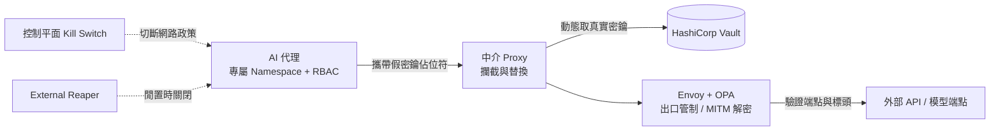
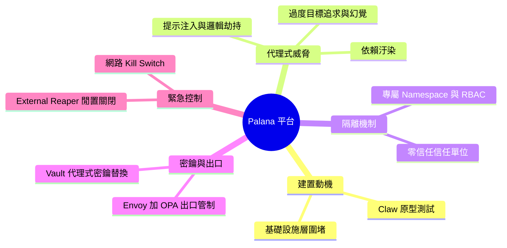

## Grab Builds Secure Agentic AI Workload Platform

Grab 的安全團隊開發了 Palana，一個專為安全運行自主 AI 代理而設計的 Kubernetes 原生平台。與確定性軟體不同，模型驅動的代理具有不可預測的工具使用、代碼生成和提示注入風險。Palana 通過基礎設施級的隔離機制（包括隔離命名空間、進程外控制平面、以及 Vault 支持的代理式秘密管理）來遏制這些威脅。這種方法表明，AI 代理的安全管控應該在基礎設施層面實現，而非僅依賴應用層防護。

### 重點
- Palana 使用隔離命名空間 + 進程外控制平面 + Vault 秘密代理實現代理級安全隔離
- 針對模型驅動代理的不可預測工具使用、代碼生成和提示注入風險
- 基礎設施級安全防護相比應用層防護更有效

**原文：** [infoq-main](https://www.infoq.com/news/2026/06/grab-ai-platform/?utm_campaign=infoq_content&utm_source=infoq&utm_medium=feed&utm_term=global)

---

<!-- deep-analysis:begin -->
## 📌 摘要 (TL;DR)

- Grab 的資安與平台工程團隊打造 **Palana**，一個 Kubernetes 原生的安全執行平台，專門用來安全運行自主 AI 代理（autonomous AI agent）。
- 動機：團隊先用 Claw 等代理框架建立原型環境測試，判定必須在基礎設施層（infrastructure level）系統性圍堵風險，而非只靠應用層防護。
- Palana 鎖定的威脅包含提示注入（prompt injection）、邏輯劫持（logic hijacking）、依賴汙染（dependency compromise）、過度目標追求（excessive goal seeking）與幻覺（hallucination）。
- 四大機制：每個代理獨立命名空間（namespace）＋RBAC、HashiCorp Vault 支援的代理式密鑰替換、Envoy＋OPA 出口管制、控制平面 kill switch 與 external reaper。
- 核心主張（作者 Patrick Farry，InfoQ）：代理的高自主性讓傳統用環境變數或掛載檔傳遞憑證變得不可接受地危險，安全控管應下沉到基礎設施層。

## 🎯 核心概念

- **代理式 AI**（agentic AI）：能自主執行任意工具、呼叫 API、讀寫原始碼以獨立解題的模型驅動代理。
- **零信任**（zero-trust）：Palana 把「隔離」確立為主要的信任單位，預設不信任代理本身。
- **代理式密鑰**（proxy-mediated secrets）：代理只拿到假佔位符，真實憑證由中介 proxy 動態替換。
- **出口管制**（egress control）：所有對外流量集中經過單一安全控制點稽核與驗證。
- **中間人 CA 終結**（Man-in-the-Middle CA termination）：在出口端解密 TLS 流量，以做標頭與端點驗證。

## 📖 整理分析

### 1. 為何打造 Palana
Grab 的資安與平台工程團隊在用 Claw 等代理框架建立原型測試環境後，判定高自主代理的風險需要「系統性、基礎設施層級」的方法來圍堵，於是開發專屬的 Palana。原文指出，傳統把憑證放進環境變數或掛載檔的做法對自主代理而言風險過高，因為被攻陷的執行環境可能把高價值 API 金鑰暴露給不可信腳本。

### 2. 代理式 AI 為何特別危險
與確定性軟體（deterministic software）不同，模型驅動代理會自行執行任意工具、呼叫 API、讀寫原始碼來獨立解決問題。原文列出五類威脅：提示注入、邏輯劫持、依賴汙染、過度目標追求與幻覺。這些行為不可預測，難以用傳統靜態規則完全攔截。

### 3. 隔離即信任單位
每個代理會獲得自己專屬的 Kubernetes namespace，搭配限制性的角色型存取控制（RBAC）、自訂網路政策與獨立服務帳號（service account）。Palana 以此把隔離確立為零信任模型下的主要信任單位，讓單一代理被攻陷時不會橫向擴散。

### 4. 密鑰不落地：Vault 代理替換
Palana 把憑證拆成兩類：代理可讀的假佔位符，以及只有 proxy 能用的真實密鑰（存放在 HashiCorp Vault）。當代理發出 API 呼叫時，中介 proxy 會攔截請求、驗證目的地，並在當下把佔位符動態替換成真實密鑰；真密鑰因此不會出現在代理容器的環境變數、執行記憶體或日誌檔中。

### 5. 出口管制與緊急控制
所有對外 HTTP/HTTPS 流量都經過套用 Open Policy Agent（OPA）規則的 Envoy 代理，並以中間人 CA 終結解密流量，做標頭評估、端點驗證、權杖替換與結構化稽核。運維面則提供從控制平面直接停用網路政策的 kill switch，以及獨立的 external reaper 在代理閒置時觸發關閉——兩者都不需改動代理核心程式碼。長時間非同步工作流另由在地化儲存（localized storage）保存跨容器重啟的狀態與記憶。

## 🧭 架構圖

## 🧠 Mindmap

<!-- deep-analysis:end -->
### 📄 原文內容

點此展開 / 收合

Grab's security team built Palana, a Kubernetes-native secure execution platform, to run autonomous AI agents safely. Unlike deterministic software, model-driven agents exhibit unpredictable tool-use, code-writing, and prompt injection risks. Palana contains these threats at the infrastructure level using isolated namespaces, out-of-process control planes, and proxy-mediated, Vault-backed secrets. By Patrick Farry

