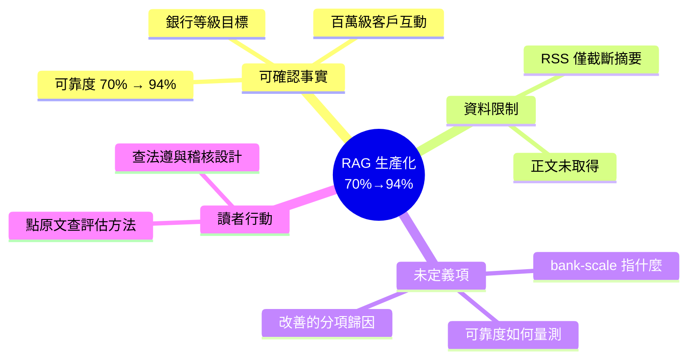

## Building Production-Grade RAG Systems: From Prototype to Bank-Scale Reliability

團隊分享了將 RAG 對話機器人的可靠性從 70% 提升至 94% 的工程經驗，系統日常處理百萬級客戶互動並達到銀行等金融機構的生產級要求。文章標題強調了從原型到銀行規模可靠性的完整過程，涵蓋生產化的多個維度。提升 24 個百分點的可靠性指標及支撐百萬級交互的規模數據，對實務應用具有明確的參考價值。雖然摘要未詳述技術方案，但可靠性量化指標本身是重要的工程里程碑。

### 重點
- RAG 系統可靠性從 70% 提升至 94%（提升 24 百分點）
- 系統規模達百萬級客戶互動並支持金融機構部署
- 強調了原型到生產環境的完整工程化過程

**原文：** [medium-tag-claude](https://medium.com/the-better-life/building-production-grade-rag-systems-from-prototype-to-bank-scale-reliability-42cfa5f071e2?source=rss------claude-5)

---

<!-- deep-analysis:begin -->
## 📌 摘要 (TL;DR)

- **重要前提**：本次抓取到的內容只有 Medium RSS 的截斷片段（標題 + 一句導言 + 「Continue reading on The Better Life »」），**文章正文並未包含在來源資料中**。以下整理嚴格限縮在可確認的資訊，不補完原文未出現的技術細節。
- 原文自述的核心成果：將一個 RAG 聊天機器人的可靠度（reliability）從 **70% 提升到 94%**，等於 +24 個百分點。
- 規模宣稱：該系統處理 **數百萬次（millions of）客戶互動**，並以「銀行等級」（bank-scale）作為可靠性標準。
- 標題定位為「從原型到生產級」（from prototype to production-grade），暗示內容主軸是工程化與可靠性，而非模型或演算法創新。
- 讀者若要取得實際做法（評估方法、檢索策略、護欄設計等），**必須點進原文**——這些在目前資料中完全缺席。

## 🎯 核心概念

以下兩個詞出現在標題／導言中，定義屬一般性背景知識，**非原文內容**：

- **檢索增強生成**（Retrieval-Augmented Generation，RAG）：先從外部知識庫檢索相關文件，再把檢索結果餵給大型語言模型生成回答的架構，用於降低幻覺並讓答案可追溯到來源。
- **生產級**（production-grade）：泛指系統已具備穩定度、可觀測性、錯誤處理與規模承載能力，可承擔真實流量。原文標題使用此詞，但**未在可取得的片段中定義其判準**。

## 📖 整理分析

### 1. 可取得的原文內容全貌

來源 `body_md` 的實質內容僅有一行：「How we scaled a RAG chatbot from 70% to 94% reliability handling millions of customer interactions」。這是 Medium 透過 RSS 輸出摘要模式時的典型結果——只推送前導句，正文留在網站上。因此本篇整理無法達到「讀者不必跳回原文」的目標，這一點必須先講清楚。

### 2. 三個可確認的數字，以及它們的未定義處

可確認的是三個量化宣稱：起始可靠度 70%、最終 94%、互動量級為百萬。但**「可靠度」的定義在片段中不存在**——它可能指答案正確率、來源引用正確率、任務完成率、或不需轉真人客服的比例，四者的工程含意差距極大。同樣地，「bank-scale」究竟指流量規模、法遵稽核要求、還是可用度 SLA，也無從判斷。在沒有定義的情況下，24 個百分點的提升無法與其他系統橫向比較。

### 3. 原文未回答、但讀者該去找的問題（此段為分析建議，非原文主張）

若要判斷這篇文章是否值得投入時間，點進原文時建議直接檢查四件事：(a) 可靠度的**量測方法與評估集大小**，是人工標註還是 LLM-as-judge；(b) 70% → 94% 是由**哪幾項改動**貢獻的，以及各自的邊際效益；(c) 金融場域的**法遵與稽核設計**（如回答留痕、來源引用、拒答策略）；(d) 是否揭露真實的客戶／機構名稱與時間範圍。這四項缺其一，數字的可信度就會大幅下降。

### 4. 對這類「X% → Y%」工程分享的一般判讀原則

（此為通用判讀建議，非原文內容）產業部落格常見以單一百分比概括系統改善，但 RAG 的可靠度提升通常是多層改動的疊加：檢索品質、切塊策略、重排序、提示設計、護欄與回退機制。缺少分項歸因時，讀者難以判斷該經驗能否遷移到自身情境。在原文正文取得前，本篇僅能記錄「有此宣稱」，不宜作為技術決策依據。

## 🧠 Mindmap

<!-- deep-analysis:end -->
### 📄 原文內容

點此展開 / 收合

How we scaled a RAG chatbot from 70% to 94% reliability handling millions of customer interactions Continue reading on The Better Life »

