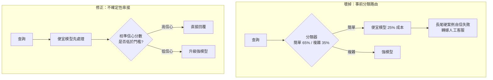
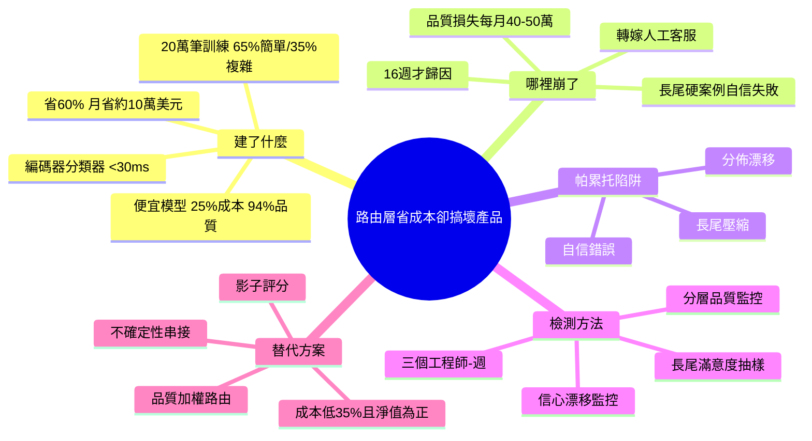

## We Built a Routing Layer to Cut Our AI Costs. It Broke the Product.

一個團隊通過建立路由層將 AI 推理成本削減超過 50%，但三個月後發現客戶滿意度下降，成本節省實際上伴隨了品質損失。文章指出這是「帕累托陷阱」—— 優化成本時無意中犧牲了產品品質。提供的檢測方法論能在數日而非數月內識別此類權衡，幫助團隊在早期預防優化反作用。

### 重點
- 成本節省 50%+ 伴隨品質下降與客戶滿意度損害；成本優化必須同步監控品質指標
- 帕累托陷阱：路由層選擇低成本模型以減少支出，卻導致推理品質下滑
- 檢測方法論在天級別（而非月級別）識別成本-品質權衡，支持快速決策

**原文：** [medium-towards-data-science](https://towardsdatascience.com/we-built-a-routing-layer-to-cut-our-ai-costs-it-broke-the-product/)

---

<!-- deep-analysis:begin -->
## 📌 摘要 (TL;DR)

- 一個客服 AI 團隊部署了路由層（routing layer）：用微調過的編碼器分類器（fine-tuned encoder，延遲 <30ms），把查詢分流到「貴的強模型」或「便宜模型」，月帳單降到原本的 40%、省下約 60%（約每月 10 萬美元）。
- 分類器用 20 萬筆歷史客服查詢訓練，標成「簡單」（佔 65% 流量）與「複雜」（35%）；便宜模型只要強模型約 25% 價格，在 5,000 筆測試集上有 94% 等效品質——帳面上看起來完美。
- 三個月後客戶滿意度下滑、流失率上升：便宜模型在「看似簡單卻藏著難題」的長尾案例上失敗（例如表面像例行帳單、實則涉及詐騙的查詢），缺口被轉嫁給人工客服「再做一次」，成本記在別的預算上。
- 作者估算：省下的推理成本約每月 10 萬美元，品質損失的代價卻達每月 40–50 萬美元，等於「兩個季度的淨負產品價值」，而問題花了 16 週才被歸因出來。
- 作者稱此為「帕累托陷阱」（Pareto trap）：省成本的人量測得到收益，品質損失卻由客戶體驗、人工客服、留存團隊承擔，量測不到。
- 解法不是放棄路由，而是改用「不確定性導向的串接」（uncertainty-routed cascade）並在上線前補三項可觀測性。最終推理成本落在比基準低 35%，且滿意度恢復、淨價值為正。

## 🎯 核心概念

- **路由層**（routing layer）：在請求進入模型前，先用一個分類器決定要送給哪個模型，用便宜模型處理多數流量以降成本。
- **帕累托陷阱**（Pareto trap）：一個結構性問題——優化收益由建系統的團隊量測，品質損失卻由下游（客戶、人工客服、留存）承擔，因此帳面只看得到「省錢」。
- **長尾壓縮**（long-tail compression）：分類器無法區分「表面簡單」與「實際脈絡複雜」的查詢，難題被壓進「簡單」桶。
- **自信錯誤**（confident failure）：便宜模型給出貌似合理卻錯誤的回答，使用者更難察覺它錯了。
- **分佈漂移**（distribution drift）：生產環境的查詢分佈會隨時間演化，分類器與訓練資料逐漸錯位。
- **不確定性導向的串接**（uncertainty-routed cascade）：所有查詢先進便宜模型，產生校準後的信心分數，低於門檻才升級到強模型。

## 📖 整理分析

### 1. 他們建了什麼：分類路由架構

團隊先用 20 萬筆歷史客服查詢訓練一個微調編碼器分類器（推論延遲 <30ms），把每筆查詢標為「簡單」（65% 流量）或「複雜」（35%）。簡單的送便宜模型、複雜的送最高階推理模型。便宜模型成本只有強模型約 25%，在 5,000 筆測試集上量到 94% 等效品質。上線後月帳單掉到原本的 40%，省約 60%——所有離線指標都通過，看起來是教科書級的成本優化。

### 2. 哪裡崩了：省 10 萬、賠 40–50 萬

三個月後客戶滿意度下降、流失上升。追查發現便宜模型在「藏在簡單分類裡的硬邊案例」失敗，例如表面像例行帳單、實際涉及詐騙的查詢。這些失敗被轉嫁到人工客服，由人「把同一個問題再處理一次」，而人力成本記在另一個預算。作者估算：推理省下約每月 10 萬美元，品質損失代價卻是每月 40–50 萬美元，累積成「兩個季度的淨負產品價值」。最致命的是時間差——問題在儀表板上隱形 3 個月，再花 1 個月歸因，總共 16 週才看清。

### 3. 為什麼便宜模型在長尾崩潰

作者歸納三個機制：（1）長尾壓縮——分類器分不出「看起來簡單」和「脈絡其實複雜」的查詢；（2）自信錯誤——便宜模型用貌似合理的錯誤回答失敗，比明顯出錯更難被使用者抓到；（3）分佈漂移——生產查詢分佈持續演化，分類器與當初的訓練資料越來越錯位。三者疊加，使品質損失既集中在長尾、又被自信的語氣掩蓋。他後續稽核的另外兩個團隊（其中一個用嵌入相似度分類器）出現同樣模式，顯示這不是個案。

### 4. 數天而非數月的檢測方法

作者主張在路由上線「之前」就補三項可觀測性：（1）分層品質監控——每個品質訊號都要按路由層級拆開，tier 標籤端到端傳遞，人工抽查、離線回歸套件（12,000 筆）、反饋事件都要分層；（2）長尾滿意度抽樣——刻意過採樣「模型選擇真正有差」的查詢，鎖定分類器低信心或落在訓練分佈外的案例；（3）路由信心漂移監控——把生產信心分數分佈對照訓練基線，因為「漂移訊號比品質訊號早幾週出現」。預防性實作只要約「三個工程師-週」，事後補救則貴得多。

### 5. 更好的替代方案：不確定性串接

與其事前分類，作者建議改用不確定性導向的串接：每個查詢先進便宜模型、產生校準信心分數，低於門檻才升級強模型。再加上「影子評分」（shadow scoring，對生產樣本平行跑強模型比對）與「品質加權路由」（quality-weighted routing，把滿意度訊號回饋去調門檻）。第一個團隊改造後，推理成本最終落在比優化前基準低 35%——比當初承諾的省得少，但部署的淨產品價值「明確為正」。結論一句話：優化的「層」比優化本身更重要。

## 🧭 流程圖 / 架構圖

原文未提供可引用的圖片，以下用 mermaid 對比「壞掉的事前分類路由」與「修正後的不確定性串接」：

## 🧠 Mindmap

<!-- deep-analysis:end -->
### 📄 原文內容

點此展開 / 收合

A team cut their AI inference bill by more than half. Three months later, customer satisfaction was dropping and the cost savings were tied to the quality loss. Cost-optimization routing layers are a Pareto trap, and here's the detection methodology that catches them in days instead of months. 
 The post We Built a Routing Layer to Cut Our AI Costs. It Broke the Product. appeared first on Towards Data Science .

