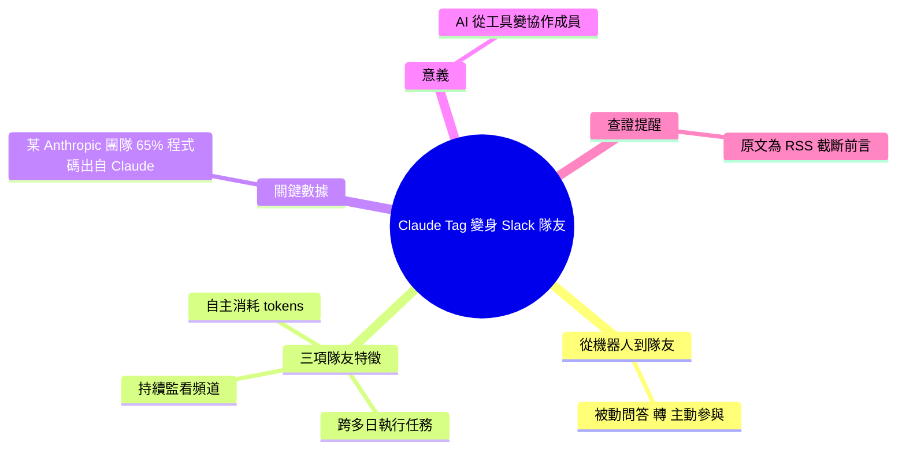

## Claude Tag Makes @Claude a Slack Teammate, Not a Chatbot

Anthropic 推出 Claude Tag 功能，使 Claude 在 Slack 中以真正的隊友身份工作——可跨多日自動運行任務、持續監看頻道、獨立消耗 tokens 執行分析。文中透露某個 Anthropic 內部團隊已有 65% 的代碼由 Claude 自動生成，直接印證了 LLM 在工程流程中的實際影響力。此發展標誌著 AI 從互動式工具轉變為主動自主、持續運作的團隊成員，改變了人與 AI 協作的根本模式。

### 重點
- Claude Tag 在 Slack 可無需人工觸發、長期自主運行任務和監看分析
- Anthropic 內部數據：某團隊 65% 的代碼由 Claude 生成（可改變決策的實證）
- AI 角色從被動回應工具演進為主動監看、自主執行的隊友

**原文：** [medium-tag-claude](https://medium.com/@automation.labs/claude-tag-makes-claude-a-slack-teammate-not-a-chatbot-18640affb045?source=rss------claude-5)

---

<!-- deep-analysis:begin -->
## 📌 摘要 (TL;DR)

- Medium 作者 automation.labs 主張：Anthropic 的「Claude 標記」（Claude Tag，即在 Slack 用 @Claude 呼叫）讓 Claude 從聊天機器人（chatbot）變成真正的隊友（teammate）。
- 文章列出三項「隊友化」特徵：可跨多日（for days）持續執行任務、主動監看（watch）你的頻道、並自行消耗 tokens 運作，不需人為逐步觸發。
- 最具話題性的數據：文中宣稱 Anthropic 某個內部團隊已有 **65% 的程式碼由 Claude 生成**。
- 核心論點：AI 協作模式正從「被動問答工具」轉向「主動、持續、自主的團隊成員」。
- ⚠️ 查證提醒：本次提供的原文僅為 Medium RSS 截斷前言（結尾為「Continue reading on Medium »」），以下分析依據可得的標題、前言與既有摘要，全文細節無法核實。

## 🎯 核心概念

- **Claude 標記（Claude Tag）**：在 Slack 頻道以 @Claude 標記呼叫 Claude 的互動方式，是本文討論的主體。
- **隊友而非機器人（teammate, not a chatbot）**：強調互動從「一問一答」轉為「長時程、主動參與」。
- **自主消耗 tokens（spends tokens on its own）**：Claude 可在不需每一步人為指令下持續運作並使用運算資源。

## 📖 整理分析

### 1. 從機器人到隊友
標題與前言的核心對比是「teammate, not a chatbot」。作者認為，加上 Claude 標記後的 Claude 不再是「收到訊息才回應」的工具，而能像團隊成員一樣常駐於 Slack。這是一種定位（positioning）上的轉變，而非單純的功能列點。

### 2. 三項「隊友」特徵
前言具體點出三件事：一是「runs tasks for days」——任務可跨多日延續；二是「watches your channels」——主動監看頻道內容；三是「spends tokens on its own」——自行消耗 tokens 執行。三者共同指向「主動、持續、自主」的運作型態。

### 3. 「65% 程式碼由 Claude 生成」的數據
文章最吸睛的數字是：Anthropic 某內部團隊已有 65% 的程式碼出自 Claude。此數據在前言中以佐證形式出現，用來支持「Claude 已實際融入工程流程」的論點。需注意這是文中宣稱、未在所提供內容中附上來源細節，引用時宜標明出處。

### 4. 為何值得關注
若上述描述成立，代表使用模式從「開啟對話、逐題提問」走向「交付任務、長期託管」。這與近年「AI 撰寫大量程式碼」的公開討論方向一致（此為背景脈絡，非本文獨家數據）。對團隊而言，真正受影響的是協作流程設計與 token 成本的管理方式。

### 5. 資料限制與查證提醒
本則來源為 RSS 聚合帳號的 Medium 截斷文章，正文需點「Continue reading」才能讀到完整內容。因此本整理刻意不補充原文未出現的版本號、效能數字或操作步驟；若需完整功能說明與 65% 數據的出處，建議回到 Medium 原文或 Anthropic 官方文件查證。

## 🧠 Mindmap

<!-- deep-analysis:end -->
### 📄 原文內容

點此展開 / 收合

It runs tasks for days, watches your channels, and spends tokens on its own &#x2014; and 65% of one Anthropic team&#x2019;s code already comes from it. Continue reading on Medium »

