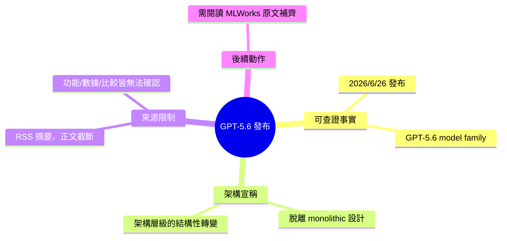

## What’s New With OpenAI’s GPT5.6?

OpenAI 於 2026 年 6 月 26 日發布 GPT-5.6 模型系列，標誌著從先前單一設計架構進行了結構性改變。此次更新代表模型設計理念的重要轉向，但詳細的功能特性與改進內容因原文截斷而無法確認。

### 重點
- GPT-5.6 模型系列發布於 2026 年 6 月 26 日
- 架構從單一設計（monolithic）轉向結構性分離設計
- 標誌著 OpenAI 模型演進的重要裡程碑

**原文：** [medium-tag-llm](https://medium.com/mlworks/whats-new-with-openai-s-gpt5-6-551b3d8cc6b6?source=rss------large_language_models-5)

---

<!-- deep-analysis:begin -->
## 📌 摘要 (TL;DR)

- OpenAI 於 2026 年 6 月 26 日發布 GPT-5.6 模型系列（GPT-5.6 model family）。
- 原文宣稱此版本是「從過往單一巨石式架構（monolithic design）的結構性轉變（structural departure）」，暗示這是架構層級、而非僅參數規模上的調整。
- ⚠️ 重要限制：本則來源為 MLWorks（Medium）的 RSS 摘要，正文在第一段後即被截斷（結尾為「Continue reading on MLWorks »」）。GPT-5.6 的具體新功能、效能 / benchmark 數據、架構細節在來源中皆無法取得。
- 因此本整理僅就「發布時間、產品名稱、架構方向宣稱」三項可查證事實展開；其餘內容需點擊原文閱讀，本文不臆測補完。

## 🎯 核心概念

- **單一巨石式架構（monolithic design）**：指將模型所有能力集中在單一、不可分割的大型網路中處理全部任務的設計。原文指 GPT-5.6 與此架構「結構性切割」，但在可取得的段落中並未說明改採何種替代設計。
- **結構性轉變（structural departure）**：原文用語，強調此次改變發生在架構層級，而非單純的版本號迭代或規模放大。

## 📖 整理分析

### 1. 可查證的發布事實
原文開頭明確指出：2026 年 6 月 26 日，OpenAI 發布 GPT-5.6 模型系列。這是來源中唯一同時具備「時間、主體、產品」三要素的完整陳述，可直接引用。

### 2. 「脫離單一巨石架構」的宣稱
原文以「marking a structural departure from previous monolithic designs」描述此次更新，強調改變落在架構層面。需特別注意：原文僅提出此方向性宣稱，並未（在可取得段落中）點名 GPT-5.6 改採的具體架構——例如混合專家（Mixture-of-Experts）、模組化或多模型路由等，皆未在來源出現，故本文不替它指定。

### 3. 來源截斷與無法確認的內容
本則為 RSS 推送的文章摘要，正文於「This update…」後即以「Continue reading on MLWorks »」截斷。因此以下項目在來源中皆不存在、無法整理：新功能清單、效能 / benchmark 數據、定價、上下文長度、與前代或競品（如 Anthropic、Google）的比較。若需這些細節，必須前往 MLWorks 原文閱讀。本文依「寧可空白、不可捏造」原則，對缺失內容保持留白。

## 🧠 Mindmap

<!-- deep-analysis:end -->
### 📄 原文內容

點此展開 / 收合

On June 26th, 2026, OpenAI released the GPT-5.6 model family, marking a structural departure from previous monolithic designs. This update&#x2026; Continue reading on MLWorks »

