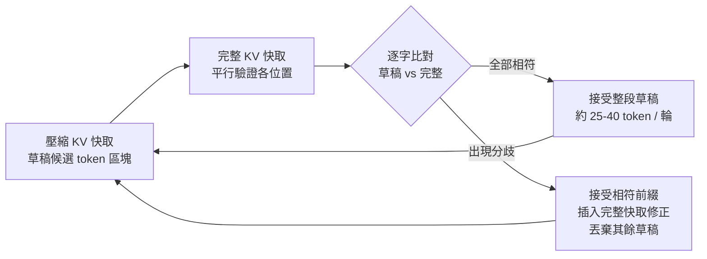
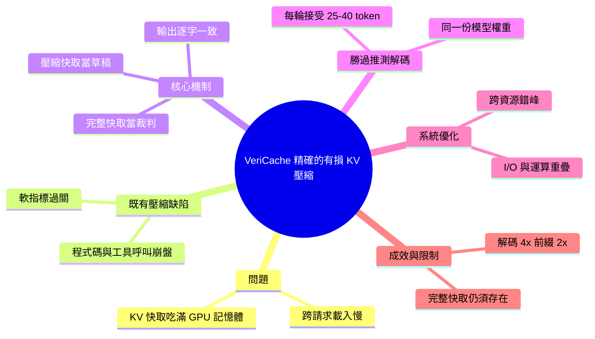

## VeriCache: Making Lossy KV Compression Exact

VeriCache 是一項針對 KV 快取優化的技術。在長上下文推理中，KV 快取已成為服務大型語言模型的主要效能瓶頸。VeriCache 的核心創新是實現有損壓縮同時保持推理結果精確性。這項技術對於降低 LLM 推理的計算和記憶體成本具有重要意義。

### 重點
- KV 快取是長上下文 LLM 推理的主要效能瓶頸
- VeriCache 通過有損壓縮與精確性結合優化 KV 快取
- 應用於降低 LLM 推理的成本與延遲

**原文：** [medium-tag-llm](https://devshahs.medium.com/vericache-making-lossy-kv-compression-exact-84ba36c318ec?source=rss------large_language_models-5)

---

<!-- deep-analysis:begin -->
## 📌 摘要 (TL;DR)

- VeriCache 把有損的 KV 快取（key-value cache）壓縮重新定位為「推測執行」(speculative execution) 的草稿來源，而不是直接拿壓縮結果當輸出，藉此在加速的同時保證輸出與完整快取逐字一致。
- 動機很硬：長上下文推理下 KV 快取是主要瓶頸——Qwen-32B 在 H100 上跑 100K token 上下文會產生約 15GB 快取，batch size 被壓到只剩 1；要從 S3 載入 100K token 的快取約需 5 秒。
- 既有壓縮（token 丟棄、量化）會改變模型行為：在 KVzip 4× 壓縮下，token-level F1 仍可維持 75% 以上，但程式碼格式正確率趨近 0、函式呼叫正確率掉到 10% 以下。
- 機制：壓縮快取負責「草稿」候選 token，完整快取平行「驗證」，左到右逐字比對，遇到分歧就接受相符前綴並用完整快取修正——草稿與驗證用同一份模型權重，每輪可接受約 25–40 個 token（小模型推測解碼通常只有 2–3 個）。
- 成效：長上下文解碼吞吐量最高提升 4×、遠端前綴快取最高提升 2×，且輸出與完整快取完全相同。
- 為何值得關注：它把「有損壓縮」與「精確正確性」兩件事解耦，特別適合對正確性敏感的程式碼生成與工具呼叫（tool calling）場景。

## 🎯 核心概念

- **KV 快取**（key-value cache）：Transformer 在生成時快取每個 token 的 key/value 以避免重算；其大小隨上下文長度線性成長，是長上下文服務的記憶體與頻寬瓶頸。
- **推測解碼**（speculative decoding）：傳統做法用一個較小的草稿模型快速產生候選，再由目標模型驗證；VeriCache 借用同一概念，但改用「快取狀態」而非「不同模型」來做草稿。
- **跨資源錯峰**（cross-resource staggering）：草稿吃 GPU 記憶體頻寬、驗證吃 CPU–GPU 互連頻寬，兩者錯開排程讓 I/O 與運算重疊。
- **接受序列**（acceptance runs）：一輪驗證中，從草稿連續被接受的 token 數；數字越大代表壓縮快取越貼近完整快取、加速越明顯。
- **注意力匯點**（attention sinks）：壓縮時被刻意保留的重要 token（如開頭與近期 token）。

## 📖 整理分析

### 1. 問題：KV 快取的兩個瓶頸
原文把瓶頸拆成兩層。**單請求**層面，快取隨上下文成長吃滿 GPU 記憶體：Qwen-32B 在 2K token 時每請求約 0.3GB、batch 可到約 50，但 100K token 時膨脹到 15GB，batch 直接掉到 1。**跨請求**層面，預先算好的前綴快取要重複從儲存載入：Llama-3.1-8B-1M 在 500K 上下文下單次 KV 讀取達 60GB；從 S3 載入 10K token 約 0.5 秒、100K token 約 5 秒（約 3GB/s）。

### 2. 既有壓縮的致命傷：軟指標過關、正確性崩盤
 token 丟棄（保留重要 token／層／注意力頭）與量化（維持快取形狀但降位元）都能省記憶體，但會改變模型輸出。作者以 KVzip 為例：4× 壓縮下 token-level F1 仍 >75%，看似可用；但程式碼格式正確率趨近 0、函式呼叫正確率 <10%。這說明有損壓縮對「模糊指標」可行，對「需要逐字精確」的任務則失效。

### 3. VeriCache 核心：壓縮當草稿、完整快取當裁判
VeriCache 同時維護兩份快取：壓縮快取快速產生候選 token 區塊，完整快取平行驗證這些位置，再左到右比對。相符則整段接受；一旦分歧，就接受已驗證前綴、插入完整快取的修正、丟棄其餘草稿。一句話總結原文立場：「壓縮 KV 可以提議 token，但由完整 KV 決定哪些 token 進入輸出」，因此輸出與完整快取推理完全相同。

### 4. 為何比傳統推測解碼更有效
關鍵差異是：草稿與驗證用**同一份模型權重**，唯一不同是快取狀態（草稿用壓縮 KV、驗證用完整 KV）。因為壓縮快取的行為仍貼近完整快取，接受序列更長——每輪約 25–40 個 token，而小模型方案通常只有 2–3 個，攤提下加速更顯著。

### 5. 系統層優化：跨資源錯峰
草稿（壓縮 KV）受 GPU 記憶體頻寬限制，驗證（搬完整 KV）受 CPU–GPU 互連限制。VeriCache 用跨資源錯峰：當一個請求在驗證自己的完整快取時，其他請求繼續用壓縮快取草稿，讓 I/O 開銷與運算重疊、把驗證成本攤到多個請求上。最終長上下文解碼吞吐量提升至多 4×、遠端前綴快取至多 2×。

### 6. 限制
原文坦承幾項邊界：完整快取仍須存在於某處（CPU 記憶體、儲存或遠端），只是把開銷搬移而非消除；驗證並非免費，效益取決於排程攤提是否有效；壓縮快取越貼近完整快取才越划算，頻繁不相符會拉高驗證負擔；最乾淨的逐字保證成立於貪婪解碼（greedy decoding），取樣（sampling）生成需要額外機制。

## 🧭 流程圖：單輪「草稿 → 驗證 → 接受／修正」

（原文 Figure 1 描繪此驗證迴圈、Figure 2 描繪跨資源錯峰排程，但文中未提供圖片 URL，以下用 mermaid 重建邏輯）

## 🧠 Mindmap

<!-- deep-analysis:end -->
### 📄 原文內容

點此展開 / 收合

Long-context inference has made the KV cache one of the main bottlenecks in serving large language models. Continue reading on Medium »

