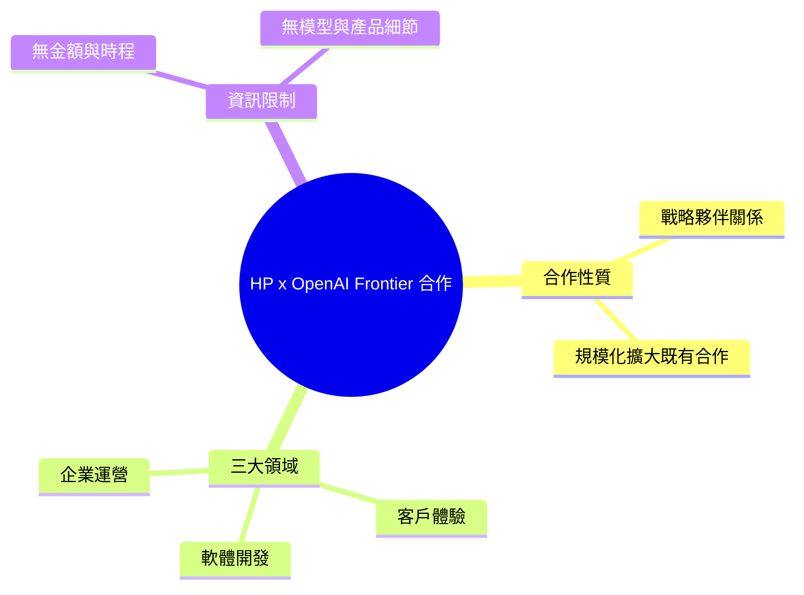

## HP Inc. launches Frontier strategic partnership with OpenAI

HP Inc. 與 OpenAI 建立 Frontier 戰略合作夥伴關係。該合作涵蓋客戶體驗、軟體開發和企業運營三大領域。HP 致力於透過與 OpenAI 的合作在這些領域擴大 AI 應用規模。

### 重點
- HP Inc. 與 OpenAI Frontier 達成戰略合作
- 應用領域涵蓋客戶體驗、軟體開發、企業運營

**原文：** [openai-blog](https://openai.com/index/hp-frontier-partnership)

---

<!-- deep-analysis:begin -->
## 📌 摘要 (TL;DR)

- HP Inc. 宣布與 OpenAI 建立名為「Frontier」的戰略合作夥伴關係（Frontier strategic partnership）。
- 合作鎖定三大領域：客戶體驗（customer experiences）、軟體開發（software development）、企業運營（enterprise operations）。
- 原文用字「scales（擴大規模）」，暗示雙方先前已有合作基礎，本次屬規模化部署階段。
- ⚠️ 注意：本則來源僅為一句話的官方公告，未揭露合作金額、時程、採用的具體模型／產品或量化成效；以下分析以原文可考內容為主，背景補充均明確標註為推論。

## 🎯 核心概念

- **Frontier 戰略合作夥伴關係 (Frontier strategic partnership)**：OpenAI 與 HP 之間的合作名稱，原文未進一步定義具體條款或範疇。
- **三大應用領域**：客戶體驗、軟體開發、企業運營，是本次合作宣稱要導入 AI 的範圍。

## 📖 整理分析

### 1. 合作的核心訊息
原文只用一句話定調：HP 正在「擴大（scales）」其與 OpenAI 的 Frontier 合作，把 AI 部署到客戶體驗、軟體開發與企業運營三個面向。從用字「scales」可推論雙方先前已有合作基礎，此次是把既有合作放大到全公司規模（此為依原文用字的推論，非原文明述）。

### 2. 三大應用領域拆解
原文僅列出三個領域名稱，未說明各自的具體做法或工具：
- **客戶體驗**：推論可能涵蓋客服、銷售或使用者支援等對外環節（原文未具體說明，屬推論）。
- **軟體開發**：推論可能指以 AI 協助 HP 內部工程團隊（原文未具體說明，屬推論）。
- **企業運營**：推論可能指內部流程與營運效率優化（原文未具體說明，屬推論）。

### 3. 為什麼值得關注
這類「PC／硬體大廠 × 前沿 AI 實驗室」的企業級合作，呼應 AI 從消費端逐步走入企業內部營運的趨勢（此為產業背景推論，非原文陳述）。不過就本則公告本身而言，缺乏可驗證的數字、模型版本或產品細節，難以據此評估實質影響力。

### 4. 原文的資訊限制
本則來源內容僅有標題加一句摘要，無日期、無金額、無模型版本、無高層具名引述、無圖片。若需深入評估合作實質內容，建議回查 OpenAI 官方頁面（openai.com/index/hp-frontier-partnership）或 HP 官方新聞稿原文。

## 🧠 Mindmap

<!-- deep-analysis:end -->
### 📄 原文內容

點此展開 / 收合

HP Inc. scales its OpenAI Frontier partnership to deploy AI across customer experiences, software development, and enterprise operations.

