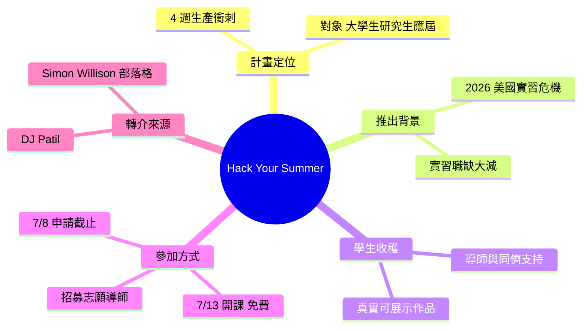

## Hack Your Summer

Hack Your Summer 是一個 4 週暑期編程衝刺計畫，由 DJ Patil 推動，針對大學生、研究生和應屆畢業生。計畫回應 2026 年嚴峻的實習危機——企業大幅縮減實習機會，團隊導師能力不足。學生將在 4 週內完成真實、可部署的項目，獲得導師與同儕支持。第二個免費 cohort 將於 7 月 13 日開始，申請截止日期為 7 月 8 日，同時歡迎志願者導師報名。

### 重點
- 4 週高速編程衝刺，學生完成可向雇主展示的真實項目
- 第二 cohort 開始日期 7 月 13 日，申請截止 7 月 8 日，免費參加
- 對應 2026 年實習危機，為實習機會短缺的學生提供替代路徑

**原文：** [simon-willison](https://simonwillison.net/2026/Jun/28/hack-your-summer/#atom-everything)

---

<!-- deep-analysis:begin -->
## 📌 摘要 (TL;DR)

- Simon Willison 於 2026/6/28 在部落格轉介一個叫 **Hack Your Summer** 的計畫，他是當天早上從 DJ Patil（曾任美國首任首席資料科學家，U.S. Chief Data Scientist）那裡得知的。
- Hack Your Summer 是一個為期 **4 週、高強度的「生產衝刺」（high-velocity production sprint）**，對象是大學生、研究生與應屆畢業生。
- 計畫目標是讓學生在暑假做出**真實、可公開展示、能拿給未來雇主看的作品**，而非單純上課。
- 推出背景是 2026 年美國大學生面臨的**實習危機**——企業縮減招聘、團隊也較沒有餘力帶實習生，導致實習職缺遠少於往年。
- **第二梯次免費**，7/13 開課，學生申請截止日為 **7/8**；計畫同時招募志願導師（mentors）。

## 🎯 核心概念

- **生產衝刺（production sprint）**：在固定且短的時間內，以高速度做出可交付、可上線成果的工作模式。
- **梯次（cohort）**：一批同時報名、共同進行並彼此支持的學員群組；本次是第二梯次。
- **實習危機（internship crisis）**：因企業縮編招聘而造成實習機會稀缺的現象，是本計畫推出的直接背景。

## 📖 整理分析

### 1. 計畫定位：4 週生產衝刺
Hack Your Summer 是一個節奏緊湊、為期 4 週的生產衝刺，面向大學生、研究生與應屆畢業生，給「想在暑假做出真東西」的人一條明確路徑。它的重點不在聽課，而在實際產出可部署、面向公眾（public-facing）的作品。

### 2. 學生能獲得什麼
原文列出四項收穫：學會**如何挑選一個項目**（identify a project）、**維持穩定進度**（make steady progress）、取得**導師與同儕的支持**，以及做出**具體、可公開、能展示給未來雇主的成果**。換言之，產出的是履歷上能拿出來的實作證據。

### 3. 推出背景：2026 實習危機
Simon Willison 指出，這個計畫部分是對今年美國大學生「實習危機」的回應。可用的實習職缺遠少於往年，原因是企業縮減了招聘規模，團隊也較沒有餘力指導實習生。對於沒搶到這些稀缺實習機會的學生，Hack Your Summer 提供了一條替代路徑。

### 4. 如何參加：時程與導師招募
第二梯次（second cohort）免費，將於 **7/13** 開課，學生的申請截止日為 **7/8**。除了學生，計畫也在招募**志願導師**協助指導。要注意這篇是 Simon Willison 的簡短轉介貼文，完整報名與計畫細節需至 Hack Your Summer 官方頁面查看。

## 🧠 Mindmap

<!-- deep-analysis:end -->
### 📄 原文內容

點此展開 / 收合

Hack Your Summer 
I learned about this initiative from DJ Patil this morning: 
 
 It’s a 4-week, high-velocity production sprint for undergraduate students, graduate students, and recent graduates who want to build something real this summer. 
 You’ll learn how to identify a project, make steady progress, get support from mentors and peers, and create tangible, public-facing work you can actually show future employers. 
 
 Hack Your Summer is partly a reaction to the internship crisis facing US college students this year. There are way fewer available internships than usual, as companies have reduced their hiring ambitions and teams have less capacity to coach interns. 
 Hack Your Summer provides an alternative path for the many students who didn't catch one of those rare internships. 
 A second (free) cohort starts on July 13th, and the deadline for students to apply is July 8th. They're also accepting volunteers to help mentor the students.

 Tags: careers

