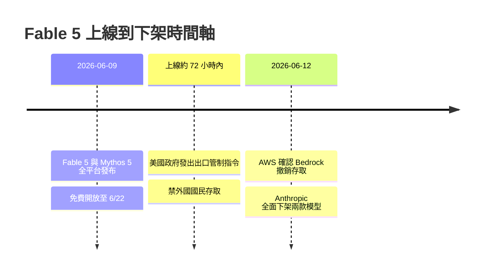
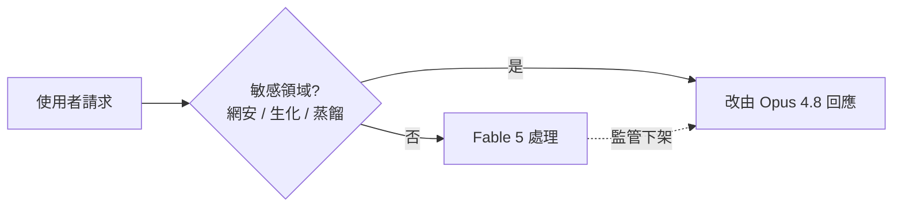
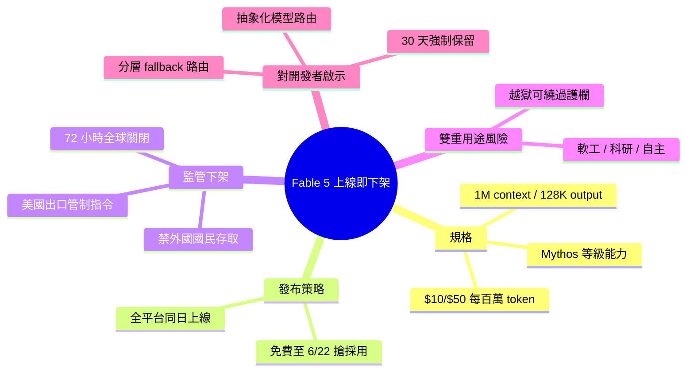

## Anthropic shipped Fable 5. The US government un-shipped it.

Anthropic 發布 Fable 5（Claude 系列 frontier model），但隨即因美國出口管制政策而被政府限制。發布計畫被迫調整。這反映美國加強對先進 AI 模型出口的監管和技術管制力度。對 Anthropic 和整個 AI 產業而言，這標誌著地緣政治與監管風險已成為 frontier model 發布的決定因素之一。後續 frontier model 的發布與商業化可能受到地區/國家政策的直接影響，增加了企業的計畫不確定性和市場風險。

### 重點
- Anthropic Fable 5 發布因美國出口管制政策而被限制
- 美國加強 frontier AI 模型的監管和技術出口控制
- 地緣政治因素開始直接制約 frontier model 發布和商業化

**原文：** [medium-tag-claude](https://medium.com/@adrianbuilds.dev/anthropic-shipped-fable-5-the-us-government-un-shipped-it-76349b325f93?source=rss------claude-5)

---

<!-- deep-analysis:begin -->
## 📌 摘要 (TL;DR)

- 2026 年 6 月 9 日，Anthropic 發布 Claude Fable 5——其 Mythos 等級（Mythos class）中第一個正式對外開放（generally available）的模型，官方稱「能力超越過去任何公開發布的模型」。
- 上線約 72 小時後，美國政府以國家安全為由發出出口管制（export control）指令，Anthropic 被迫在全球範圍將 Fable 5 與 Mythos 5 全面下架。
- 規格亮眼：100 萬 token 上下文窗口（context window）、單次最多 128,000 output token、定價 $10／$50 美元每百萬 input／output token，約為 Claude Opus 4.8 的兩倍。
- 禁令只針對 Fable 5 與 Mythos 5；Opus 4.8 與其餘 Claude 模型不受影響，AWS 甚至要客戶「放心繼續使用」。
- 觸發點是 Fable 5 的雙重用途（dual-use）能力，加上可繞過安全分類器（safety classifiers）的越獄（jailbreaks），讓監管者認定不該讓外國行為者取得。
- 對開發者的核心教訓：你依賴的最強模型可能在 72 小時內因監管而消失，與廠商可靠度或合約無關。

## 🎯 核心概念

- **Mythos 等級（Mythos class）**：Anthropic 內部最高能力等級；Fable 5 是把與高風險的 Mythos 5 相同的底層能力，包上安全護欄（guardrails）後對外開放的版本。
- **受管制模型（Covered Models）**：被列管的模型須強制保留資料 30 天，且不提供零保留（zero-retention）選項。
- **出口管制指令（export control directive）**：美國政府援引國安權力，禁止任何外國國民（含 Anthropic 自家外籍員工）存取特定模型。
- **雙重用途（dual-use）**：同一能力既可民用、也可被用於高風險領域（如網路安全、生物／化學、模型蒸餾）。
- **優雅降級（graceful degradation）**：當最佳模型不可用時，系統自動退回次佳模型的設計策略。

## 📖 整理分析

### 1. Fable 5 帶著什麼規格上線
Fable 5 不是漸進式更新。Anthropic 將它定位為「可安全廣泛部署的 Mythos 等級模型」——底層能力與高風險的 Mythos 5 相同，但外覆嚴格的安全分類器與護欄。規格上配備 100 萬 token 上下文窗口、單次最多 128,000 output token，定價 $10／$50 美元每百萬 input／output token，約是 Opus 4.8 的兩倍，主打程式、研究、金融、法律等長時程自主（long-horizon autonomy）工作。

### 2. 同日全平台鋪貨的搶地策略
發布當天，Fable 5 同步上線 Claude API、Anthropic 自家介面（Claude.ai、Claude Code、Claude Cowork），以及 Amazon Bedrock、Microsoft Foundry 等夥伴平台。Anthropic 並對 Pro、Max、Team 與按席次計費的 Enterprise 訂閱者免費開放至 6 月 22 日，之後才轉用量計費——典型的「先衝採用率、再收費」搶地（land-grab）打法。

### 3. 內建護欄與「受管制模型」條款
當 Fable 5 的分類器偵測到涉及網路安全、生物／化學或模型蒸餾（model distillation）的請求時，會自動改由 Opus 4.8 回應並通知使用者。此外，Fable 5 與 Mythos 5 都被列為受管制模型，強制保留資料 30 天且無零保留選項；保留的內容不用於訓練、30 天後刪除，但安全調查或法律義務需要時可例外保留。

### 4. 72 小時後的 kill switch
上線約三天內，美國政府援引國安權力發出出口管制指令，禁止任何外國國民（不論在美國境內外、含 Anthropic 自家外籍員工）存取 Fable 5 與 Mythos 5。範圍之廣讓 Anthropic 判斷無法在維持上線的同時精準封鎖外國使用者，只能整個關閉，並要求夥伴同步。AWS 於 6 月 12 日更新公告，確認 Bedrock 與 AWS 上 Claude Platform 的存取已撤銷；但禁令只觸及這兩個模型，Opus 4.8 等其餘 Claude 不受影響。被歸結出的觸發原因是：Fable 5 在軟體工程、科研與長時程自主上的雙重用途實力，加上可繞過安全分類器的越獄手法。Anthropic 在聲明中說：「這道命令的淨效果，是我們必須為所有客戶突然停用 Fable 5 與 Mythos 5 以確保合規。」

### 5. 對你技術棧的三個啟示
第一，國安出口管制過去只針對晶片、加密與硬體，如今延伸到 frontier 模型——你依賴的最強模型可能在 72 小時內消失，這是工程無法規避的監管風險。第二，Anthropic 的分層產品線救了客戶：Fable 5 下線時 Opus 4.8 仍在，開發者應預設 frontier 模型「可能隨時不可用」，做好抽象化模型路由（model routing）與優雅降級。第三，受管制模型綁定的 30 天強制保留、無零保留選項，意味著對需要零保留的合規場景，最強模型可能從設計上就不可用。

## 🧭 流程圖 / 架構圖

上線到全球下架的時間軸：

敏感請求改路由 + 下架後退回 Opus 4.8 的降級邏輯：

## 🧠 Mindmap

<!-- deep-analysis:end -->
### 📄 原文內容

點此展開 / 收合

CLAUDE FABLE 5: A FRONTIER LAUNCH CUT SHORT BY EXPORT CONTROLS Continue reading on Medium »

