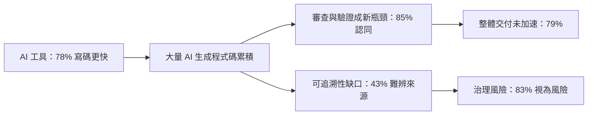
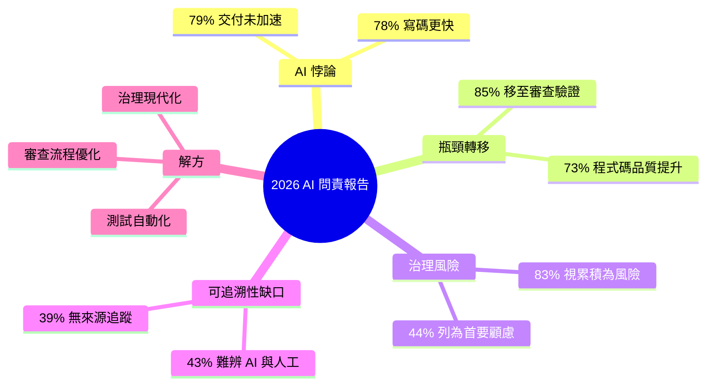

## AI Tools Accelerates Coding, but Not Overall Software Delivery, GitLab Research Finds

GitLab 2026 AI 責任報告發現一個引人注目的「AI 悖論」：報告數據顯示 78% 的開發者表示使用 AI 工具後代碼編寫速度顯著提升。然而整體軟體交付周期並未實現相應加速，這表明代碼速度提升並未自動轉化為交付速度提升。下游的測試與代碼審查已成為新的瓶頸，阻斷了加速收益。同時企業治理、版本追蹤和可追蹤性面臨新的複雜性挑戰。要釋放 AI 工具的完整價值，企業必須在流程層面進行投資，包括測試自動化、審查流程優化和治理框架現代化。

### 重點
- 78% 開發者自報代碼速度提升，但端到端交付速度未見加快（AI 悖論）
- 測試與審查瓶頸、企業治理與可追蹤性挑戰是主因
- 企業需在流程層面（非工具層面）進行優化以實現交付加速

**原文：** [infoq-ai-ml](https://www.infoq.com/news/2026/06/ai-coding-outpaces-governance/?utm_campaign=infoq_content&utm_source=infoq&utm_medium=feed&utm_term=AI%2C+ML+%26+Data+Engineering)

---

<!-- deep-analysis:begin -->
## 📌 摘要 (TL;DR)

- GitLab 發布《2026 AI 問責報告》（2026 AI Accountability Report），提出一個「AI 悖論」（AI Paradox）：78% 的開發者表示用 AI 工具寫碼更快，但 79% 坦言整體軟體交付速度並未跟上。
- 加速效益沒有消失，而是被往下游推：85% 受訪者認同 AI 把瓶頸從「寫程式碼」搬到了「審查與驗證程式碼」。
- 速度的代價是風險累積：83% 的組織把大量 AI 生成程式碼視為風險，44% 更將其列為首要技術顧慮之一。
- 可追溯性（traceability）出現缺口：43% 難以分辨程式碼是 AI 還是人寫的，39% 根本沒有追蹤程式碼來源的系統。
- 報告把「AI 問責」（AI accountability）定義為能回答三個問題的能力：這行程式碼從哪來、原本要做什麼、上線後誰負責。
- 解方不在更強的模型，而在流程：測試自動化、審查流程優化、治理（governance）框架現代化。

## 🎯 核心概念

- **AI 悖論**（AI Paradox）：個別開發者寫碼變快，但組織整體交付速度沒有等比例提升的矛盾現象。
- **AI 問責**（AI accountability）：能對任一行 AI 生成程式碼回答「來源、意圖、責任歸屬」三問的組織與技術能力。
- **下游瓶頸**（downstream bottleneck）：加速效益在測試、審查、驗證等後段流程被吃掉。
- **可追溯性**（traceability）：能追蹤程式碼來源、變更與責任歸屬的能力，是供應鏈安全與問責的基礎。

## 📖 整理分析

### 1. AI 悖論：寫得快 ≠ 交得快
報告最核心的發現是一個落差：78% 開發者覺得寫碼更快、73% 認為程式碼品質有提升，但 79% 指出整體交付流程並未同步加速。換句話說，AI 帶來的是「局部速度」而非「端到端速度」，個人生產力的提升並沒有自動轉化成交付週期的縮短。

### 2. 瓶頸沒有消失，只是往下游搬
加速效益去哪了？85% 的受訪者認同：AI 把瓶頸從「寫程式碼」轉移到「審查與驗證程式碼」。當 AI 大量產出程式碼，下游的人工審查、測試與驗證量同步暴增，形成新的塞車點。寫得越快，待審查的存量越多，交付反而卡在後段。

### 3. AI 程式碼累積成為治理風險
速度帶來的副作用是風險存量。83% 的組織把累積的 AI 生成程式碼視為一種風險，44% 甚至將它列為最主要的技術顧慮之一。這不是「程式能不能跑」的問題，而是「沒人完全掌握這些程式碼怎麼來、能不能信任」的治理問題。

### 4. 可追溯性缺口：問責的三個問題
報告把「AI 問責」拆成三個必須能回答的問題：程式碼從哪來、原本要做什麼、上線後誰負責。現實卻是 43% 的人難以分辨程式碼是 AI 還是人類所寫，39% 沒有追蹤程式碼來源的系統，40% 因工具鏈破碎而難以追溯。GitLab 產品兼行銷長 Manav Khurana 指出，供應鏈攻擊（supply chain attack）、可靠性問題與監管期待，都讓可追溯性成為避免組織暴險的關鍵。

### 5. 解方：把投資放在流程，而非只在模型
報告的結論是：要釋放 AI 的完整價值，企業得在流程層下功夫——測試自動化、審查流程優化、治理框架現代化。值得注意的還有一個信心落差：87% 的人自信能在 24 小時內判定某次線上事故是否由 AI 程式碼造成，但實際發生事故的組織中，有 34% 根本做不到。這說明問責能力目前多半停留在「自我感覺」而非「制度落實」。

## 🧭 流程圖：加速為何被吃掉

## 🧠 Mindmap

<!-- deep-analysis:end -->
### 📄 原文內容

點此展開 / 收合

GitLab's 2026 AI Accountability Report highlights an AI Paradox: although 78% of developers say they code faster, overall software delivery has not accelerated due to downstream testing and review bottlenecks and new challenges for enterprise governance and traceability. By Sergio De Simone

