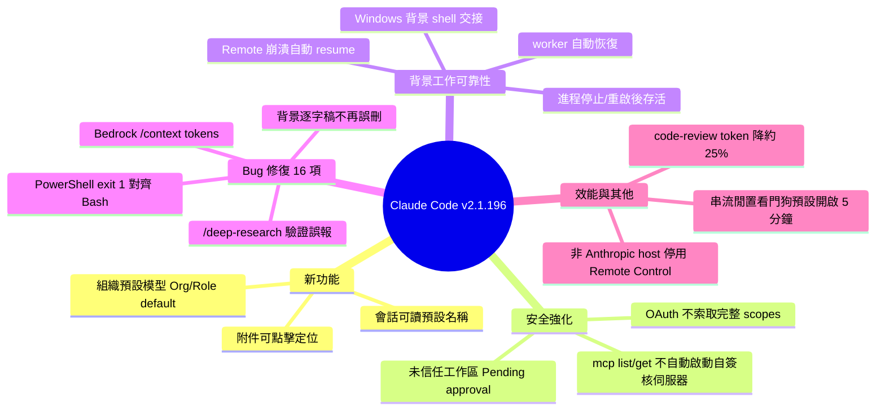

## v2.1.196

Claude Code v2.1.196 發佈多項功能和安全性增強。新增組織層級預設模型設定（管理員可在 org console 統一配置）、可點擊檔案附件快速定位（Cmd/Ctrl-click）、更易識別的會話命名。安全方面強化 MCP：claude mcp list/get 不再執行透過 .claude/settings.json 自簽核的 .mcp.json 伺服器，未信任工作區標記待核准狀態。修復 11+ 項 bug 包括後台任務對話遺失、限流警告閃爍、PowerShell 相容性等；/code-review 工作流程合併檢查器，token 用量減少 ~25%；改善後台任務穩定性使長時間命令和工作流程能在進程重啟後自動恢復。

### 重點
- 組織層級預設模型設定，管理員可統一配置團隊模型選項
- MCP 安全性強化：禁止執行 .claude/settings.json 自簽核伺服器；/code-review 工作流最佳化減少 ~25% token
- 後台任務可靠性改善：長時間命令和工作流程支援進程重啟自動恢復（Windows 已驗證）

**原文：** [claude-code-releases](https://github.com/anthropics/claude-code/releases/tag/v2.1.196)

---

<!-- deep-analysis:begin -->
## 📌 摘要 (TL;DR)

- Claude Code v2.1.196 是一次以「穩定性 + 企業治理 + 安全」為主軸的維護版本，共帶來 3 項新功能、1 項安全強化、16 項 bug 修復與多項效能改善。
- 新增組織預設模型（organization default models）：管理員在 org console 統一設定，使用者未自選時，`/model` 會顯示為「Org default」或「Role default」。
- 安全強化：`claude mcp list` / `get` 不再自動啟動由 repo 透過已提交的 `.claude/settings.json` 自我核准的 `.mcp.json` 伺服器；未信任工作區會顯示 ⏸ Pending approval。
- 可靠性大幅提升：長時間執行的背景指令與工作流程現在能在進程被停止、重啟或更新後存活（Windows 上背景 shell 改為交接而非殺掉）；被 daemon 重啟中斷的背景 agent 會自動從中斷點恢復。
- 效能：`/code-review` 工作流程把 5 個清理檢查器合併成 1 個，token 用量減少約 25%。

## 🎯 核心概念

- **組織預設模型**（organization default models）：由管理員在管理主控台集中指定的模型，套用到未自行選擇模型的成員。
- **背景工作 / 背景會話**（background job / session）：可在主對話之外持續執行的長任務，本版重點加強其崩潰後的恢復能力。
- **結構化輸出**（StructuredOutput）：模型依 schema 產生的結構化回覆，重試機制在此版修正了重複渲染問題。
- **串流閒置看門狗**（streaming idle watchdog）：偵測回應串流在一段時間內無事件即中止並重試的保護機制。
- **略過權限模式**（bypass mode，即 `--dangerously-skip-permissions`）：跳過權限確認的高風險模式。

## 📖 整理分析

### 1. 三項新功能
本版新增三個面向不同對象的功能。**組織預設模型**讓企業管理員能在 org console 統一配置團隊模型，成員在 `/model` 中會看到「Org default」或「Role default」標示。會話啟動時現在會自動產生**可讀的預設名稱**，方便辨識與後續傳訊。聊天中的**檔案附件可點擊**，用 Cmd/Ctrl-click 即可在 Finder / Explorer 中定位該檔案。

### 2. MCP 安全性強化
針對供應鏈風險，`claude mcp list` 與 `claude mcp get` 不再自動啟動那些「由 repo 自己透過已提交的 `.claude/settings.json` 核准」的 `.mcp.json` 伺服器——避免 clone 到惡意 repo 時被自動執行。未受信任的工作區會將這些伺服器標記為 ⏸ Pending approval，等待使用者明確核准。此外，MCP OAuth 在未指定 scope 時不再索取授權伺服器完整的 `scopes_supported` 清單，修正了 GitLab 自架與其他企業 IdP 上的 `invalid_scope` 失敗。

### 3. 背景工作可靠性
這是本版最實質的改善。長時間執行的指令與工作流程現在能在會話進程被停止、重啟或更新後**繼續存活**，Windows 上背景 shell 改採「交接」而非直接終止。被 daemon 重啟殺掉的背景 worker，會在下次開啟 agents 視圖時**自動從中斷處恢復**。Remote 會話若因伺服器重啟而中斷，也能在下一個 worker 上自動 resume。同時修復了一個嚴重 bug：喚醒背景工作時，若 transcript 探測誤讀了真實逐字稿，原本會永久刪除對話並重跑原始 prompt——現在該檔案只會被移置一旁、絕不刪除。

### 4. Bug 修復重點（共 16 項）
涵蓋跨平台與多個子系統：PowerShell 下 `git diff` / `git grep`、`egrep`/`fgrep` 及含 `|` 的引號搜尋樣式在 exit 1 時不再被誤報失敗（對齊 Bash 行為）；`/context` 在 Bedrock 上顯示所有工具群組為 0 tokens 已修正；`/deep-research` 不再把驗證器失敗誤報為「所有主張被駁回」，而正確標為未驗證。限流警告閃爍與並行請求觸頂時的遙測重複計數、背景會話結束後的重複 recap 行、`claude agents` 側面板的鍵盤焦點卡住與狀態顯示錯誤等也一併修復。`--dangerously-skip-permissions` 先前會靜默退回 auto 模式，現在會正確顯示略過權限的免責聲明。

### 5. 效能與其他調整
`/code-review` 把五個清理檢查器合併為一，token 用量約降 25%。終端 UI 在串流時跳過無效的子樹走訪，減少每幀渲染工作。**串流閒置看門狗**現在對所有供應商預設開啟：串流 5 分鐘無事件即中止並重試，可用 `CLAUDE_ENABLE_STREAM_WATCHDOG=0` 關閉。當 `ANTHROPIC_BASE_URL` 指向非 Anthropic 主機時，Remote Control 會被停用（與 Bedrock / Vertex / Foundry 既有行為一致）。從前景會話開啟 agents 視圖現在只需按一次 ← 鍵。

## 🧠 Mindmap

<!-- deep-analysis:end -->
### 📄 原文內容

點此展開 / 收合

What's changed 
 
 Added support for organization default models — admins set it in the org console; it shows as "Org default" (or "Role default") in /model when you haven't picked one yourself 
 Added readable default names for sessions at start, making them easier to identify and message 
 Added clickable file attachments in chat — Cmd/Ctrl-click reveals the file in Finder/Explorer 
 Security: claude mcp list / get no longer spawn .mcp.json servers that a repo self-approved via a committed .claude/settings.json ; untrusted workspaces show ⏸ Pending approval 
 Fixed waking a background job permanently deleting its conversation and re-running the original prompt when the transcript probe misread a real transcript; the file is now set aside, never deleted 
 Fixed the rate-limit warning flickering off and rate-limit telemetry being over-counted when multiple parallel requests were in flight at the moment a usage limit was hit 
 Fixed duplicate recap lines after a background session's turn: a schema-rejected StructuredOutput attempt no longer renders alongside its retry 
 Fixed PowerShell git diff / git grep , egrep / fgrep , and quoted search patterns containing | being reported as failures when they exit 1, matching Bash behavior 
 Fixed multiple claude agents side panel issues: keyboard focus getting stuck when opening an agent, background jobs losing their subagent types on every open, and sessions showing incorrect status while actively running 
 Fixed claude agents --dangerously-skip-permissions silently falling back to auto mode instead of showing the bypass disclaimer and applying bypass mode to spawned agents 
 Fixed mid-turn crash recovery for Remote sessions — sessions interrupted by a server restart now auto-resume on the next worker 
 Fixed sessions moved with /cd reappearing in the old directory's resume list after a non-graceful exit when the old path contained special characters 
 Fixed claude plugin validate skipping local plugins whose source is "." and stopping after the first error class 
 Fixed Esc Esc at an idle prompt not opening the rewind menu (regression); use Ctrl+C or Ctrl+X Ctrl+K to stop background agents 
 Fixed MCP OAuth requesting the authorization server's full scopes_supported catalog when no scope is specified, causing invalid_scope failures on GitLab self-hosted and other enterprise IdPs 
 Fixed /context showing 0 tokens for all tool groups on Bedrock 
 Fixed /deep-research misreporting verifier failures as "all claims refuted" instead of unverified 
 Fixed plugin dependency version pins not being honored when the marketplace was added as a local folder path backed by a git repo 
 Fixed claude agents session status: completed rows no longer flip between "Done" and "Needs your input", stalled agents are now labeled "Needs attention", and results that mention a PR show a clickable link 
 Fixed voice dictation swallowing spaces and spuriously starting a recording during very fast typing when voice mode is enabled 
 Improved background session reliability: long-running commands and workflows now survive the session's process being stopped, restarted, or updated — including on Windows, where background shells are handed off instead of being killed 
 Improved background agents: workers killed by a daemon restart are now automatically resumed from where they left off the next time the agents view opens 
 Improved /code-review workflow: merged five cleanup finders into one, cutting token usage by roughly 25% 
 Reduced per-frame rendering work in the terminal UI by skipping no-op subtree walks during streaming 
 The streaming idle watchdog is now on by default for all providers — it aborts and retries when a response stream produces no events for 5 minutes. Set CLAUDE_ENABLE_STREAM_WATCHDOG=0 to disable. 
 Remote Control is now disabled when ANTHROPIC_BASE_URL points at a non-Anthropic host, matching the existing behavior under CLAUDE_CODE_USE_BEDROCK / _VERTEX / _FOUNDRY 
 Changed opening the agents view from a foreground session to require a single ← press instead of two, matching the behavior in background sessions

