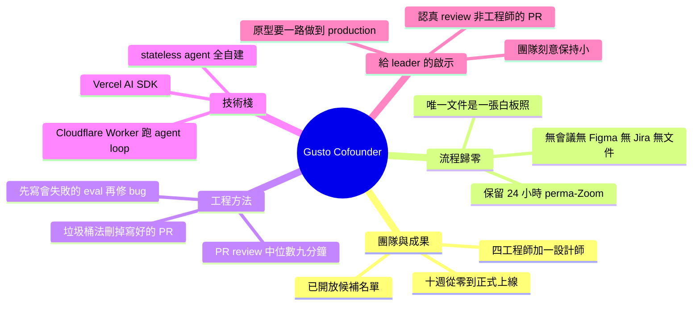

## No Figma. No Jira. No docs. How Gusto built a new product line with Claude Code | Eddie Kim (CTO)

Gusto CTO Eddie Kim 分享了 5 人团队在 10 周内使用 Claude Code 从零开始构建完整 AI 产品线的真实案例。这个项目展示了 Claude Code 作为 AI 编程助手的生产力潜力。团队采取极简协作模式，完全摒弃了传统开发工具链：无 Figma 设计稿、无 Jira 任务管理系统、无独立文档库。沟通完全通过 Zoom 进行，大幅简化了协作复杂性。这个案例深刻演示了当 AI 代码生成达到足够质量后，如何改变传统产品开发流程。从约束条件（极简工作流）到成果（完整产品线）的 10 周交付，提供了 Claude Code 生产力的有力数据支撑。对于考虑采用 AI 辅助开发的团队，这个案例提供了参考：小团队配合强大的 AI 工具可以达成传统方式需要更多人力的成果。

### 重點
- 5 人团队 × 10 周时间用 Claude Code 完成 AI 产品线交付，体现 AI 辅助开发的生产力倍增效果
- 极简工作流实践：无 Figma/Jira/文档库，仅通过 Zoom 维持沟通，展现工程效率优化的思路
- Claude Code 端到端支持从需求分析、设计、开发到交付的完整产品开发链路

**原文：** [substack-lennys-newsletter](https://www.lennysnewsletter.com/p/no-figma-no-jira-no-docs-how-gusto)

---

<!-- deep-analysis:begin -->
## 📌 摘要 (TL;DR)

- Gusto 共同創辦人暨 CTO Eddie Kim 在 Lenny 旗下的《How I AI》（主持人 Claire Vo）分享：5 人團隊（含他自己共 4 名工程師 + 設計師 Katie Kovalcin）用 Claude Code，10 週內把全新 AI 產品線 **Gusto Cofounder** 從零做到正式上線（tier-one launch）。
- 流程幾乎「歸零」：沒有會議、沒有 tech spec、沒有 Figma、沒有 Jira、沒有文件——10 週唯一產出的「文件」是一張白板照片。
- 唯一保留的儀式是 24 小時常駐的 perma-Zoom，讓這支全遠端團隊的 PR review 中位數壓到 **9 分鐘**。
- 技術棧極簡：用 Cloudflare Worker 跑 agent loop、搭 Vercel AI SDK，其餘全自建、沒有額外 harness；agent 是獨立 repo 裡的 stateless 服務。
- 招牌「垃圾桶法」：把寫到可上線品質的 PR 當產品決策來審，覺得功能不該存在就直接刪掉——連 Eddie 自己的原型也被整個刪掉、當天重寫成 TypeScript 版。
- 修 AI bug 一律 **eval-first**（先寫會失敗的 eval 重現問題再修）；設計師 Katie 在 Gusto 千人 R&D 的 DX「true throughput」指標衝到第 94 百分位。

## 🎯 核心概念

- **Gusto Cofounder**：架在既有薪資產品（內部暱稱 Gusto classic）之上的 agentic AI 產品，核心原語是能自動跑工作流的「automations」，執行後產生 charts、文件等 artifacts，並可透過 SMS、Slack 互動。
- **垃圾桶法（trash can method）**：把寫好、可上線品質的 PR 當成產品決策來 review，決定不要就整個關掉刪除。
- **perma-Zoom**：24 小時不關的 Zoom 房，取代站會（standup）、回顧會（retro）與 Slack 協作。
- **eval 優先（eval-first）**：修 AI 對話 bug 前，先寫一個會失敗的評估測試（eval）重現問題，再讓 Claude Code 修到它轉綠。
- **真實產出量（true throughput）**：DX 這個工程效能工具衡量「實際推上 production 的 PR 量」的百分位指標。

## 📖 整理分析

### 1. 10 週、5 人，從零到正式上線
Eddie 在 2 月一趟馬德里飛倫敦、轉機延誤的約 5 小時 layover，用 Claude Code 做出第一版原型；3 月在 Denver 辦公室一場白板會被綠燈，接著 5 人團隊（4 工程師 + 設計師 Katie Kovalcin，沒有 PM）花 10 週做到 tier-one launch，產品已在 gusto.com/cofounder 開放候補。對照 Gusto 超過千人的 R&D 組織，這是「小團隊 + 強 AI 工具」打法的活案例。

### 2. 把流程「歸零」：唯一文件是一張白板照
Eddie 說這次「比起做了什麼，更是由我們不做什麼來定義」。他們砍掉會議、tech spec、Figma、Jira 看板、站會、retro 與所有文件；別人來要文件，他最愛回「我們沒有任何文件」。10 週唯一留下的書面紀錄，是一張畫著 chat、一張 chart 和 task 名稱的白板照片。沒有 PM，於是「每個人都是 PM」，產品決策直接在程式碼上發生。

### 3. 垃圾桶法 + perma-Zoom：好 PR 說刪就刪
他們把 PR 當規格（PR-as-spec）：先把功能寫到可上線、可送人工 review 的品質，再到 perma-Zoom 討論這功能該不該存在；不該存在就直接刪掉——即使那是好程式碼。Eddie 自己的 layover 原型就被工程師說服整個刪掉，當天改用 TypeScript + Cloudflare Worker 重寫，他事後說「那絕對是最好的決定」。因為總有人待在 perma-Zoom，這隊的 PR review 中位數只要 9 分鐘。

### 4. 極簡技術棧與 eval 優先工作流
技術棧只有兩件：Cloudflare Worker 跑 agent loop、Vercel AI SDK 當框架，其餘自建、沒有額外 harness；他說「memory 對我們來說就是一個寫進資料庫 memory 欄位的 tool」。修 bug 時，他用 Whisper Flow 語音把真實客戶對話貼進 GitHub issue，要求 Claude Code 先寫一個會失敗的 eval 重現問題，再修到 eval 轉綠；最關鍵的一步是「親自 review 它改的 prompt 與程式碼」是否夠精簡，才開 PR。等待時就開第二、第三個 Claude Code terminal 平行做事。

### 5. 設計師衝到第 94 百分位 + 給 leader 的建議
設計師 Katie 並非工程師，卻在 DX「true throughput」上排到全公司千人 R&D 的第 94 百分位，而且「程式碼很好」。Eddie 點出關鍵不是工具，而是有 3–4 名工程師願意 review 她的 code、教她怎麼把 Claude prompt 得更好、培養她對「什麼是好 AI 程式碼」的品味——他認為把非工程師的 PR 當低優先級是「反模式」。對 leader，他的建議是：原型只是起點，要親手把它一路做到 production 品質、刻意把團隊保持小，並給團隊「明確的許可」去打破舊流程。

## 🧭 流程圖：eval 優先的修 bug 工作流

## 🧠 Mindmap

<!-- deep-analysis:end -->
### 📄 原文內容

點此展開 / 收合

Watch now | &#127897;&#65039; Eddie Kim, the CTO of Gusto, shows how a 5-person team shipped a full AI product line in 10 weeks using Claude Code, a perma-Zoom, and zero documentation

