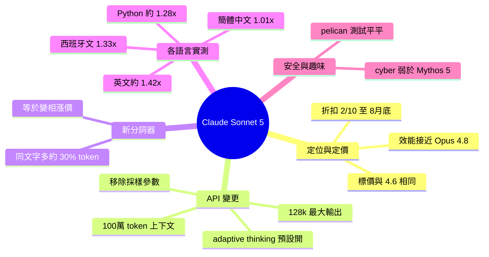

## What's new in Claude Sonnet 5

Claude Sonnet 5 发布，性能接近 Opus 4.8 但价格显著更低。重大变更：采样参数（temperature、top_p、top_k）不再支持，上下文窗口增至 100 万 token、最大输出 128k token，Adaptive thinking 默认启用。**关键成本陷阱**：新 tokenizer 导致同样文本增加约 30% token 消耗——英文 +42%、西班牙文 +33%、Python 代码 +28%、中文基本无增加——实际上抵消官价优势（官价与 Sonnet 4.6 相同 $3/$15M，折扣价 $2/$10 仅至 8 月 31 日）。使用 Simon Willison 的 Token Counter 工具实测多种语言文档及代码，展示 tokenizer 变更对成本的直接影响。

### 重點
- Claude Sonnet 5 性能比肩 Opus 4.8，官定价与 Sonnet 4.6 相同（$3/$15M），但新 tokenizer 实际成本增加 ~30%（英文、西班牙文分别增 42%、33%）
- 不再支持 temperature/top_p/top_k 参数，Adaptive thinking 默认启用，100 万 token 上下文 + 128k 最大输出
- 同一文本在新旧 tokenizer 间的成本倍数：Universal Declaration of Human Rights 英文 1.42x、西班牙文 1.33x、中文 1.01x、4279 行 Python 代码 1.27–1.28x

**原文：** [simon-willison](https://simonwillison.net/2026/Jun/30/claude-sonnet-5/#atom-everything)

---

<!-- deep-analysis:begin -->
## 📌 摘要 (TL;DR)

- Anthropic 發布 Claude Sonnet 5，官方定位為「效能接近 Opus 4.8，但價格更低」；Simon Willison 直接拆解開發者的「what's new」文件，因為比官方公告更多可操作資訊。
- 官方標價與 Sonnet 4.6 相同：input $3、output $15（每百萬 token），並附上introductory 折扣 $2 / $10，至 8 月 31 日止。
- **最大陷阱**：Sonnet 5 換了新分詞器（tokenizer），同一段文字產生的 token 數約多 30%，等於變相漲價 30%。
- Simon 用自製 Claude Token Counter 實測：英文約多 42%、西班牙文 33%、Python 程式碼約 27~28%，但簡體中文幾乎不變（+1%）。
- API 重大變更：不再支援採樣參數 temperature / top_p / top_k、上下文視窗擴大到 100 萬 token、最大輸出 128,000 token、Adaptive thinking 預設開啟。
- 監管面：系統卡指出 Sonnet 5 在網路攻擊任務上遠弱於 Mythos 5，安全防護等級比照 Opus 4.7 / 4.8；招牌的鵜鶘騎腳踏車 SVG 測試表現平平，模型自認畫得像一隻鵝。

## 🎯 核心概念

- **分詞器（tokenizer）**：把文字切成 token 的規則；規則一改，同一段文字的 token 數與計費就跟著變。
- **採樣參數（sampling parameters）**：temperature、top_p、top_k，用來控制輸出隨機性，Sonnet 5 起不再支援。
- **自適應思考（adaptive thinking）**：模型自動決定思考深度的機制，Sonnet 5 預設開啟。
- **上下文視窗（context window）**：單次請求可容納的 token 上限，Sonnet 5 為 100 萬。
- **系統卡（system card）**：Anthropic 隨模型發布的安全與能力評估文件。

## 📖 整理分析

### 1. 定位：接近 Opus 4.8 的效能
Anthropic 稱 Sonnet 5「效能接近 Opus 4.8，但價格更低」。Simon Willison 習慣直接看開發者的「what's new」文件，因為它比官方公告含更多可操作資訊，這篇整理正是從那份文件逐條拆解。

### 2. API 重大變更
採樣參數 temperature、top_p、top_k 全部不再支援；上下文視窗提升至 100 萬 token，最大輸出 128,000 token；工具與平台功能與 Sonnet 4.6 相同；Adaptive thinking 預設開啟，必須傳入 `"thinking": {type: "disabled"}` 才能關閉。

### 3. 新分詞器：帳面沒漲、實際變貴
官方標價與 Sonnet 4.6 相同（input $3、output $15；折扣期 $2 / $10 至 8/31）。但文件明說新分詞器「同一段輸入文字產生的 token 數約多 30%」，Simon 直指這等於 30% 的漲價。折扣價 $2 相對原價 $3 約為 67 折，折扣期間大致可抵銷多出的 token；但依數字推算，折扣一過（9 月起）漲幅就會完全反映在帳單上。

### 4. 各語言與程式碼 token 實測
Simon 用 Claude Token Counter 對幾份較長文件實測，倍數相對 Sonnet 4.6：

| 文件 | Sonnet 4.6 | Opus 4.7 | Sonnet 5 |
|---|---|---|---|
| 世界人權宣言（英文） | 2,356 | 3,347（1.42x） | 3,341（1.42x） |
| 世界人權宣言（西班牙文） | 3,572 | 4,753（1.33x） | 4,747（1.33x） |
| 世界人權宣言（簡體中文） | 3,334 | 3,366（1.01x） | 3,360（1.01x） |
| sqlite_utils/db.py（4,279 行 Python） | 44,014 | 56,118（1.28x） | 56,113（1.27x） |

結論：新分詞器對英文約 1.42x、西班牙文 1.33x、Python 程式碼約 1.28x 最傷，但對簡體中文幾乎沒差（1.01x）。換言之，中文用戶受影響最小，英文與程式碼用戶最該重新估算成本。

### 5. 安全監管與 pelican 測試
系統卡說明模型為何能順利發布、未被美國政府擋下：Sonnet 5 在網路攻擊（cyber）任務上「明顯弱於 Mythos 5」，因此安全防護等級比照 Opus 4.7 與 4.8（兩者比 Sonnet 5 強，但遠弱於 Mythos 5）。Simon 慣例的鵜鶘騎腳踏車 SVG 測試表現普通，他形容不值一提，連 Sonnet 5 自己都覺得畫得像一隻鵝。

## 🧠 Mindmap

<!-- deep-analysis:end -->
### 📄 原文內容

點此展開 / 收合

What&#x27;s new in Claude Sonnet 5 
Claude Sonnet 5 came out this morning . I always head straight for the "what's new" developer docs because they tend to have more actionable information than the official announcement post. 
 Anthropic say of Sonnet 5 that "its performance is close to that of Opus 4.8, but at lower prices". The system card helps explain how they were able to release the model without being blocked by the US government: 
 
 Sonnet 5 is significantly less capable at cyber tasks than Mythos 5: its safeguards are thus similar to those we apply to Opus 4.7 and Opus 4.8 (models that are more capable than Sonnet 5 but much less capable than Mythos 5). 
 
 Of note from the "what's new" API changes: 
 
 Sampling parameters temperature , top_p , top_k are no longer supported. 
 It has a 1 million token context window and 128,000 maximum output tokens. 
 It features "the same set of tools and platform features as Claude Sonnet 4.6" 
 Adaptive thinking is on by default, unless you specify "thinking": {type: "disabled"} . 
 The pricing is the same as Sonnet 4.6: $3/million input, $15/million input, with an introductory discount to $2/$10 until 31st August. But... 
 The model has a new tokenizer, where "The same input text produces approximately 30% more tokens than on Claude Sonnet 4.6." - effectively a 30% price increase. 
 
 I used my Claude Token Counter tool to try out the new tokenizer. Here are my results for several larger documents: 
 
 
 
 Document 
 Sonnet 4.6 
 Opus 4.7 
 Sonnet 5 
 
 
 
 
 Universal Declaration of Human Rights (English) 
 2,356 
 3,347 1.42x 
 3,341 1.42x 
 
 
 Universal Declaration of Human Rights (Spanish) 
 3,572 
 4,753 1.33x 
 4,747 1.33x 
 
 
 Universal Declaration of Human Rights (Chinese, Mandarin Simplified) 
 3,334 
 3,366 1.01x 
 3,360 1.01x 
 
 
 sqlite_utils/db.py (4,279 lines of Python) 
 44,014 
 56,118 1.28x 
 56,113 1.27x 
 
 
 

 So the new token is roughly 1.4x times more expensive for English, 1.33x for Spanish, 1.28x for Python code and effectively the same cost for Simplified Mandarin. 
 Here's the pelican . It's nothing to write home about. Sonnet 5 thinks it looks like a goose. 
 

 Via Hacker News 

 Tags: ai , generative-ai , llms , anthropic , claude , llm-pricing , pelican-riding-a-bicycle , llm-release

