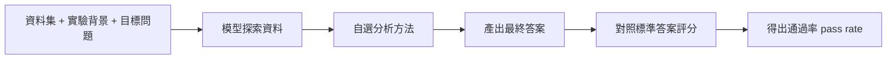
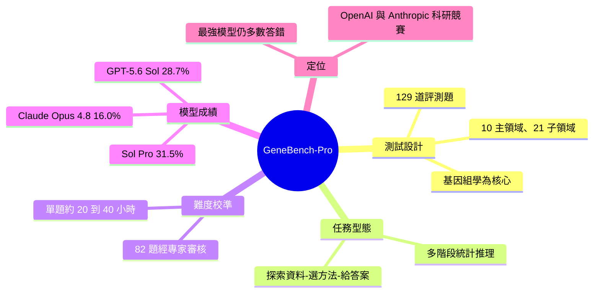

## Introducing GeneBench-Pro

OpenAI 推出 GeneBench-Pro，一項新的 AI 性能基準測試工具，聚焦基因組學、生物學及科學研究領域，採用複雜的真實世界資料集進行評估。

### 重點

**原文：** [openai-blog](https://openai.com/index/introducing-genebench-pro)

---

<!-- deep-analysis:begin -->
## 📌 摘要 (TL;DR)

- OpenAI 推出 **GeneBench-Pro**，一個評估 AI 在基因組學（genomics）、定量生物學（quantitative biology）與轉譯生物醫學（translational biomedicine）進行「多階段統計推理」的基準測試（benchmark）。
- 全測試共 **129 道題**，橫跨 10 個主領域、21 個子領域，核心圍繞基因組學；每題給模型一份資料集、實驗背景與目標問題，模型須自行探索資料、選擇分析方法並給出最終答案。
- 難度經專家校準：129 題中有 **82 題**送交外部專家（研究生、博士後、業界科學家、教授）審核，估計單題人類專家需花 **20–40 小時**才能完成。
- 模型成績——**GPT-5.6 Sol** 在最高推理層級通過率 **28.7%**、**GPT-5.6 Sol Pro** 為 **31.5%**、**Claude Opus 4.8** 為 **16.0%**。
- OpenAI 自陳最強模型仍答錯多數題目，凸顯 AI 距真實科研判斷尚有距離；本測試亦被媒體視為 OpenAI 與 Anthropic 在科學研究戰場競爭的一環。

## 🎯 核心概念

- **基準測試（benchmark）**：以固定題庫標準化衡量 AI 能力的評測工具。
- **多階段推理（multi-stage reasoning）**：一題需連續完成多個分析步驟（探索資料 → 選方法 → 得結論），而非單次問答。
- **基因組學（genomics）**：研究生物基因組結構與功能的學科，為本測試的核心領域。
- **轉譯生物醫學（translational biomedicine）**：把基礎生物研究轉化為臨床與醫療應用的領域。
- **推理層級（reasoning level）／通過率（pass rate）**：前者指模型投入的思考運算量（愈高愈耗算力），後者為答對比例。

## 📖 整理分析

### 1. 測試設計：仿真科研的多階段任務
GeneBench-Pro 不是選擇題式問答，而是模擬計算生物學家的真實工作流程。每題提供一份**資料集、實驗背景與一個目標問題**，模型必須自己探索資料、決定要用哪種分析方法，最後給出結論。全測試共 129 道評測，涵蓋 10 個主領域與 21 個終端子領域，並以基因組學為核心，延伸到定量生物學與轉譯生物醫學。

### 2. 難度校準：82 題經專家審核，單題 20–40 小時
為確認題目確實貼近前沿研究，OpenAI 將 129 題中的 82 題送交外部領域專家審核，審核者橫跨研究生、博士後、業界科學家與教授。他們估計，一道典型的 GeneBench-Pro 題目，人類專家平均需要 **20 到 40 小時**才能完成——這說明題庫測的是「研究等級的判斷力」，而非查詢型知識。

### 3. 模型成績：最好也僅三成出頭
即便是最新模型，通過率仍偏低：

| 模型 | 通過率 |
|---|---|
| GPT-5.6 Sol（最高推理層級） | 28.7% |
| GPT-5.6 Sol Pro | 31.5% |
| Claude Opus 4.8 | 16.0% |

三成出頭的最高分，代表模型在多數題目上仍會失敗，也讓不同模型間拉出明顯差距（OpenAI 系列約為 Claude Opus 4.8 的兩倍）。

### 4. 定位與脈絡：科研判斷仍是門檻
OpenAI 罕見地以「自家最強模型仍答錯多數題」來為結果降溫，強調 AI 在真實科學研究上的判斷力還有很長的路要走。GeneBench-Pro 亦有對應的 bioRxiv 論文（標題聚焦「多階段統計推理」），並被媒體放在 OpenAI 與 Anthropic 競逐「AI for Science」主導權的敘事框架下解讀。

## 🧭 評測流程圖

## 🧠 Mindmap

<!-- deep-analysis:end -->
### 📄 原文內容

點此展開 / 收合

Introducing GeneBench-Pro, a new benchmark testing AI performance in genomics, biology, and scientific research using complex, real-world datasets.

