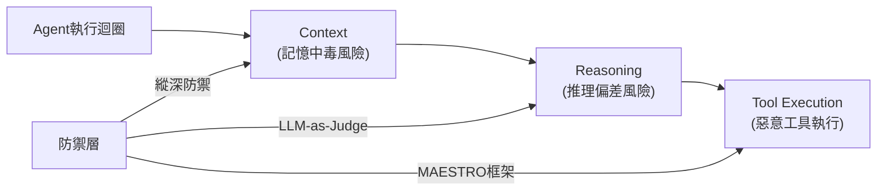

## Presentation: Trustworthy Productivity: Securing AI-Accelerated Development

InfoQ演講探討自主AI agent生產環保的安全威脅與防禦策略。演講者Sriram Madapusi Vasudevan剖析ReAct迴圈內的三大脆弱點（上下文、推理、工具執行），分享記憶中毒、惡意工具執行等實際威脅，並提出防禦架構包括縱深防禦、LLM-as-judge評審機制、MAESTRO威脅模型框架。該分析為AI agent安全提供產業匯聚的可行威脅評估方案。

### 重點
- ReAct迴圈的上下文、推理、工具執行存在三層關鍵脆弱點
- 記憶中毒與惡意工具執行是自主agent的實際威脅
- MAESTRO威脅模型 + LLM-as-judge + 縱深防禦提供產業可行方案

**原文：** [infoq-ai-ml](https://www.infoq.com/presentations/ai-development/?utm_campaign=infoq_content&utm_source=infoq&utm_medium=feed&utm_term=AI%2C+ML+%26+Data+Engineering)

---

### 📄 原文內容

點此展開 / 收合

Sriram Madapusi Vasudevan discusses industry-converging patterns for securing autonomous AI agents in production. He explains the critical vulnerabilities hidden inside the ReAct loop across context, reasoning, and tool execution. He shares how to mitigate risks like memory poisoning and rogue tool execution using defense-in-depth strategies, LLM-as-a-judge critics, and MAESTRO threat modeling. By Sriram Madapusi Vasudevan

