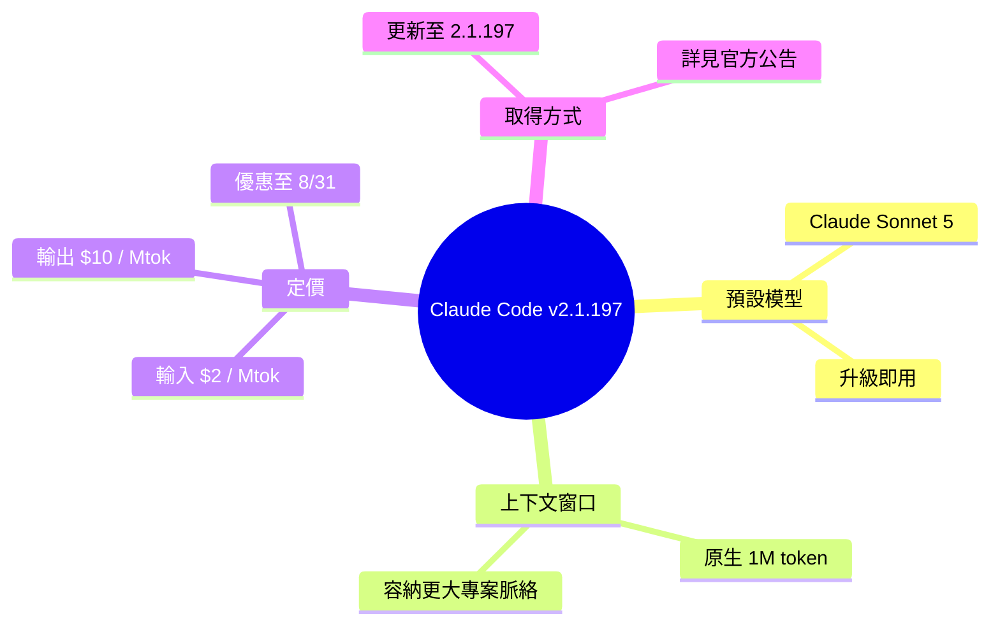

## v2.1.197

Claude Code v2.1.197 推出 Claude Sonnet 5 作為預設模型，具備原生 100 萬 token 上下文窗口。同步提供限時優惠定價：輸入 $2/百萬 token，輸出 $10/百萬 token，優惠期至 2026 年 8 月 31 日。此版本升級使開發者能在代碼編輯中處理更大規模的專案上下文。

### 重點
- Claude Sonnet 5 預設模型，原生 1M token 上下文窗口
- 限期定價 $2/$10 per Mtok，有效期至 2026/8/31
- Claude Code v2.1.197 版本更新

**原文：** [claude-code-releases](https://github.com/anthropics/claude-code/releases/tag/v2.1.197)

---

<!-- deep-analysis:begin -->
## 📌 摘要 (TL;DR)

- Claude Code 發布 **v2.1.197**，將 **Claude Sonnet 5** 設為預設模型（default model），使用者升級到此版本即可取得。
- Sonnet 5 具備**原生 100 萬 token 上下文窗口**（native 1M-token context window），可在單次對話中容納更大規模的程式碼與檔案。
- 推出**限時優惠定價**：每百萬 token（per Mtok）輸入 $2、輸出 $10，優惠至 **8 月 31 日**（依發布時序為 2026 年）止。
- 詳細模型說明見 Anthropic 官方公告：`anthropic.com/news/claude-sonnet-5`。
- 對開發者的意義：更大的上下文加上壓低的價格，降低了處理大型專案脈絡的門檻與成本。

## 🎯 核心概念

- **上下文窗口**（context window）：模型單次請求能一起處理的最大 token 數；1M 代表約一百萬 token，可一次讀入更多檔案、log 或整段程式碼。
- **原生支援**（native）：1M 上下文是模型本身直接支援，而非靠外掛切割或檢索拼接。
- **百萬 token 計價**（per Mtok）：以每一百萬 token 為單位計費，此版本為輸入 $2、輸出 $10。

## 📖 整理分析

### 1. Sonnet 5 成為預設模型
此次 v2.1.197 的核心變動，是把 **Claude Sonnet 5** 設為 Claude Code 的預設模型。使用者只要更新到 2.1.197，即自動以 Sonnet 5 進行程式碼編輯與對話，無需額外切換設定。

### 2. 原生 100 萬 token 上下文
Sonnet 5 主打**原生 1M-token 上下文窗口**。對開發場景而言，更大的上下文意味著能一次帶入更多的專案檔案、依賴關係與歷史脈絡，減少因視窗不足而需反覆分段或遺漏脈絡的情況。（原文僅說明容量為 1M，未提供延伸的效能數據。）

### 3. 限時優惠定價
官方同步提供**促銷定價**：每百萬 token 輸入 $2、輸出 $10（$2/$10 per Mtok），優惠期限為 **8 月 31 日**。此為限時方案，代表常態定價與此不同；讀者若要評估成本，需以優惠截止日為分界規劃用量。

### 4. 如何取得
取得方式單純：**更新至版本 2.1.197**即可使用 Sonnet 5 與其 1M 上下文。更完整的模型能力與定位說明，Anthropic 另有專文公告（`anthropic.com/news/claude-sonnet-5`），本 release note 本身僅為版本更新通知。

## 🧠 Mindmap

<!-- deep-analysis:end -->
### 📄 原文內容

點此展開 / 收合

What's changed 
 
 Introducing Claude Sonnet 5: now the default model in Claude Code, with a native 1M-token context window and promotional pricing of $2/$10 per Mtok through August 31. Update to version 2.1.197 for access. https://www.anthropic.com/news/claude-sonnet-5

