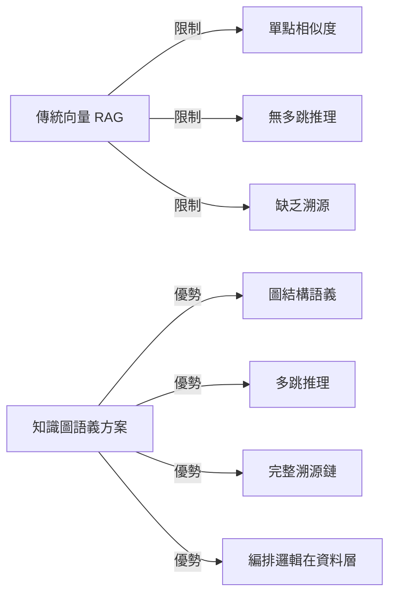

## Presentation: Graph RAG: Building Smarter Retrieval Workflows with Knowledge Graphs

InfoQ演講介紹GraphRAG架構演進。演講者Cassie Shum說明傳統向量RAG在全局上下文、多跳推理和溯源上的不足，對比知識圖語義結構化方案如何將編排邏輯推向資料層。這是從純向量檢索邁向企業語義架構的重要演進模式。

### 重點
- 向量RAG在全局上下文和多跳推理上存在瓶頸
- 知識圖語義結構化方案將編排邏輯下沉至資料層
- 企業構建有根據的知識圖是先進AI工作流的基礎

**原文：** [infoq-ai-ml](https://www.infoq.com/presentations/graph-rag-llm/?utm_campaign=infoq_content&utm_source=infoq&utm_medium=feed&utm_term=AI%2C+ML+%26+Data+Engineering)

---

### 📄 原文內容

點此展開 / 收合

Cassie Shum discusses the architectural evolution of GraphRAG and why data foundations are critical for advanced AI workflows. She explains how traditional vector RAG falls short when addressing global context, multi-hop reasoning, and provenance. She shares enterprise strategies for building semantically structured knowledge graphs that shift raw orchestrating logic down to the data layer. By Cassie Shum

