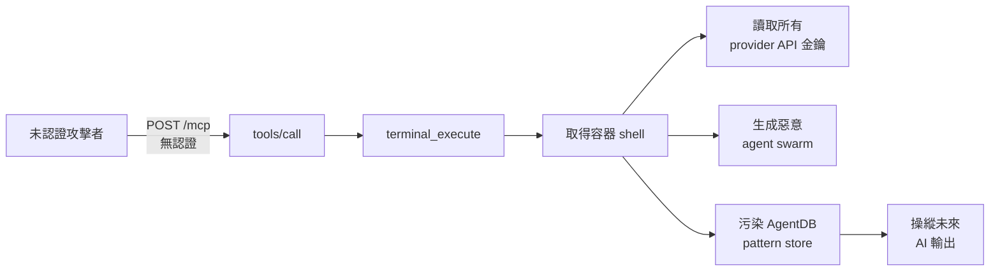
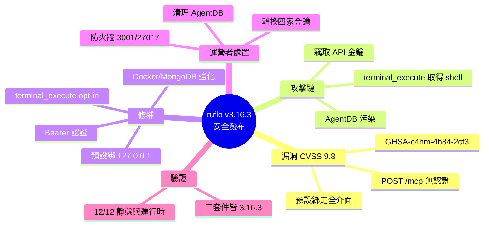

## v3.16.3 — Security release (GHSA-c4hm-4h84-2cf3, ADR-166 MCP bridge RCE)

ruflo v3.16.3 是重大安全發布，修復 CVSS 9.8 critical 漏洞（GHSA-c4hm-4h84-2cf3、ADR-166）。MCP bridge 先前暴露 POST /mcp 端點無認證，配合預設綁定所有介面的 docker-compose，攻擊者可執行 terminal_execute 獲取容器 shell、竊取所有 API 密鑰、生成惡意 agent swarms、污染 AgentDB 學習儲存庫。修復包括：MCP bridge 預設綁定 127.0.0.1（公網綁定需 MCP_AUTH_TOKEN）、Bearer auth middleware（timingSafeEqual 常時比較）、執行工具伺服端門檻（terminal_execute 需 MCP_ENABLE_TERMINAL=true）、Docker read-only rootfs、MongoDB 強制認證。12/12 靜態與 12/12 運行時迴歸測試全綠。運營者必須立即防火牆、輪換 OPENAI/GOOGLE/OPENROUTER/ANTHROPIC 密鑰、審計與清理 AgentDB。

### 重點
- MCP bridge 無認證 POST /mcp 端點 CVSS 9.8 RCE — 攻擊者可讀取所有 API 密鑰、污染 AI 輸出（供應鏈中毒）
- 修復策略：預設綁定 127.0.0.1、Bearer auth middleware、executeTool 伺服端門檻、read-only rootfs、強制 MongoDB 認證
- 運營者需執行三層行動：防火牆隔離、祕密輪換、AgentDB 審計與清理（修補部署無法撤銷污染）

**原文：** [ruflo-releases](https://github.com/ruvnet/ruflo/releases/tag/v3.16.3)

---

<!-- deep-analysis:begin -->
## 📌 摘要 (TL;DR)

- ruflo **v3.16.3** 是一則安全發布，修補一個 **CVSS 9.8 極高風險（critical）** 漏洞，對應資安公告 **GHSA-c4hm-4h84-2cf3** 與架構決策紀錄 **ADR-166**。
- 舊版 `ruflo/docker-compose.yml` 讓 MCP 橋接器（MCP bridge）的 `POST /mcp` 端點**完全無認證**，且預設把橋接器與 MongoDB 綁定到「所有網路介面」。
- 兩者疊加後，未經認證的網路攻擊者可鏈式呼叫 `tools/call → terminal_execute` 取得容器 shell、讀走所有 provider API 金鑰、用受害者金鑰生成惡意 agent swarm，並在 AgentDB 學習儲存庫植入污染 pattern。
- 修補重點：預設綁 `127.0.0.1`、Bearer 認證中介層、`terminal_execute` 改為需明確開啟、Docker 唯讀根檔案系統、MongoDB 預設強制認證。
- 迴歸測試 **12/12 靜態 + 12/12 運行時全綠**，並附上 CI workflow。
- 已對外暴露的運營者**必須立即**防火牆封鎖 `:3001` 與 `:27017`、輪換 OPENAI/GOOGLE/OPENROUTER/ANTHROPIC 四家金鑰，並清理 AgentDB——**光是重新部署補丁版本無法消除已植入的 AI 供應鏈污染**。

## 🎯 核心概念

- **MCP 橋接器（MCP bridge）**：ruflo 用來對外暴露 tools/call 介面的服務，漏洞就出在它的 `POST /mcp` 端點。
- **遠端程式碼執行（remote code execution，RCE）**：攻擊者可在受害主機／容器上執行任意指令，本案最終能拿到 shell。
- **協調揭露（coordinated disclosure）**：由外部資安研究員與 ADR-166 共同作者協同回報、修補後再公開的流程。
- **AI 供應鏈污染（AI supply-chain poisoning）**：把惡意 pattern 寫進 AgentDB 學習庫，藉此持續操縱未來 AI 的輸出。
- **CVSS 9.8**：漏洞嚴重度評分（滿分 10），屬 critical 等級。

## 📖 整理分析

### 1. 漏洞根因：無認證 + 全介面綁定
漏洞來自兩個預設值同時出錯。第一，隨 `docker-compose.yml` 出貨的 MCP 橋接器把 `POST /mcp` 端點暴露出來卻**沒有任何認證**；第二，docker-compose 的預設設定把橋接器與 MongoDB 綁定到所有網路介面（`0.0.0.0`）。單一問題或許還好，但兩者結合等於把一個可執行工具的 API 直接開在公網上。

### 2. 攻擊鏈：從 /mcp 到容器 shell
未經認證的攻擊者可直接對 `/mcp` 送出 `tools/call`，呼叫 `terminal_execute` 在橋接器容器內取得 shell。拿到 shell 後即可：讀取容器環境變數中的**每一把 provider API 金鑰**、用受害者的金鑰生成攻擊者控制的 agent swarm（燒受害者的額度），最後把一筆污染的 pattern 寫進 AgentDB 學習庫，讓未來的 AI 輸出被暗中操縱。官方指出 `terminal_execute` 的伺服端門檻缺失，正是讓整條 RCE 鏈「打通到 shell」的關鍵環節。此鏈由一份**端對端 8 步 PoC** 完整驗證。

### 3. 3.16.3 的修補
修補採「預設安全」而非只加 token 的策略：
- **預設綁 `127.0.0.1`**：要對公網開放（public bind）必須設定 `MCP_AUTH_TOKEN`，否則行程開機即以非零碼（≠0）退出並印出 FATAL 訊息。
- **Bearer 認證中介層**：使用 `timingSafeEqual` 做常時比較（constant-time compare），防時序側通道。
- **伺服端 `executeTool` 門檻**：`terminal_execute` 改為需以 `MCP_ENABLE_TERMINAL=true` 明確開啟，且在 `/mcp`、`/mcp/:group` 與 autopilot 三處一致強制。
- **Docker 強化**：橋接器改唯讀根檔案系統（read_only rootfs）、MongoDB 預設開 `--auth`、開機必須提供 `MONGO_INITDB_ROOT_PASSWORD`。
- **CORS 允許清單**：透過 `MCP_CORS_ORIGIN` 設定。
- 附靜態 + 運行時迴歸鎖（各 12/12 綠）與 CI workflow。

### 4. 運營者必做的緊急處置
官方明示，凡曾以舊版預設 docker-compose 跑在公網 IP 上者**必須**：(1) 立即防火牆封鎖 `:3001`（橋接器）與 `:27017`（MongoDB）；(2) 輪換 `OPENAI`、`GOOGLE`、`OPENROUTER`、`ANTHROPIC` 四家金鑰；(3) 審計 AgentDB pattern store，找出並清除被注入的 `agentdb_pattern-store` 項目；(4) 檢查 MongoDB 是否遭竄改。特別提醒：**只重新部署補丁版本並不能還原 AI 供應鏈污染**，污染資料必須手動清除。

### 5. 破壞性變更與驗證
這是一個「為了安全的正確破壞性變更」：`docker-compose.yml` 現在若缺 `MONGO_INITDB_ROOT_PASSWORD` 就拒絕啟動，可用 `openssl rand -base64 32` 產生密碼寫入 `.env`。若要走公網部署，需另設 `MCP_BIND_HOST=0.0.0.0`、`MCP_AUTH_TOKEN`，並以 `docker-compose.public.yml` 疊加啟動。版本驗證方面，`@claude-flow/cli`、`claude-flow`、`ruflo` 三個套件皆為 `3.16.3`，且 `latest`、`alpha`、`v3alpha` 三個 dist-tag 全指向 3.16.3。修補由一名外部資安研究員（姓名將隨 CVE 公布）與 ADR-166 共同作者 Dragan Spiridonov 協調揭露。

## 🧭 攻擊鏈流程圖

## 🧠 Mindmap

<!-- deep-analysis:end -->
### 📄 原文內容

點此展開 / 收合

🔒 Security release 
 Advisory: GHSA-c4hm-4h84-2cf3 — CVSS 9.8 critical 
 ADR: ADR-166: MCP Bridge Unauthenticated RCE — Coordinated Disclosure Remediation 
 What was vulnerable 
 The MCP bridge shipping in ruflo/docker-compose.yml exposed POST /mcp with no authentication. The docker-compose defaults bound the bridge and MongoDB to all interfaces. Combined, an unauthenticated network attacker could invoke tools/call → terminal_execute inside the bridge container, obtain a shell, read every provider API key from the container env, spawn attacker-controlled swarms on the victim's keys, and persist a poisoned pattern into the AgentDB learning store that steers future AI outputs. 
 What's fixed in 3.16.3 
 
 MCP bridge binds 127.0.0.1 by default. Public bind requires MCP_AUTH_TOKEN or the process exits ≠0 at boot with a FATAL message. 
 Bearer auth middleware with timingSafeEqual constant-time compare. 
 Server-side executeTool gate for terminal_execute (opt-in via MCP_ENABLE_TERMINAL=true ) — enforced identically on /mcp , /mcp/:group , and autopilot. This was the missing link that made the disclosed RCE chain reach shell. 
 docker-compose.yml : read_only bridge rootfs, MongoDB --auth on by default, MONGO_INITDB_ROOT_PASSWORD required to boot. 
 CORS allowlist wiring via MCP_CORS_ORIGIN . 
 Static + runtime regression locks (12/12 static, 12/12 runtime green) + CI workflow. 
 
 ⚠️ Operators of any exposed instance MUST 
 
 Firewall :3001 and :27017 immediately if you were running the previous default docker-compose on a public IP. 
 Rotate OPENAI , GOOGLE , OPENROUTER , ANTHROPIC keys. 
 Audit the AgentDB pattern store for injected agentdb_pattern-store entries and purge them. A patched redeploy alone does NOT undo the AI-supply-chain poisoning vector. 
 Audit MongoDB for tampering. 
 
 Breaking change (correct one, for security) 
 docker-compose.yml now refuses to start without MONGO_INITDB_ROOT_PASSWORD . Generate one: 
 echo " MONGO_INITDB_ROOT_PASSWORD= $( openssl rand -base64 32 ) " &gt;&gt; .env 
 For the optional public-bind deployment pattern, additionally: 
 echo " MCP_BIND_HOST=0.0.0.0 " &gt;&gt; .env
 echo " MCP_AUTH_TOKEN= $( openssl rand -base64 32 ) " &gt;&gt; .env
docker compose -f docker-compose.yml -f docker-compose.public.yml up -d 
 Credit 
 Coordinated disclosure by an external security researcher (name to be published with the CVE) and Dragan Spiridonov (ADR-166 co-author). The end-to-end 8-step PoC drove the choice to bind loopback by default rather than paper over with token-only auth — thank you. 
 Verification 
 
 @claude-flow/cli@3.16.3 — npm view @claude-flow/cli@latest version → 3.16.3 
 claude-flow@3.16.3 — npm view claude-flow@latest version → 3.16.3 
 ruflo@3.16.3 — npm view ruflo@latest version → 3.16.3 
 All three dist-tags ( latest , alpha , v3alpha ) point at 3.16.3 
 
 🤖 Generated with RuFlo

