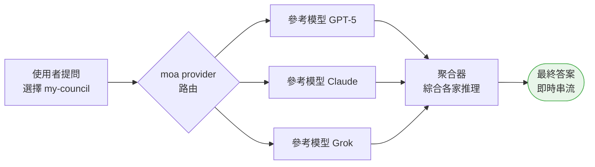
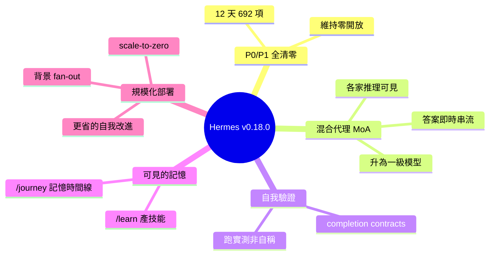

## Hermes Agent v0.18.0 (2026.7.1) — The Judgment Release

Hermes Agent v0.18.0「The Judgment Release」發佈，在 12 天內解決 696 個最高優先級項目（3 P0 issues、493 P1 issues、8 P0 PRs、188 P1 PRs），達成並保持零開放 P0/P1 的里程碑。Mixture-of-Agents 升級為一級模型，可直接從選擇器中選擇命名集合（如「my-council」），每個參考模型的推理過程可見，最終答案實時流式呈現。新增 completion contracts 讓 /goal 通過運行實際檢查驗證工作完成，而非依賴模型主觀判斷；/learn 自動將任何內容提取為可重用技能；/journey 提供可編輯的記憶時間線和記憶圖。delegate_task 支持背景並行 fan-out 無需阻塞聊天，桌面應用增加專業 Projects 管理，網關實現 scale-to-zero 和 drain coordination，輔助模型用於自我改進迴圈以降低成本。

### 重點
- P0/P1 100% 清空（3 P0 issues + 493 P1 issues + 8 P0 PRs + 188 P1 PRs），共 696 項優先級項目在 12 天內解決，現保持零開放 P0/P1
- Mixture-of-Agents 成為一級模型可直接選擇，每個參考模型推理可見流式呈現，completion contracts 定義完成標準透過實際檢查驗證而非主觀判斷
- 背景 fan-out 支持並行任務無需阻塞聊天，/journey 提供透明可編輯的記憶時間線，桌面 Projects、scale-to-zero gateway、輔助模型自我改進降低成本、Google Vertex AI 支持

**原文：** [hermes-agent-releases](https://github.com/NousResearch/hermes-agent/releases/tag/v2026.7.1)

---

<!-- deep-analysis:begin -->
## 📌 摘要 (TL;DR)

- NousResearch 於 2026 年 7 月 1 日發佈 Hermes Agent v0.18.0（v2026.7.1），代號「審判版」（The Judgment Release）；自 v0.17.0 起累積約 1,720 commits、998 個合併 PR、2,215 個檔案變更、370+ 社群貢獻者。
- 核心里程碑：整個 repo 的 P0/P1 問題與 PR 100% 清零——12 天內解決約 692 個最高優先項（issue 496 + PR 196），並宣示自此維持零開放 P0/P1。
- 混合代理（Mixture-of-Agents，簡稱 MoA）升級為一級模型，可像挑 Claude、GPT、Grok 一樣直接從選單挑「my-council」這類命名集合。
- 每個參考模型（reference model）的完整推理會分塊顯示，聚合器（aggregator）綜合後的最終答案改為即時串流。
- /goal 新增完成契約（completion contracts），讓代理靠「跑實際檢查」證明工作完成，而非模型自稱；/learn 一鍵把任何東西萃取成可重用技能，/journey 提供可編輯的記憶時間線。
- 基礎設施升級：delegate_task 支援背景扇出（background fan-out）、網關支援縮至零（scale-to-zero），自我改進迴圈改用輔助模型（auxiliary model）以降低成本。

## 🎯 核心概念

- **混合代理**（Mixture-of-Agents，簡稱 MoA）：多個前沿模型組成的命名集合，一起審議同一個提問，再由聚合器綜合出單一答案。
- **完成契約**（completion contracts）：使用者定義「完成」長什麼樣，常駐目標迴圈（standing-goal loop）依此證據判定是否真的做完。
- **背景扇出**（background fan-out）：delegate_task 一次派出多個子代理（subagent）在背景並行，聊天不被阻塞，全部完成後彙整成單一回合。
- **縮至零**（scale-to-zero）與**排空協調**（drain coordination）：網關閒置時休眠、重啟前乾淨排空，且不中斷進行中的對話。

## 📖 整理分析

### 1. P0/P1 全清零里程碑
團隊一週半全力衝優先權待辦，把整個 repo 的 P0 與 P1 全數關閉：P0 關 3 個 issue、合 8 個 PR；P1 關 493 個 issue、合 188 個 PR，合計約 692 項於 12 天內解決。最後倒下的是「interrupt-protected-compression 手足分支（sibling-fork）」bug（issue #56391）及其修復（#56416）。貢獻者 @kshitijk4poor 包辦了 cron 可靠性、compression-fork 修復與憑證外洩（credential-exfil）強化等大量 P1 收尾。

### 2. MoA 升為一級模型、推理全可見
過去 MoA 是要手動切換的模式，如今每個命名 MoA 預設都以 moa provider 出現在 CLI、TUI、桌面與網關的模型選單裡，和 Claude、GPT、Grok 並列，選「my-council」就等於挑一個模型。集合執行時，GPT-5、Claude、Grok 各自的完整輸出會以獨立標記區塊呈現，讓你先讀到各家想法，聚合器再綜合；最終答案也從「長時間沉默後一次跳出」改為即時串流。

### 3. 自我驗證與完成契約
Hermes 現在會為程式工作記錄驗證證據，並能實際跑專案的檢查來判定是否完成，而非口頭宣稱成功。/goal 導入完成契約：你陳述「完成」的樣貌，迴圈就依證據判定，而不是模型覺得差不多就停。另提供 pre_verify hook 串接自訂檢查，以及一次性遷移調校預設值。差別就在於「我覺得修好了」與「測試通過，這是證明」。

### 4. /learn 與 /journey——讓記憶可見可控
/learn <任何東西> 能把一個目錄、一個 URL、或你剛剛帶它走過的流程，萃取成可重用技能（skill），並自動照 CONTRIBUTING.md 的規範寫入。/journey 則在 CLI 與 TUI 提供學習時間線，列出累積的記憶與技能且可就地編輯或刪除；搭配桌面新的記憶圖（memory graph，放射狀可播放時間線），代理的記憶不再是黑盒。

### 5. 規模化與成本：背景扇出、縮至零、更省的自我改進
delegate_task 可把多個子代理丟到背景並行（如「並行研究五家競品」），完成後彙整成單一回合。網關支援 scale-to-zero 與 drain coordination，閒置休眠、重啟前乾淨排空而不斷線，讓託管式 Hermes 更接近正式環境等級。回合後的自我改進分支改路由到輔助模型、只消化上下文摘要而非重播整段對話，讓「事後學習」迴圈成本大幅下降。此外桌面新增一級 Projects 管理（含 git worktree 與 review 面板）、/prompt 可在 $EDITOR 手寫長提示，Google Vertex AI 也成為一級供應商，可用 GCP 服務帳號存取 Gemini 而不需靜態金鑰。

## 🧭 流程圖

MoA 集合的審議流程：

## 🧠 Mindmap

<!-- deep-analysis:end -->
### 📄 原文內容

點此展開 / 收合

Hermes Agent v0.18.0 (v2026.7.1) 
 Release Date: July 1, 2026 
 Since v0.17.0: ~1,720 commits · 998 merged PRs · 2,215 files changed · ~251,000 insertions · ~41,000 deletions · 949 issues closed · 370+ community contributors 
 
 The Judgment Release. Over the last week and a half the team put nearly all of its effort into one goal: resolve every P0 and P1 issue and PR in the entire Hermes Agent repo — and as of this release, 100% of them are closed. Zero open P0s. Zero open P1s. That's ~700 highest-priority items cleared as part of ~1,950 total issues and PRs closed this window. We intend to keep P0/P1 at zero from here on. 
 On top of that clean-sweep, v0.18.0 is about how well Hermes thinks and how it knows when its work is actually done . Mixture-of-Agents became a first-class citizen — named ensembles of models you can pick like any other model, with every reference model's reasoning shown to you and the aggregator's answer streamed live. The agent learned to verify its own work against evidence instead of vibes, /goal gained completion contracts, and /learn + /journey turned self-improvement into something you can see and steer. Underneath, the gateway became genuinely deployable-at-scale (scale-to-zero, drain coordination), the desktop grew first-class coding projects and a playable memory graph, and subagents can now fan out in the background. 
 
 🎯 The P0/P1 Clean Sweep — 100% resolved 
 This is the release headline. For a week and a half the team hammered the priority backlog day and night, and every single P0 and P1 across the whole repo is now closed: 
 
 
 
 Priority 
 Issues closed 
 PRs merged 
 
 
 
 
 P0 (critical) 
 3 
 8 
 
 
 P1 (high) 
 493 
 188 
 
 
 Total 
 496 
 196 
 
 
 
 That's ~692 highest-priority items resolved in twelve days — and at the moment the sweep completed, the open P0/P1 count hit 0 across the entire repo. The final cluster to fall was the interrupt-protected-compression sibling-fork bug (issue #56391 ) and its fix ( #56416 ), closed on an all-nighter right before this release cut. 
 Special shoutout to @kshitijk4poor , who burned through the priority backlog day and night alongside the core team — the cron reliability wave, the compression-fork fix, the credential-exfil hardening, and a huge share of the P1 closures are his. 
 We're keeping P0/P1 at 0 from here forward. 🫡 
 ✨ Highlights 
 
 
 Mixture-of-Agents is now a first-class model you can pick — MoA used to be a mode you toggled; now every named MoA preset shows up as a selectable model under a moa provider, right alongside Claude, GPT, and Grok in every model picker (CLI, TUI, desktop, gateway). Pick "my-council" the same way you'd pick any model, and Hermes routes your prompt through that ensemble automatically. An ensemble of frontier models deliberating on your hardest questions is now one selection away, on every surface. ( #46081 , #53548 , #53561 — @teknium1 ) 
 
 
 See every model's reasoning, then watch the answer stream in — When a MoA ensemble runs, each reference model's full output now renders as its own labelled block — you can read what GPT-5 thought, what Claude thought, and what Grok thought, before the aggregator synthesizes them into one answer. And that final answer now streams to you live instead of appearing all at once after a long silence. This works in the CLI, the TUI, and the desktop app. You get to watch the committee deliberate, not just read the verdict. ( #53793 , #53855 , #55625 , #56101 — @teknium1 ) 
 
 
 The agent verifies its own work — "done" means proven, not claimed — Hermes now records verification evidence for coding work and can decide it's finished by actually running your project's checks, not by asserting success. /goal gained completion contracts : you state what "done" looks like, and the standing-goal loop judges completion against that evidence instead of stopping when the model feels like it. There's a pre_verify hook for wiring in custom checks and a one-time migration that tunes the defaults sensibly. The difference between "I think I fixed it" and "the tests pass, here's proof." ( #50501 , #52285 , #55413 , #53552 — @teknium1 , @OutThisLife ) 
 
 
 /learn — turn anything into a reusable skill by describing it — Run /learn &lt;anything&gt; and Hermes distills a reusable skill out of whatever you point it at — a directory, a URL, or just the workflow you walked it through five minutes ago. It writes the skill to the standards in your CONTRIBUTING.md automatically. The next time you need that workflow, it's already there. Teaching Hermes a new trick is now a single command, not a manual skill-authoring session. ( #51506 , #52372 — @teknium1 ) 
 
 
 /journey — a playable timeline of everything Hermes has learned about you — The CLI and TUI gained /journey , a learning timeline that shows the memories and skills Hermes has accumulated over time — and you can edit or delete any of them right from the view. Pair it with the desktop's new memory graph (a top-down, playable radial timeline of memories and skills) and for the first time you can actually see what your agent knows, watch it grow, and prune what's wrong. Your agent's memory stops being a black box. ( #55555 , #55859 , #55226 — @OutThisLife ) 
 
 
 Delegate a pile of work and keep going — background fan-out — delegate_task can now fan out multiple subagents that all run in the background : your chat is never blocked, and when every subagent finishes, their results come back as a single consolidated turn. Kick off "research these five competitors in parallel" or "audit these three modules," then carry on with something else while a small fleet works. When it's all done, you get one clean summary instead of babysitting each one. ( #49734 — @teknium1 ) 
 
 
 First-class coding Projects in the desktop app — The desktop app gained real, per-profile Projects — a sidebar of your codebases, a coding rail, a review pane, git worktree management, and agent-facing project tools, all backed by a proper project → repo → lane model. Instead of scattered chat sessions, your coding work is organized into projects the agent understands and can act on. It's the desktop turning into an actual coding cockpit. ( #49037 , #54385 , #54517 — @OutThisLife ) 
 
 
 Run Hermes at scale — scale-to-zero and drain coordination — The gateway can now go dormant when idle and quiesce cleanly before a restart, migration, or auto-update — without dropping in-flight conversations. A hosted or relay-only Hermes can scale to zero when nobody's talking to it and wake back up on demand, and disruptive lifecycle actions coordinate an external drain so nobody gets cut off mid-turn. Running Hermes for a team or as a hosted service just got a lot more production-grade. ( #52243 , #52937 , #54824 — @teknium1 , @benbarclay ) 
 
 
 Cheaper self-improvement — smarter background review — The post-turn self-improvement fork (the one that decides whether to save a memory or skill) now routes to an auxiliary model, digests context instead of replaying the whole conversation, and adapts its cadence — so the "learn from what just happened" loop that runs after your turns costs a fraction of what it used to. You keep the self-improvement, you stop paying full main-model price for it. ( #49252 — @teknium1 ) 
 
 
 Compose your next prompt in your editor — /prompt — /prompt opens your $EDITOR so you can hand-write a long, multi-line prompt in real markdown instead of fighting a one-line input box. Draft a detailed spec, a structured question, or a big paste, save, and it's queued as your next message. Small thing, huge quality-of-life win for anyone who writes Hermes more than a sentence at a time. ( #50509 — @teknium1 ) 
 
 
 Google Vertex AI — Gemini through your GCP service account, no static key — Vertex AI is now a first-class provider for Gemini models over Vertex's OpenAI-compatible endpoint. The reason a plain custom-provider setup always died mid-session is that Vertex has no static API key — every request needs a short-lived OAuth2 access token (~1h TTL) minted from a service-account JSON or Application Default Credentials. Hermes now mints and auto-refreshes those tokens for you, so if your org runs Gemini through Google Cloud, you point Hermes at your service account and it just works — no token-pasting, no mid-session expiry. ( #56363 — @teknium1 , @slawt ) 
 
 
 Security round — This window hardened several surfaces: MCP-config persistence attack surface locked down, cron base_url overrides that could exfiltrate provider credentials blocked, a non-reusable sentinel for prefix secrets in file reads, Slack app-level ( xapp- ) token redaction, a browser cloud-metadata floor enforced on every backend, and an aiohttp CVE floor across the lazy messaging paths. Fewer ways for a prompt-injected or misconfigured session to leak a credential. ( #50476 , #56196 , #54166 , #56227 , #52349 , #56237 — @teknium1 , @kshitijk4poor , @claudlos ) 
 
 
 
 🧠 Mixture-of-Agents (MoA) 
 MoA graduated from a mode to a first-class part of the model system this window. 
 
 Presets as selectable virtual models — each named MoA preset appears as a model under provider moa ; pick it in any model picker and Hermes routes through the ensemble ( #46081 , #53561 , #53775 — @teknium1 ) 
 /moa is now one-shot sugar — runs a single prompt through the default preset and restores your model afterward; persistent switching goes through the model picker ( #53548 — @teknium1 ) 
 Reference-model output shown as labelled blocks in CLI, TUI, and desktop — read each model's reasoning before the aggregator's synthesis ( #53793 , #53855 — @teknium1 ) 
 Aggregator response streams live instead of appearing whole after a silence ( #55625 — @teknium1 ) 
 References see full tool state and fire on every user/tool response ; advisory references end on a user turn and get a reference-role system prompt ( #54016 , #54007 — @teknium1 ) 
 Opt-in full-turn trace persistence to JSONL ( moa.save_traces ) for debugging and eval ( #56101 — @teknium1 ) 
 Reliability: reference + aggregator models called through their provider's real route; context window resolved from the aggregator (not the 256K default); auxiliary tasks resolve to the aggregator; virtual provider blocked as a reference/aggregator slot; tolerant of hand-edited preset config ( #53580 , #53780 , #53827 , #53281 , #53275 , #53556 — @teknium1 ) 
 MoA slot provider-identity unified on the single call_llm chokepoint; HermesBench results documented ( #55991 , #53206 — @teknium1 ) 
 
 ✅ Verification &amp; Goals — the agent proves its work 
 
 Completion contracts for /goal — state what "done" looks like; the standing-goal loop judges against evidence, not the model's say-so ( #50501 — @teknium1 ) 
 /goal wait &lt;pid&gt; — park the standing-goal loop on a background process instead of re-poking the agent ( #50503 — @teknium1 ) 
 Coding verification evidence ledger — profile-scoped record of canonical project checks detected by agent.coding_context ; gateway exposes verification status ( #52285 , #52286 — @OutThisLife ) 
 pre_verify hook + coding guidance config ; verification stop loop + ad-hoc verification scripts ( #55413 , #52296 , #52297 — @OutThisLife ) 
 verify-on-stop defaults OFF with a one-time v32 migration; skips doc-only edits; surface-aware "auto" default restored; gated off for messaging surfaces ( #53552 , #54740 , #55449 , #52412 — @teknium1 , @OutThisLife , @GodsBoy ) 
 
 🎓 Self-Improvement (Learn / Journey) 
 
 /learn &lt;anything&gt; — distill a reusable skill from a directory, URL, or a workflow you just walked through; honors CONTRIBUTING.md skill standards and mixed requirements ( #51506 , #52372 , #55956 — @teknium1 ) 
 /journey — CLI + TUI learning timeline of accumulated memories and skills, with in-place edit/delete ( #55555 , #55859 — @OutThisLife ) 
 Cheaper background review — aux-model routing + context digest + adaptive cadence for the post-turn self-improvement fork ( #49252 — @tekni

[... truncated for safety ...]

