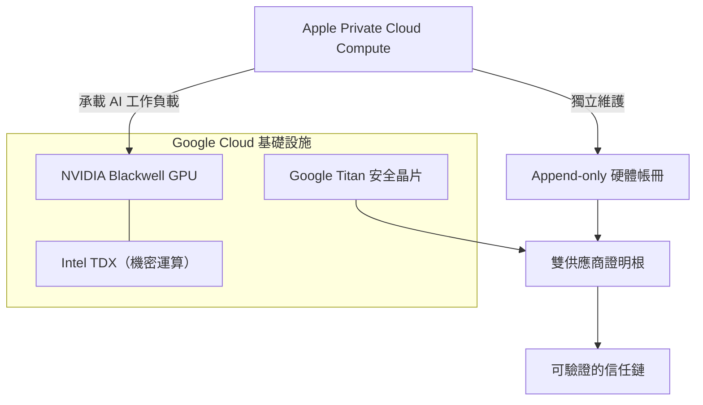
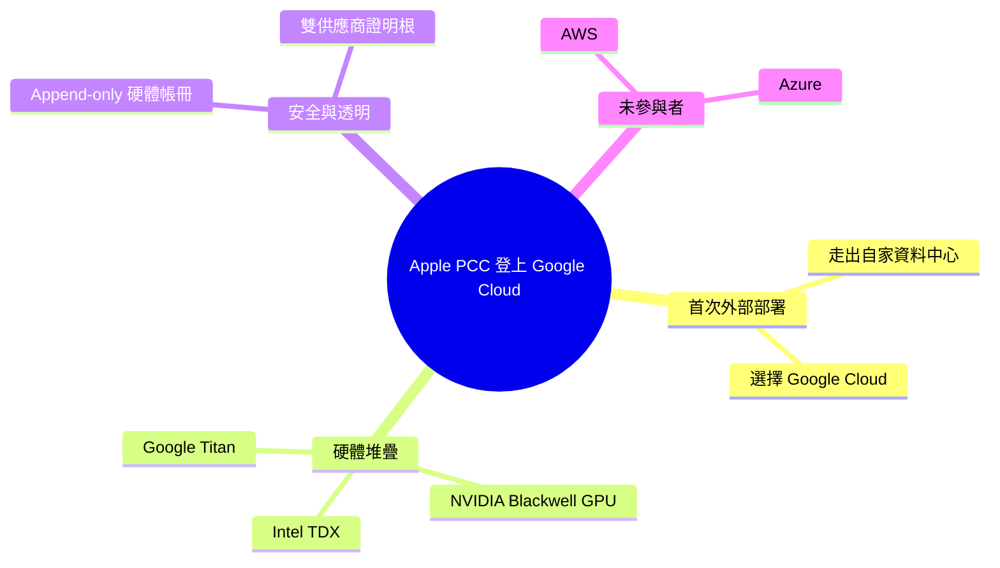

## Apple Extends Private Cloud Compute to Google Cloud for the First Time

Apple 首次在 Google Cloud 外部數據中心運行私有雲計算（Private Cloud Compute），支持其 AI 功能。基礎設施採用 NVIDIA Blackwell GPU、Intel TDX（可信執行環境）和 Google Titan 芯片。Apple 維護獨立的附加唯讀硬體帳冊（hardware ledger）和雙供應商證明根確保安全性和透明度。AWS 和 Azure 未參與此合作。

### 重點
- NVIDIA Blackwell GPU + Intel TDX + Google Titan chip 構成 PCC 硬體基礎
- 獨立附加唯讀硬體帳冊實現不可篡改的操作記錄
- 雙供應商證明根提供跨廠商安全保證，AWS 和 Azure 未參與

**原文：** [infoq-main](https://www.infoq.com/news/2026/07/apple-pcc-google-cloud/?utm_campaign=infoq_content&utm_source=infoq&utm_medium=feed&utm_term=global)

---

<!-- deep-analysis:begin -->
## 📌 摘要 (TL;DR)

- Apple 首次將私有雲計算（Private Cloud Compute，簡稱 PCC）部署到自家資料中心以外，合作對象是 Google Cloud。
- 底層硬體採用 NVIDIA Blackwell GPU、Intel TDX（Trust Domain Extensions，可信執行環境）與 Google 自研的 Titan 安全晶片。
- 為維持安全與可驗證性，Apple 自行維護一份獨立、僅可追加的硬體帳冊（append-only hardware ledger），並建立雙供應商證明根（dual-vendor attestation roots）。
- 兩大雲端對手 AWS 與 Azure 並未參與此次合作，外部部署由 Google Cloud 獨家承接。
- 報導由 InfoQ 的 Steef-Jan Wiggers 撰寫，用於支撐 Apple 的 AI 功能。

## 🎯 核心概念

- **私有雲計算**（Private Cloud Compute，簡稱 PCC）：Apple 用來處理無法在裝置端完成的 AI 請求、並以隱私保護為核心設計的雲端基礎設施。
- **Blackwell GPU**：NVIDIA 的 GPU 架構，負責承載 AI 運算工作負載。
- **Intel TDX**（Trust Domain Extensions）：Intel 的機密運算 / 可信執行環境技術，將工作負載隔離在受保護的信任域中。
- **Google Titan**：Google 自研的安全晶片，可作為硬體信任根（root of trust）。
- **僅可追加硬體帳冊**（append-only hardware ledger）：只能新增、不可竄改的紀錄，用來追蹤硬體狀態。
- **雙供應商證明根**（dual-vendor attestation roots）：由兩個供應商各自提供驗證依據，讓信任不集中在單一方。

## 📖 整理分析

### 1. 首次走出 Apple 自家機房
過去 PCC 都運行在 Apple 自有資料中心；這是 Apple 第一次把 PCC 放到外部雲端，並選擇 Google Cloud 作為承載平台。此舉代表 Apple 願意在外部基礎設施上，執行其對隱私要求極高的 AI 工作負載。

### 2. 硬體堆疊：Blackwell + TDX + Titan
在 Google Cloud 上，運算由 NVIDIA Blackwell GPU 提供；安全隔離則同時倚賴 Intel TDX 的可信執行環境與 Google Titan 安全晶片。三者組成兼顧算力與機密運算的硬體基礎。

### 3. 安全與透明：獨立帳冊 + 雙供應商證明根
即使運行在 Google 的機房，Apple 仍自行維護一份獨立、僅可追加的硬體帳冊，並採用雙供應商證明根。這種設計讓信任不完全依賴 Google 單一方，而是透過雙方各自的驗證來確保透明與可驗證性。

### 4. 缺席者：AWS 與 Azure
報導特別點出，AWS 與 Azure 並不在此次合作範圍內——這次 PCC 的外部部署由 Google Cloud 獨家承接。

## 🧭 架構圖

## 🧠 Mindmap

<!-- deep-analysis:end -->
### 📄 原文內容

點此展開 / 收合

Apple chose Google Cloud to run Private Cloud Compute outside its own data centers for the first time, using NVIDIA Blackwell GPUs, Intel TDX, and Google's Titan chip. Apple maintains an independent append-only hardware ledger and dual-vendor attestation roots. AWS and Azure are not part of the collaboration. By Steef-Jan Wiggers

