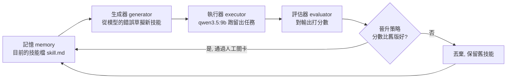
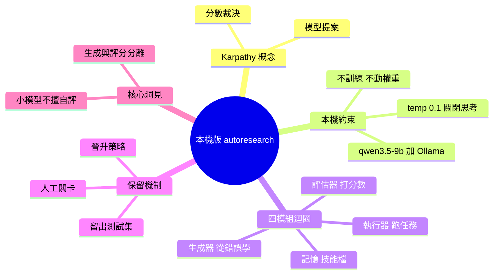

## Karpathy’s Autoresearch, for a Local LLM

本文介紹 Andrej Karpathy 的自動研究（Autoresearch）系統在本地 LLM 上的應用。該系統由四個核心模塊組成：生成器（generator）負責生成研究/推論、執行器（executor）執行任務、評估器（evaluator）檢驗結果品質、記憶模塊（memory）保存歷史知識。整個系統設計用於在個人機器上構建、測試和測量性能，支援研究人員在本地環境快速迭代改進 LLM 的行為。

### 重點
- Autoresearch 系統包含 generator / executor / evaluator / memory 四個可組合的模塊
- 支援在本地機器上運行，避免依賴外部 API，降低成本與延遲
- 強調小規模構建與可測量的迭代循環，適合個人開發者實驗

**原文：** [medium-tag-llm](https://generativeai.pub/karpathys-autoresearch-for-a-local-llm-d5b47e838970?source=rss------large_language_models-5)

---

<!-- deep-analysis:begin -->
## 📌 摘要 (TL;DR)

- 作者 Jes Fink-Jensen 把 Andrej Karpathy 提出的「自動研究」（autoresearch）概念縮小到一台個人電腦：用單一 9B 模型跑一個「提案 → 測試 → 只保留有進步的版本」的自我改進迴圈。
- 核心原則是「模型負責提案，分數負責裁決」（the model proposes, but a score decides）——改動由模型草擬，但去留由一個可在終端機直接讀到的量化指標決定。
- 關鍵設計：模型權重完全不動，唯一會改變的是一份會被前置到提示（prompt）最前面的 markdown 技能檔（skill file）。
- 迴圈由四個模組組成：生成器（generator）、執行器（executor）、評估器（evaluator）、記憶（memory），外加一個可開關的「人工關卡」（human gate）晉升策略。
- 實驗環境全在本機：Windows 上以 Ollama 服務 qwen3.5:9b，關閉思考模式、temperature 設 0.1，不需訓練、不需 GPU 徹夜運算。
- 作者刻意點出：小模型是機率性的、且不擅長評判自己的成果——這正是為何「打分」必須獨立於「生成」的關鍵理由。

## 🎯 核心概念

- **自動研究（autoresearch）**：Karpathy 提出的自動化迴圈，讓模型對程式碼庫提出修改、跑測試，只有當量測分數變好時才保留該修改。
- **技能檔（skill file）**：一份 markdown 檔，會被接在提示最前面；在這個實驗裡它是唯一「可被學習與更新」的部分，等同系統的長期記憶。
- **留出測試集（held-out set）**：一組不參與生成、專門用來評分的任務，避免模型「改考卷給自己打高分」。
- **晉升策略（promotion policy）**：決定新技能是否被採用的規則，可加上人工關卡（human gate）讓人做最後把關。
- **Ollama / qwen3.5:9b**：本機模型服務工具與所用的 9B 參數模型；關閉 thinking、temperature 設 0.1 以求輸出穩定。

## 📖 整理分析

### 1. Karpathy 的 autoresearch 是什麼
Karpathy 描述的自動研究是一個自動化迴圈：模型對一個程式碼庫「提案一項修改 → 執行測試 → 只有當量測顯示更好時才保留」。重點在於分工——模型負責提案，分數負責裁決。作者想驗證的問題是：當把它縮到一顆本機 9B 模型、沒有訓練、沒有整夜 GPU、指標只是終端機裡一個數字時，這個構想還能剩下多少。

### 2. 不動權重，只改一份技能檔
作者刻意讓模型權重「完全不變」。整個系統唯一會被更新的，是一份會前置到提示最前面的 markdown 技能檔。換句話說，這不是微調（fine-tuning），而是把「學到的教訓」寫成純文字提示片段累積下來——這讓整套流程能在筆電上跑、可讀、也可回溯。

### 3. 四個模組如何組成迴圈
- 生成器（generator）：讀取模型自己犯過的錯，草擬一份新的候選技能。
- 執行器（executor）：把（含新技能的）提示丟給 qwen3.5:9b，實際跑那批任務。
- 評估器（evaluator）：拿一組留出任務對輸出評分，產生一個可比較的數字。
- 記憶（memory）：保存目前採用的技能檔，作為下一輪的起點與長期知識。

### 4. 晉升策略與人工關卡
新技能不會被自動信任。晉升策略比較「新技能的分數」與「舊版本的分數」，分數變好才晉升、否則丟棄並維持舊技能。作者還加了一個可開關的人工關卡：需要時由人做最後決定，讓自動迴圈保有可控性。

### 5. 為何「生成」與「評分」必須分離
作者強調小模型是機率性的，而且不擅長評判自己的作品。若讓同一顆模型既提案又自評，就會系統性高估自己。因此把裁決權交給一個客觀、可在終端機讀到的分數與獨立的留出集，是整個設計能站得住腳的關鍵。（本文為 Medium 會員限定的 15 分鐘實作長文，內含可實際執行的完整迴圈程式碼；此處整理自可公開存取的前段內容，未臆造文中的實測數字。）

## 🧭 流程圖 / 架構圖

## 🧠 Mindmap

<!-- deep-analysis:end -->
### 📄 原文內容

點此展開 / 收合

The four parts (generator, executor, evaluator, memory) built small, tested, and measured on your own machine. Continue reading on Generative AI »

