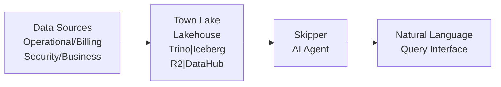

## Cloudflare Details Unified Data Platform Where Billing Workloads Account for 53% of Queries

Cloudflare 公开了内部统一数据平台 Town Lake。该平台基于 lakehouse 架构，集成了 Trino、Iceberg、R2 和 DataHub 等技术栈，支持跨多个数据域的统一查询。配套推出了 Skipper，一个 AI 分析 agent，能够通过自然语言接口统一访问 operational、billing、security 和 business 四大数据范畴。平台处理的约 91K billing queries 中，billing 工作负载占比 53%，这表明企业内部计费和成本分析是数据查询的主要场景。Town Lake 展示了大规模企业如何通过现代数据栈和 AI 技术实现跨系统的 governed analytics。

### 重點
- Town Lake lakehouse 平台：Trino + Iceberg + R2 + DataHub 技术栈
- Skipper AI analytics agent 支持自然语言查询，统一访问 4 大数据范畴（operational/billing/security/business）
- 处理约 91K billing queries，billing 占 53%，计费是主要查询场景

**原文：** [infoq-main](https://www.infoq.com/news/2026/07/cloudflare-unified-data-platform/?utm_campaign=infoq_content&utm_source=infoq&utm_medium=feed&utm_term=global)

---

### 📄 原文內容

點此展開 / 收合

Cloudflare details Town Lake, an internal unified data platform, and Skipper, an AI analytics agent unifying access to operational, billing, security, and business data. The platform processed ~91K billing queries, with billing forming majority usage. Built on a lakehouse architecture using Trino, Iceberg, R2, and DataHub, it enables governed cross-system analytics and natural language access. By Leela Kumili

