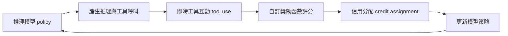
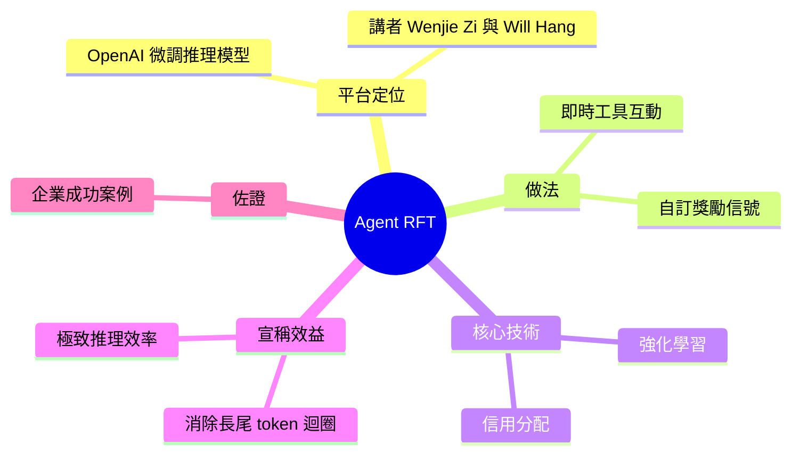

## Presentation: Fine Tuning the Enterprise: Reinforcement Learning in Practice

OpenAI 推出 Agent RFT 平台，用於通過實時工具交互和自定義獎勵信號對推理模型進行微調。該平台利用強化學習在上下文窗口內解決複雜的信用分配問題，有效消除長尾 token 迴圈，顯著提升推理效率。演講分享了企業應用成功案例，展示該方法如何驅動極致效率的達成。

### 重點
- Agent RFT 通過實時工具交互和自定義獎勵信號實現推理模型微調
- 強化學習在上下文窗口內解決複雜信用分配問題，消除長尾 token 迴圈
- 企業應用驗證了效率提升，達到 extreme efficiency

**原文：** [infoq-main](https://www.infoq.com/presentations/rft-openai-model/?utm_campaign=infoq_content&utm_source=infoq&utm_medium=feed&utm_term=global)

---

<!-- deep-analysis:begin -->
## 📌 摘要 (TL;DR)

- 這是一場 InfoQ 演講，講者為 Wenjie Zi 與 Will Hang，主題是 **Agent RFT**——OpenAI 用來微調推理模型（reasoning model）的平台。
- Agent RFT 的核心做法：讓模型在訓練時進行即時工具互動（real-time tool interactions），並以自訂獎勵信號（custom reward signals）評分與優化。
- 技術重點是用強化學習（reinforcement learning，簡稱 RL）解決上下文窗口（context window）內的信用分配（credit assignment）難題——判斷一連串推理與動作中，哪些步驟真正貢獻了最終結果。
- 講者主張此法可消除「長尾 token 迴圈」（long-tail token loops），驅動極致的推理效率，並分享了企業導入的成功案例。
- ⚠️ 依據說明：本整理依 InfoQ 公布的演講**摘要**（abstract）撰寫；該摘要未載明具體企業名稱、基準數據與模型版本，故以下不臆造這些細節，僅就已揭露的機制與公開的 RFT 背景知識展開。

## 🎯 核心概念

- **強化微調**（Reinforcement Fine-Tuning，簡稱 RFT）：用強化學習、而非傳統監督式標註資料來微調模型；以獎勵函數 / grader 給輸出評分，逐步優化模型策略。
- **Agent RFT**：RFT 的延伸，讓模型在訓練迴圈中實際呼叫工具、與環境即時互動之後再評分，而非只對單次文字輸出打分。
- **推理模型**（reasoning model）：會先產出思考 / 推理 token、再給答案的模型（如 OpenAI o 系列）。
- **信用分配**（credit assignment）：RL 的核心難題——在一長串動作與 token 中，判斷哪些步驟真正促成好結果、該被獎勵。
- **長尾 token 迴圈**（long-tail token loops）：模型推理時陷入冗長、重複或無效的思考輸出，拖慢效率。

## 📖 整理分析

### 1. Agent RFT 是什麼
Agent RFT 是 OpenAI 提供的微調平台，專為推理模型設計。傳統微調多用固定的標註資料集，Agent RFT 則讓模型在訓練時真實地呼叫工具、進行即時互動，並以開發者自訂的獎勵信號評估整段行為的好壞，再回饋更新模型。

### 2. 強化學習如何解信用分配
演講指出，此法用強化學習處理「上下文窗口內的信用分配」。當模型的一次回合包含多輪推理與多次工具呼叫時，最終獎勵要如何分攤到中間每一步，是 RL 的經典難題；RFT 透過獎勵訊號在上下文窗口內做這種分配，讓模型學會保留有效步驟、捨棄無效步驟。

### 3. 消除長尾迴圈、追求效率
講者主張 Agent RFT 能消除「長尾 token 迴圈」，也就是模型冗長、繞圈式的推理輸出。透過獎勵設計讓短而準的推理路徑得到正回饋，模型會傾向用更少 token 完成任務，帶來他們所稱的「極致效率」。

### 4. 企業落地案例
演講分享了企業導入 Agent RFT 的成功故事，用以佐證上述效率提升。（註：公開摘要未列出具體公司、任務類型與量化數據，此處不臆造；欲取得完整案例需回看原始演講。）

## 🧭 流程圖 / 架構圖

下圖為 Agent RFT 訓練迴圈的機制示意（依摘要描述的元素繪製）：

## 🧠 Mindmap

<!-- deep-analysis:end -->
### 📄 原文內容

點此展開 / 收合

The speakers discuss Agent RFT, OpenAI’s platform for fine-tuning reasoning models via real-time tool interactions and custom reward signals. They explain how reinforcement learning solves complex credit assignment challenges within the context window. They share enterprise success stories, showing how Agent RFT eliminates long-tail token loops and drives extreme efficiency. By Wenjie Zi, Will Hang

