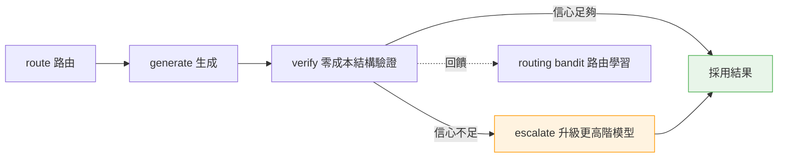
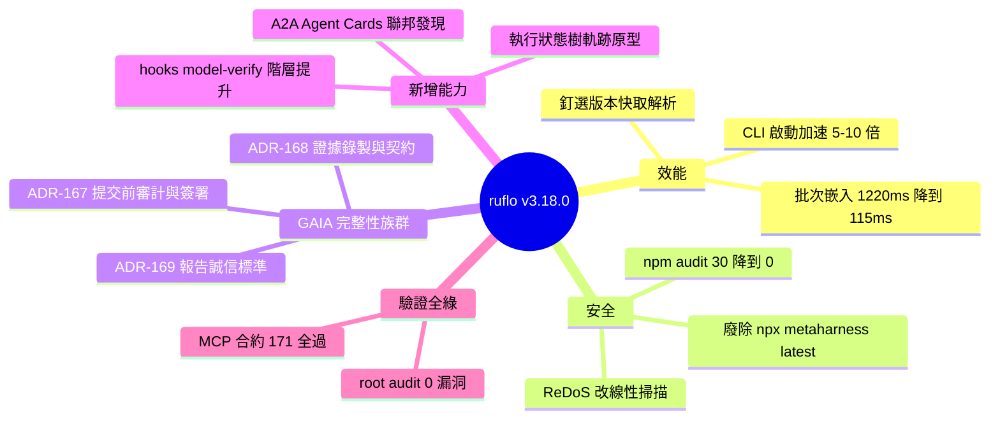

## v3.18.0 — Review-driven upgrades: 5-10x faster CLI, supply-chain hardening, GAIA integrity family, SOTA capabilities

ruflo v3.18.0 是四輪專家審視驅動的大版本升級，涵蓋三大支柱：（1）性能：CLI 啟動 5–10x 加速（--help 0.50s → 0.09s，回到 <500ms 目標），移除 450–2,800ms ONNX embedder 初始化稅；記憶體批量嵌入 1220ms → 115ms；metaharness 技能從版本快取解析零登錄流量。（2）安全：廢除第三方 npx metaharness@latest（供應鏈 HIGH），版本快取遞減解析；npm audit 從 30 降至 0；CodeQL HIGH 修復多項（polynomial ReDoS → linear scan）。（3）GAIA 完整性族群（ADR-167/168/169）：執行前漏洞審計 + 簽署完整性證明；軌跡錄製、工具名稱+參數、分割來源追蹤；基準報告嚴格標準（strict-EM、檢視標籤、空率披露）。新增能力：hooks_model-verify（信心閘控階層提升）、A2A Agent Cards 聯邦發現、執行狀態樹軌跡原型。驗證：171/171 MCP 合約、122/122 外掛煙霧測試、0 漏洞。

### 重點
- CLI 啟動 5–10x 加速（--help 0.09s），ONNX embedder 延遲初始化移除固定開銷
- GAIA 完整性框架（ADR-167/168/169）：執行前審計 + 簽署證明 + 軌跡錄製，可驗證任務執行
- 供應鏈安全硬化：移除 npx@latest、版本快取遞減、漏洞清零（npm audit 30 → 0）

**原文：** [ruflo-releases](https://github.com/ruvnet/ruflo/releases/tag/v3.18.0)

---

<!-- deep-analysis:begin -->
## 📌 摘要 (TL;DR)

- **ruflo** 發布 v3.18.0，是一次由「四輪專家審視」（SOTA 研究、效能、架構、安全）驅動、六個並行代理（concurrent agents）實作、合併兩條功能線的大版本升級（PR #2543 / #2547 / #2552）。
- **效能**：CLI 啟動加速 5–10 倍——移除每道指令 450–2,800ms 的 ONNX 嵌入器（ONNX embedder）延遲初始化稅，`--help` 從 0.50s 降到 0.09s，整個 CLI 回到 <500ms 目標；記憶體匯入的批次嵌入（batch embeddings）在 200 筆情境下從 1220ms 降到 115ms。
- **安全**：廢除第三方 `npx metaharness@latest`（供應鏈 HIGH 風險），改用釘選版本快取（pinned versioned cache）解析；root `npm audit --omit=dev` 漏洞從 30 降到 0；修復 A2A slugify 的多項式正則阻斷服務（polynomial ReDoS，CodeQL high）。
- **GAIA 完整性族群**（ADR-167 / 168 / 169）：提交前弱點審計加上簽署的「賺得完整性」證明、軌跡與工具證據錄製、以及基準報告誠信標準（strict-EM、揭露空跑率）。
- **新能力**：hooks_model-verify 信心閘控階層提升、階層記憶時效性、A2A Agent Cards（spec 1.0.0）聯邦發現、執行狀態樹軌跡檢索原型。
- **驗證全綠**：MCP 合約 171/171、外掛煙霧測試 122/122、記憶 442/442、聯邦 600/600、root audit 0 漏洞，合併主幹 CI 全綠（含修復 25 個紅燈作業的 #2552 lockfile hotfix）。

## 🎯 核心概念

- **metaharness**：ruflo 的技能與工具子系統，本版含 15 個 MCP 工具；技能改由釘選版本快取解析，不再走註冊庫（registry）流量。
- **ruvector**：ruflo 的向量／嵌入解析元件；本版採本地優先（local-first）解析，並修好了各舊版都失效的瀏覽器軌跡錄製旗標。
- **架構決策紀錄**（Architecture Decision Record，簡稱 ADR）：記錄架構決策的文件，本版涉及 ADR-166 至 169。
- **GAIA**：AI 代理基準測試（benchmark）；本版針對其「完整性」建立一整族群機制。
- **代理對代理**（Agent-to-Agent，A2A）：代理間互通協定，本版實作 Agent Cards spec 1.0.0。
- **GEPA**：metaharness 的失敗類別診斷／演進機制（承接 v3.17.0 的 metaharness learn + gepa）。

## 📖 整理分析

### 1. 審視驅動的雙功能線
本版並非零散更新，而是先做一次「四輪審視審計」（SOTA research、performance、architecture、security 四個角度），再由六個並行代理落地實作，最後合併成兩條功能線。這種「先審視、後實作」的流程，讓效能、安全、完整性三大主軸的改動彼此對齊。

### 2. CLI 啟動 5–10 倍加速
關鍵瓶頸是每道指令都要初始化 ONNX 嵌入器，帶來 450–2,800ms 的固定成本。改為延遲（lazy）初始化後，`--help` 從 0.50s 降到 0.09s，整體 CLI 回到 <500ms 目標。此外，記憶體匯入的批次嵌入把 200 筆匯入從 1220ms 壓到 115ms，`score` 指令因改讀釘選版本快取只需 0.35s 且零註冊庫流量。

### 3. 供應鏈與漏洞強化
最重要的一項是廢除第三方 `npx metaharness@latest`——這是被標為 HIGH 的供應鏈風險——改用釘選版本快取解析，並保留優雅降級（graceful degradation）。同時解除先前 OpenTelemetry（OTel）把下限變上限的覆寫，使 root `npm audit --omit=dev` 漏洞從 30 清到 0，清掉 grpc-js／hono／brace-expansion 三個 GHSA；並把 A2A card slugify 對遠端輸入的 polynomial ReDoS 改成線性掃描（linear scan）。

### 4. GAIA 完整性族群（ADR-167 / 168 / 169）
三份 ADR 分工明確：**ADR-167** 做提交前弱點審計（AUD-1..10）加上簽署的「賺得完整性」證明——簽章證明位元組沒被竄改，審計證明分數是真的「賺來」的；證據不足處以誠實的 `harness_gap` 跳過。**ADR-168** 是把這些跳過變成可強制執行的前向契約：錄製軌跡、工具名稱與參數、資料分割來源（split provenance）、簽署的評審快取（#2548）。**ADR-169** 則訂基準報告誠信標準：strict-EM 頭條數字、標註視角的擴充分支、揭露空跑／空回率，並強制附上可重現區塊。

### 5. 新增能力與驗證
hooks_model-verify 導入信心閘控的階層提升——用零成本結構驗證器走「route → generate → verify → escalate」，並回饋給路由 bandit（routing bandit）。其他新增包含：階層記憶的時效性（validFrom／validUntil 加衝突時取代，Zep／Graphiti 風格）、A2A Agent Cards 於 `/.well-known/agent-card.json` 做聯邦發現、MAGE 風格的執行狀態樹軌跡檢索原型（`strategy: "state-tree"`）、`metaharness evolve --diagnose` 的 GEPA 失敗類別診斷，以及修好端到端的瀏覽器工作階段錄製。驗證面則是 tsc 乾淨、MCP 合約 171/171、外掛煙霧 122/122、記憶 442/442、聯邦 600/600、root audit 0 漏洞。

## 🧭 流程圖：hooks_model-verify 信心閘控

## 🧠 Mindmap

<!-- deep-analysis:end -->
### 📄 原文內容

點此展開 / 收合

Two merged feature trains, driven by a 4-review audit (SOTA research + performance + architecture + security) implemented by six concurrent agents. 
 Performance 
 
 CLI startup 5–10x faster — lazy ONNX embedder init removed a 450–2,800ms tax from every command ( --help 0.50s → 0.09s, whole CLI back under the &lt;500ms target) 
 Batch embeddings in memory import (200-entry import: 1220ms → 115ms), local-first ruvector resolution, metaharness skills now resolve from a pinned versioned cache ( score 0.35s, zero registry traffic) 
 
 Security 
 
 Killed third-party npx metaharness@latest (supply-chain HIGH) — pinned versioned-cache resolution with graceful degradation intact 
 OTel floor-became-ceiling overrides lifted (root npm audit --omit=dev : 30 → 0 ); grpc-js / hono / brace-expansion GHSAs cleared 
 CodeQL high fixed: polynomial ReDoS in A2A card slugify (remote input) → linear scan 
 
 GAIA integrity family (ADR-167 / 168 / 169) 
 
 ADR-167 : pre-submission exploit audit (AUD-1..10) + signed earning-integrity attestation — signing proves bytes; the audit proves the score was earned. Honest harness_gap skips where the harness can't yet supply evidence 
 ADR-168 : harness evidence recording (trajectories, tool names+args, split provenance, signed judge cache) — the forward contract that turns those skips enforceable ( #2548 ) 
 ADR-169 : benchmark reporting integrity standard — strict-EM headlines, view-labeled scaling arms, disclosed no-work/empty rates, mandatory reproducibility blocks 
 
 New capabilities 
 
 hooks_model-verify — confidence-gated tier escalation ($0 structural verifier; route → generate → verify → escalate; feeds the routing bandit) 
 Temporal validity on hierarchical memory (validFrom/validUntil + supersede-on-conflict, Zep/Graphiti-style) 
 A2A Agent Cards (spec 1.0.0) — federation discovery interop at /.well-known/agent-card.json , ADR-166 bind posture preserved 
 Execution-state-tree trajectory retrieval prototype (MAGE-style) behind strategy: "state-tree" 
 metaharness evolve --diagnose — GEPA failure-class diagnosis 
 Browser session recording fixed end-to-end (trajectory flags were invalid on every prior ruvector version) 
 
 Validation 
 tsc clean · MCP contract 171/171 (15 metaharness tools) · plugin smoke 122/122 · memory 442/442 · federation 600/600 · root audit 0 vulnerabilities · CI fully green on merged main (incl. the #2552 lockfile hotfix that had 25 main jobs red) 
 PRs: #2543 , #2547 , #2552 · Issues: #2542 , #2548 · Previous: v3.17.0 (metaharness learn + gepa)

