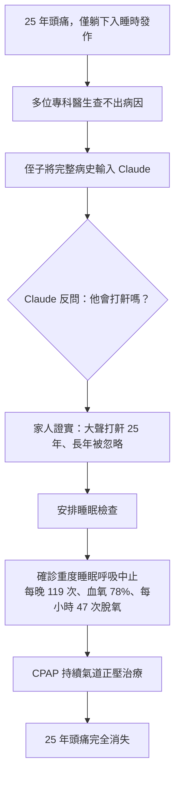
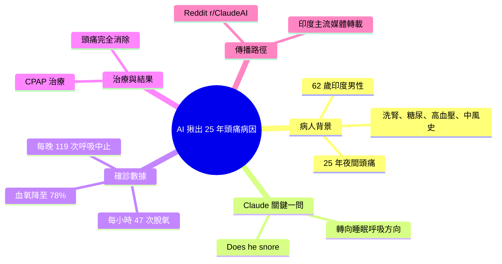

## 25 Years of Headaches. Zero Doctors Found the Cause. One AI Conversation Did.

62 歲印度腎透患者（每週透析 3 次、糖尿病、高血壓、6 年前中風史）持續 25 年頭痛（僅在躺下睡眠時發作），歷經多位專科醫生未診斷。患者侄子將病史輸入 Claude，模型提問「他打鼾嗎？」——家族證實確有打鼾 25 年但被忽視。診斷：重度睡眠呼吸暫停（每晚 119 次呼吸暫停、氧飽和度降至 78%、每小時 47 次脫氧事件）。CPAP 治療後頭痛完全消除。個案在 2026 年 3 月發布於 Reddit r/ClaudeAI，後被印度今日報、NDTV、泰晤士報等主流媒體報導。

### 重點
- AI 提問 vs. 25 年無診斷：單一「打鼾」詢問識別出被忽視的症狀交叉連結，突破傳統診斷盲點
- 診斷確認：睡眠研究數據完全符合（119 呼吸暫停、氧飽和 78%、AHI 47）；治療即刻有效
- 臨床案例：重度腎臟病共病患者對診斷黑盒特別脆弱；AI 對話可填補醫學評估的系統性漏洞

**原文：** [medium-tag-claude](https://medium.com/@jamilxt/25-years-of-headaches-zero-doctors-found-the-cause-one-ai-conversation-did-0803f1b15053?source=rss------claude-5)

---

<!-- deep-analysis:begin -->
## 📌 摘要 (TL;DR)

- 一名印度 62 歲男性長期洗腎患者（每週透析 3 次，合併糖尿病、高血壓、6 年前中風史），25 年來持續頭痛、且僅在「躺下入睡時」發作，看過多位專科醫生始終查不出原因。
- 患者的侄子把完整病史輸入 Claude，模型只丟出一個關鍵問題：「他會打鼾嗎？」（Does he snore?）——家人這才想起他確實大聲打鼾 25 年，卻長年被當成無關小事。
- 睡眠檢查證實為重度睡眠呼吸中止症（sleep apnea）：每晚呼吸中止 119 次、血氧一度掉到 78%、每小時 47 次血氧下降事件。
- 使用 CPAP（持續氣道正壓）治療後，困擾 25 年的頭痛完全消失。
- 個案於 2026 年 3 月由 Reddit 用戶 u/the_kuka 發布在 r/ClaudeAI，數日內被 India Today、NDTV、Hindustan Times、Economic Times、Times of India 等印度主流媒體報導。
- 值得關注的重點：這是 AI「問對問題」而非「取代醫生」的案例——價值在於整合零散病史，並提出被人類忽略的鑑別診斷方向。

## 🎯 核心概念

- **睡眠呼吸中止症**（sleep apnea）：睡眠中上呼吸道反覆塌陷，導致呼吸暫停與血氧下降的疾病，重度患者每小時可中止數十次。
- **持續氣道正壓**（Continuous Positive Airway Pressure，簡稱 CPAP）：透過面罩持續送出氣流撐開呼吸道的標準療法，用於中重度睡眠呼吸中止。
- **血氧飽和度**（oxygen saturation）：血液攜氧比例，健康值約 95% 以上；本案一度降到 78%。
- **血氧下降事件**（oxygen desaturation）：睡眠中血氧短暫大幅下滑的次數，是評估呼吸中止嚴重度的指標；本案每小時 47 次。

## 📖 整理分析

### 1. 25 年查不出的怪頭痛
患者是印度一名 62 歲男性，本身病況複雜：腎衰竭需每週洗腎 3 次，並有糖尿病、高血壓，6 年前曾中風。他主訴 25 年來持續嚴重頭痛，特徵是「只有躺下準備睡覺時才發作」。歷經多位專科醫生評估，始終沒有人找出病因。

### 2. Claude 問了一個沒人問的問題
侄子將叔叔的完整病史資料輸入 Claude。模型並未急著下結論，而是反問：「他會打鼾嗎？」（Does he snore?）。家人這才確認——他確實大聲打鼾 25 年，只是從沒把打鼾和頭痛連在一起。這一問把診斷方向從「頭痛本身」轉向「睡眠時的呼吸狀況」。

### 3. 睡眠檢查證實重度呼吸中止
依線索安排睡眠檢查後，數據觸目驚心：每晚呼吸中止 119 次、血氧一度掉到 78%（健康值約 95% 以上）、每小時發生 47 次血氧下降事件。這正好解釋了「為何躺下才頭痛」——平躺時呼吸道更易塌陷，夜間反覆缺氧引發夜間與晨起頭痛。

### 4. CPAP 治療後頭痛消失
確診後開始使用 CPAP，結果是困擾 25 年的頭痛完全消除。關鍵不在 AI「取代」醫生，而在於它整合了分散的病史、並提出一條被所有人忽略的推理鏈：打鼾 → 睡眠呼吸中止 → 夜間缺氧 → 頭痛。（補充：原文為個人分享、未附任何醫療免責聲明，這類案例屬個案，不宜當成通則。）

### 5. 從 Reddit 到主流媒體
此案於 2026 年 3 月由 Reddit 用戶 u/the_kuka 發表在 r/ClaudeAI 社群，數日內被 India Today、NDTV、Hindustan Times、Economic Times、Times of India 等印度主流媒體轉載。本文則由 Medium 作者 jamilxt（自述為軟體工程師）於 2026 年 7 月整理發布。

## 🧭 診斷時間線

## 🧠 Mindmap

<!-- deep-analysis:end -->
### 📄 原文內容

點此展開 / 收合

A 62-year-old man in India. Kidney failure, on dialysis three times a week. Continue reading on Medium »

